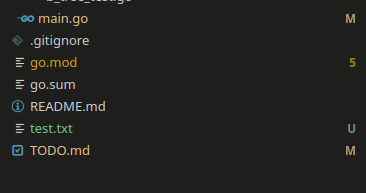
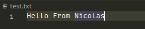

# The beginning of the Journey

Sometimes, while working on projects, I feel like I'm playing a RPG, where I have some quests to complete for achieving new quests, gain experience and gather new weapons, all of that to enable me facing new and more challenging situations.

I think I really like this feeling of RPG in development, and that is something that motivates me to keep pushing and learning new subjects. I must confess, I felt upset and unmotivated recently, there were some things in my life that were worryng me, that is normal, concerns are part of our life, despite of that you must keep yourself positive and work to push away those concerns and bring joy to your life.

Among the problems I have to face in the end of 2023, there is my boredom in the free time. I'm a very active guy, I go to the gym, I watch animes, but I also like to involve myself into programming or engineering projects. 

You know, I need money for me and my family, my wife is pregnant and I have a lot of bills to pay, we are reforming our appartment to welcome the baby. I am investing a lot of my free time on building a SaaS platform (which is still in development) for accounting services, the project itself is interesting in the perspective of software and cloud architecture and also in the perspective of money, but it is letting me tired, and in the sense of reasoning challenge was not satisfying.

Some people just say to me to focus on what gives you money directly, but doing that, with all the situations in my life right now, I started becomming really stressed and upset. I have to recover my energy.

Then the Idea of a Database came up. Why not spending time to build something great and also learn something new? I combined both Golang language and the database project to be my free time partner for a while. And as I expected, I was diving deep into the project right from the beginning.

# Hands On - First day

I remember that at the University, I had some tests and small projects regarding Data Structures, such as Linked list, Binary Tree, Graph, among others. Since I started my carreer as a developers, I haven't had so many oportunities to implement them in real life (real projects), although they are naturally part of our life (Like you or not). Perhaps that is the reason why the big techs care so much about this sort of knowledge in their interviews, who knows you might implement them one day?

I knew that the database files could be similar to some data structures, and reading more about databases, I realized it was true. The implementation of data structures in files is possible and is used a lot in software industrie. That is the case of Btree.

### The BTree and what that is

The BTree or Binary Tree is a data structure used do store date (Really?), but the key point is how it stores it. It works as a tree, it has the nodes and leaves. The tree also has some limitations, such as maximum number of members within a node or a leaf, the values must be sorted, the tree must stay balanced to prevent some possible slow searches.

If you want to read a good article of Btrees and the types of Trees that exist, just check this [link](https://builtin.com/data-science/b-tree-index).

Normally, all the examples on the internet are done using memmory pointers, which is not our use case, the tree we are about to build is based on disk information. The idea is quite simillar, but instead of addressing memory pointers to nodes, we are going to address one file page.

### How would that work?

The operating system provides API to access files, by its File System. In other words, we can access data from disk, read, write, modify, save files and so on.

The data of a database is written in one or more files, but the data don't stay there randomly, it has an order, it is correctly divided to easy the access to it.

Have you ever read a book? Normally books have indices, that demonstrate where to find chapters, or some specific part of it. You read what is the page that ou want to reach from index, let's say **Chapter 2** of a book and goes directly there, instead of keep turning pages until you reach that page. It is much faster than normal turning page process.

Imagine that now for a database that has millions, sometimes billions or more lines in a table. How to access it rapidly? How does a computer access just a specific page of a file, without bringing all the file bytes into memory?

That is the magic of database, accessing the right page to get the right data rapid.

### First Objective

Knowing that I must build a Btree based on disk and I have to separate the file into pages, I have to make some tests. And those tests require some understanding o the language that I want to use (Golang) to build the database. So I decided to divide my first tasks into three diferent:

- Learn Golang API for managing files
- Research and understand more about file page size
- How to load just a specific part of a file, lets say, from byte 200 to 400?

#### Day One - Golang API for Files

Let's code now. I am new to Go programming. To be honest, I've downloaded de oficial Go book and read some basic chapters. I prefer to try myself some implementations and see what comes out.

**PS: Some code generated here will not be present in commits, because they were used just to prove concepts and test functions**

For testing purpose I started a new file in golang **main.go** with the package name **main** and created an empty function **main**

```go
package main

func main() {
    // I'll implement the code here
}
```

So far so good, but I don't know how to import external packages, or even built-in packages. Using the most famous website for that **stackoverflow** I read that you must use **import** statement with the library name that you want to use. Lets import the library os, I think that is the right one to import, and use the method for creating a file, normally is the method **Open** present in many others languages as well.

I was right, there is a public function in the library **os** from Golang that enables us to create a file. So I wrote the following code:


```go
package main

import "os"

func main() {
    // I'll implement the code here
    fileName := "/home/nicolas/Desktop/nicolas/projetos/monvandb/text.txt"
    // Filename, modes for opening file Create (if doesn't exist and Read Write)
    // And also permissions for file
    fp, err := os.OpenFile(fileName, os.O_CREATE|os.O_RDWR, 0666)

    if err != nil {
        panic("Could not create file")
    }

    fp.Write([]byte("Hello From Nicolas"))

    defer fp.Close()
}
```

We can see that the file was created correctly and also that the string wrote into file is correct





Ok, I think that was really easy, since the API is similar to all other languages, this is not something new to me. But let's say I have a file of a length of 4096 bytes, and I want to read the first 100 bytes without loading the rest of the file into memory, how can I do that?

One hypothesis is to use the **os** library as well, let's see if it works. Using the same function OpenFile, we can access the data saved in the file, but I want to access te first 100 bytes.

First of all, I'll create an array of bytes of size 4096, concatenating the same phrase *Hello From Nicolas* followed by a lot of hastags *#*, than I'll write it to the file, using the same script

```go
package main

import "os"

func generateByteArray() []byte {
	header := []byte("Hello From Nicolas")
	// Create new empty 4096 byte array
	mArray := make([]byte, 4096)
	// Copy header to mArray
	copy(mArray[:len(header)], header)

	// fill out the rest with hashtag
	for i := len(header); i < len(mArray); i++ {
		mArray[i] = byte('#')
	}

	return mArray
}

func main() {
    // I'll implement the code here
    fileName := "/home/nicolas/Desktop/nicolas/projetos/monvandb/text.txt"
    // Filename, modes for opening file Create (if doesn't exist and Read Write)
    // And also permissions for file
    fp, err := os.OpenFile(fileName, os.O_CREATE|os.O_RDWR, 0666)

    if err != nil {
        panic("Could not create file")
    }

    fp.Write(generateByteArray())

    defer fp.Close()
}
```
After the file is updated, I must write some code to read out data out of the file.

```go
func main() {
	// I'll implement the code here
	fileName := "/home/nicolas/Desktop/nicolas/projetos/monvandb/test.txt"
	fp, err := os.OpenFile(fileName, os.O_CREATE|os.O_RDWR, 0666)

	if err != nil {
		panic("Could not create file")
	}

	// Output with the size that we want to read
	output := make([]byte, 18)
	_, err = fp.ReadAt(output, 0)

	if err != nil {
		panic("Could not read file")
	}

	// print readData
	fmt.Printf("First 18 characteres = %s\n", output)

	defer fp.Close()
}
```

Also returning Hello From Nicolas, which was expected. I don't feel that using os.OpenFile is the proper way of doing access to files when constant modifications keep happening. The OS requests resources to kernel to access files and other peripherals. Why not using directly the Kernel to read file bytes? The answer to this question remains for posterity, with all of the testing made today, I have already a notion of how I should use Golang's API for files.


#### Day Two - Understanding more about File Systems

Reading books has not always been my passion. When I was younger I didn't have the habbit of reading. Out of curiosity, I gave reading a try, bought some history books, and one of them was a mistery solving book. After finished the first book (The mistery one) I fell in love with reading. The feeling of mstery beginning to reveal itself is exciting, you literally can't stop reading when that feeling comes up.

And the same feeling comes to me when learning new subjects for solving problems or building projects. Obviously, after I started researching about database, files, I had that feeling of revealing the mysteries in my mind along with the excitement. I needed to know more about files and how to OS deals with them. How to minimize the chance of corrupting a file during unexpected failures.

Ideally, when modifying a file, the operations should be atomic acording to some blogs and topics I've found. But how to I ensure that all operations are atomic? What does that mean? How the file writing process works behind the scenes?

I think that to respond this question I shall learn how the machine deals with this sort of task.

**Atomicity**

Atomic operations are defined as operations that cannot be interrupted by any other process or task. To achieve that in file system operation, such as Write, ou read, may be sometimes hard.

One good way of modifying files with one single atomic operation is to rename the file. Yes, the idea is simply to always have a copy of the original file (Database), and whenever we want to commit changes to the original database, the file name is changed. This action is always atomic, meaning that if any fault occours during process, either the operation occours or not, the file would not be corrupted. 

**Page Size**

Since reading and writing data to disk means more Disk operations, we want to ensure that those operations are done in a optmized way. But how? Knowing the size of the OS Page Size, helps us to determine what will be the size of our pages used in our data structure.

Ensuring that the pages have the size of the OS page size, we not only have a efficient memory usage by the kernel and system, but also many more advantages, both for concurrency control, disk operations, recovery mechanisms.

If you have a Unix like os, using *getconf PAGE_SIZE* will display the page size of you computer.

#### Conclusion

I really tought that the file parts would be sensible, but not that there were so many possiblities and details in the subject. I think that during the project building, I'll have more and more modifications to the code, in order to fit all requirements presented at the beginning of the project.

For now, I'll focus on enabling the most basic blocks of the project. The first part is to build the BTree and its basic operations. I am really excited to start this chapter of the project. I don't have much experience with Golang, nor I have the fixed idea of how it will be implemented, but I'll do it anyway.

