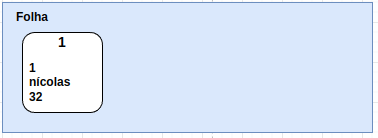
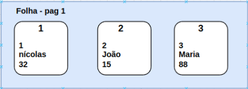

# The idea

Before I start implementing or showing anything about this subject, it is interesting to visualize what I want to build and how it fits into a database solution.

Since the goal is to save and work with tabular data, these table rows must be saved in a file somewhere on the computer, usually with the extension .db, or something similar.

If we try to open them with a text editor, we can barely understand anything visually. This is because the data is, in fact, binary information structured in some way that the database developers planned.

For those who have had experience with pandas, dataframes (tables) can be saved in different formats. However, when you want to read specific information from this file, the entire document is read and brought into memory and, thus, searches in memory are made so that the information is effectively brought.

In database files, this search is transparent, the specific information is brought directly from the file without having to load it all into memory. But this specific feature leads me to the following question: "How to do this?".

**The file**

Have you ever stopped to think about why tables in a relational database need indexes? The answer is directly linked to the data structure used to assemble the file.

Binary trees, or B+Trees in our case, use some type of information as an index, be it a number, a text, a date; something that identifies a record within the data structure. Let's imagine the fictitious example of my user table below:


The table contains three columns: id; name; age, with id being the index column. Let's say it is of type int (integer). When we insert this data, what happens in the files?

I like to make analogies with the things I work on so that it is easier to visualize the solutions. A database file makes searching fast because it basically works like a book, containing an index, which shows where to find the pages of each chapter, and the pages, which store various information, which can be other indexes or text information.

The file on disk is also separated by pages, and each one has a specific size, which can range from 512 bytes to much more, sometimes reaching a few GB.

See how interesting, each page of the file corresponds to a structure of the binary tree, being a node or a leaf.

**But what is the difference between a node and a leaf? What are their functions?**

Nodes are disk pages that contain information about other nodes or leaves, while leaves are disk pages that actually contain the information that should be saved, in the case of tables, the rows.

Let's use the table in Figure 1 to illustrate our binary tree incrementing as the table rows are inserted. We start with an empty file, and the first row of the table with id = 1 is added to the file.

Since the file is empty, when the first row is inserted, a leaf appears and the key 1 with the information is added.



In this example, the maximum number that a leaf can hold is three rows. However, in practice, the data limit for the leaf is related to the number of free bytes it has. The same occurs for nodes that, instead of storing row information, store addresses of other pages.

Continuing, when adding keys 2 and 3 to the leaf, the result is the following:



When the fourth row is inserted, the tree needs to grow, so a new leaf must appear to accommodate the new data. This process is called a split.

In addition to the new leaf, a page containing the node structure must also appear, since from now on, our database has two pages of information, so an index page is needed to indicate where to find the rows with their respective indexes.


A entrada do nó como página raíz faz com que a busca por chaves específicas torne-se mais rápida. Por exemplo, se quisessemos buscar a chave dois, a primeira página acessada seria o nó da página 3, tendo sua primeira informação como chave igual a 1 na página 1. 

Neste caso e nesta implementação, como a chave 1 é menor ou igual à chave que estou buscando, o sistema supõe que a chave dois esteja nesta folha. Caso não estivesse, o sistema tentaria encontrá-la em alguma outra folha disponível, até que não tivesse mais opções.

Esta mesma ideia se propaga para um universo infinito de páginas. Conforme a base de dados e a tabela vão crescendo, o número de páginas também e, consequentemente, o tamanho do arquivo.

Vale lembrar que neste exemplo ilustrativo utilizei informações concretas e com tipos de dados concretos, mas na verdade os valores salvos são representações binárias de tipos de dados. O índice pode ser um inteiro, texto, ponto flutuante, etc, enquanto que o valor também pode ser qualquer tipo de bytes sequenciais.

Para finalizar a ideia, todo arquivo de B+Tree corresponde a um índice de uma tabelae por isso que quando se cria uma tabela em um banco de dados SQL, é obrigatório o uso da chave primária.

Além disso, a página zero desses arquivos são descritos como página de cabeçalho, nas quais informações sobre qual a página raíz da árvore, tamanho das páginas, entre outras informações importantes, lá encontram-se.

Agora que temos um entendimento básico do que quero montar, bora fazer acontecer? Para isso se tornar realidade, precisamos estruturar nossos Nós e Folhas da árvore em Golang. Segue comigo que explico como fiz.

# Tree Nodes

The first day of implementation was a normal day. My daily work was not tiring and I decided to start shaping the beginning of BTree. The concept of a binary tree is a data structure based on nodes and leaves. I know that there are several types of trees but I will implement the B+Tree, whose nodes are responsible for storing other nodes or leaf positions, while the leaves store Key-Values ​​(Bytes).

Preparing a byte structure to be saved in a file page is something I had to think carefully about how to do. I usually ask myself some questions before writing any code, and the questions were the following:

- Will the structure need more than one type of byte arrangement?

- Will they share some type of information?

- What type of information do I need?

Answering the first question: **Yes**! Since we have nodes and leaves, we have to create both structures. Sharing information between them would be good, both should store information about the page, be it node addresses, number of items, free bytes or even real data values.

I think that starting with the basic information mentioned above for both is enough. I believe that with the evolution of the binary tree structure -- and this I say in the long term -- new compositions of these structures will emerge and there will be modifications. But there is no point in trying to predict everything before experiencing the difficulties. Let's start with the basics

**How ​​to create and define structures**

The basic (functional) byte structure is not a difficult task, but it should be done with caution. Working with IoT gave me a good idea of ​​how to build data protocols for wireless communication, by building data structures from byte arrays or structs. The bad news for me now is that everything was written in C back then, not Golang.

For those of you with experience coding in C, what I want to build for the basic data structure is something like the following C code:

```C
#include <stdint.h>

struct Node {
    uint8_t type; // Node or Leaf
    uint8_t n_items; // Number of items stored
    uint16_t free_bytes; 
    uint64_t p_parent; // Pointer to parent address
}
```
The structure above represents basic header for a Node or leaf, lets call them Node Node, and Node Leaf. Implementing something similar in Golang would be:

```go
type Node struct {
    nodeType  uint8; // Node or Leaf
    nItems    uint8; // Number of items stored
    freeBytes uint16; 
    pParent   uint64 ; // Pointer to parent address
}
```

Golang also provides struct types, with some differences. In C, struct serialization occurs directly. Let's say I use malloc to allocate a page size of memory, in this case, 4096 bytes. When I cast it to a struct type, it automatically uses the total amount of bytes that the struct needs, and the rest stays free for another purpose.

In Golang, it is also possible to serialize a struct, but it is not so direct as in C. Knowing that, and considering that converting bytes to another data type to convert them again and, afterwards, do some operations would become slow for large data operations, I've decided to build my own serialization process for my Nodes and Leaves.

I researched and saw that Golang has two libraries used to deal with byte arrays: Binary and Bytes, containing functions to work directly with bytes and binary information.

## Golang Struct

Every node is one page, and one page corresponds to an array of bytes. So, to build our struct, we need to fill up an array of bytes. I thought it would be a good idea to have a struct like this:

```go
type TreeNode struct {
    data []byte
}
```

That means, when I serialize data, I just take the data field containing all node bytes. I don't personally like to do it this way, but I am not sure whether or not there is another option that may be as fast as this one.

The disadvantages of this sort of implementation are that we must build all getters and setters for all specific parts of our page, which brings more complexity to my solution. I'll continue with this solution anyway; let's see what I get.

# The Node Node

I was not inspired today to create something fabulous, so let's try to do the basic. The Node node should have a header and also a structure to save data from nodes or leaves. B-tree normally requires keys that are used as indexes to searches. What kind of Key will the B-tree have?

Normally, what I see are columns with non-negative integer numbers that increase automatically with time. I think the first approach would be to use an integer number as key; I don't want complexity right now. The key can become huge, so I assume that it is the largest number available in the language: **uint64**.

For every key, we store a value, but for the case of the Node Node, we store an address, not a memory address, but a page address, that can also be huge, so we assume the page address is **uint64** as well.

So, the first step is to create the basic structure for our nodes:

```go
/* Base Node */
type TreeNode struct {
	// This holds bytes to be dumped to the disk
	data []byte
}
```

It's also required to create a enum type for differentiating node type, using iota

```go
/* TreeNode implementation */
const (
	TREE_NODE = iota
	TREE_LEAF
)
```

It's time to think and build the basic structure to the node. I thought it would be good this way shown below:

- **type**: Type of Btree TREE_NODE or TREE_LEAF **uint16**
- **nItems**: Indicates how many items the node has **uint16**
- **freeBytes**: Indicates how many free bytes the node has **uint16**
- **pParent**: Page refering to parent node (In case we need it) **uint64**
- **n * NodeStructure**: This is just a representation for explaining that, after pParent bytes, there is just data related to another nodes and addresses **Can be many bytes**
- **NodeStructure**:
- - **key**: lowest key of the page referenced **uint64**
- - **addr**: Address of the page **uint64**

I created an image to show an example of how the key address **NodeStructure** would work in a practical way:


There is the header, which is composed of the fields: type, nItems, etc.; followed by free space used to store information related to key addresses. Whenever a new key address struct is added to the page, the value is concatenated to the page after the headers, the count of nItems is increased by one, and the number of free bytes decreases.

The same idea would apply to the key-value pairs, differing only by the fact that the number of bytes stored in value is variable; therefore, we need information about how many bytes does value consist.

## First implementation

Starting with the headers I had to transform that planned header into something usefull. Since we want to build our own serialization through the struct information, we shall than start by writing getters and setters (Who programs in Java loves this).

For this task, I'll use the **binary** package, that enables us to work with bytes and write information whether it is in little endian or big endian. I'll use little endian, but nothing prevents anyone to use big endian.

Before I start writing any getter or setter, I decided to create some macros variable, which are written with **const** statement, specifying the lenght of each information in bytes, and also the position that those information begin in the byte arrays.

```go
// Example of const declaration
const (
	NODE_TYPE_LEN            = 2 // Length of node type field in bytes
	NODE_OFFSET_LEN          = 2 // Length of offset field in bytes
	NODE_N_ITENS_LEN         = 2 // Length of field n Itens in bytes
	NODE_FREE_BYTES_LEN      = 2 // Length of node free bytes field in bytes
	NODE_PARENT_ADDR         = 8 // Length of node parent address field in bytes
	NODE_P_KEY_LEN           = 8 // Length of node key len
	NODE_P_CHILD_ADD_LEN     = 8 // Length of node children address in bytes
	NODE_P_KEY_ADDRESS_LEN   = NODE_P_KEY_LEN + NODE_P_CHILD_ADD_LEN // Length key address len for node
	LEAF_HAS_SEQ_LEN         = 2 // Length of leaf has sequence field
	LEAF_SEQ_P_LEN           = 8 // Length of leaf sequence address field
	LEAF_KEY_LEN_LEN         = 2 // Length of leaf key lenght field in bytes
	LEAF_VAL_LEN_LEN         = 8 // Length of leaf val lenght field in bytes
	LEAF_SEQ_N_BYTES         = 2 // Length number of bytes in leaf sequence
	LEAF_SEQ_FREE_BYTES_SIZE = PAGE_SIZE - LEAF_SEQ_BYTES_OFFSET // Length of sequences free bytes size
)
```

I know that the names are possibly not so easy to understand nor really beatiful, but that is how I've written them (If you want to see all of them, just find the bTreeNode.go file in the btree module)

**Writing Getters and Setters**

I have never written some getters and setters in Golang before. I've done this in different languages: C, Java, JS, Python, but in Golang it is something really new. I've read that it is possible to both write them linked to some struct, namely class methods, or to write by passing some struct address as a function parameter, and modify what you want inside the function.

I am going to be honest. I mixed both trying to differ some characteristics of the node leaf and node node, but that ended up being some confusion and a non-pattern way of writing code. Fixing it is a task for posterity. But let's code.

```go
func (n *TreeNode) GetType() uint16 {
	return uint16(binary.LittleEndian.Uint16(n.data[NODE_TYPE_OFFSET : NODE_TYPE_OFFSET+NODE_TYPE_LEN]))
}

func setType(n *TreeNode, nType uint16) {
	binary.LittleEndian.PutUint16(n.data[NODE_TYPE_OFFSET:NODE_TYPE_OFFSET+NODE_TYPE_LEN], nType)
}

// Example of use
var node TreeNode
type_of_node := node.GetType()

setType(&node, 1)
```
Here a two examples of how can you use methodes with structs. I tryed to differ them, I've put the public functions with the struct methodes and private functions separated, although not everything follows this pattern.

**The NewNode function**

I wanted to have a function that would return me an empty Node Node to be used in my application, similar to a constructor for my structure. Therefore, creating a function for that seemed like a good idea. The problem was that I didn't know how to initialize a struct containing a byte array as a property. After a while of testing, I figured out that there are a couple of built-in functions that help you create an object out of a type easily. These are the make and new functions.

The make function is useful when creating arrays of types. In my case, I needed an array of bytes. On the other hand, the new function is used to create empty structs for the given type. Additionally, you can manually create the struct similar to C, as shown in my example, where I combined make and C-style struct creation to create a new TreeNode struct.

```go
func NewNodeNode() *TreeNode {
	// Create a pointer to a new Node Structure
	nodeNode := &TreeNode{data: make([]byte, PAGE_SIZE)}
	// Set headers
	setType(nodeNode, TREE_NODE)
	setNItens(nodeNode, 0)
	setFreeBytes(nodeNode, PAGE_SIZE-NODE_FREE_BYTES_LEN-NODE_TYPE_LEN-NODE_N_ITENS_LEN-NODE_PARENT_ADDR)
	return nodeNode
}

```

## Advancing - Nodes types and Insertion Deletion Methodes

Getters and setters were implemented using *binary.LittleEndian* methods to work with byte arrays. Now it's time to implement functions to enable us to insert, delete, update, and get key values and addresses from our Node pages. I must confess that I am feeling quite lazy and don't want to spend too much time on this task, nor do I want to develop complex logic for it.

I think the only constraint I have is to maintain all values on pages sorted, in other words, to store them sorted (which is desired), but retrieving them sorted is enough.

Before advancing further on the subject, I needed to create some concrete struct types to demonstrate what types of information are stored inside the pages. These are **NodeKeyAddr** and **LeafKeyValue**, as shown below:

```go
type LeafKeyValue struct {
	keyLength   uint16
	valueLength uint64
	key         []byte
	value       []byte
}

type NodeKeyAddr struct {
	keyLen uint16
	key    []byte
	addr   uint64
}

```

I decided to change the key from uint64 to a byte array, considering the possibility of using indexed keys such as strings, different bytes, objects, among others. Changing the field to a byte array was the best option I could choose.

For every type of node, a function to insert, delete, and update values is created. In fact, the update method will not be implemented, as updating is essentially the same as deleting and inserting the same key.

**Insert**

```go
func (n *TreeNode) PutNodeNewChild(key []byte, addr uint64) error {

	// Verify whether it will exceed total bytes
	aditionalLength := len(key) + 2 + 8
	if int(GetFreeBytes(n))-(aditionalLength) < 0 {
		return errors.New("exceeds total bytes")
	}
	keyLen := uint16(len(key))
	// takes offset
	offset := getNodeOffset(n)

	/*
		2B - Len of key
		Len of Key B - Key
		8B - Address
		Example:
		key = ["a","t","o","m","i","c"]
		addr = 157

		keyLen = 6 - Therefore the size will be 2B + 6B + 8B = 16B
	*/

	// Write len 2B
	binary.LittleEndian.PutUint16(n.data[offset:offset+2], keyLen)
	// Write Key (variable)
	copy(n.data[offset+2:offset+2+keyLen], key)
	// Write Address 8B
	binary.LittleEndian.PutUint64(n.data[offset+2+keyLen:offset+2+keyLen+8], addr)

	// Set new offset
	setNodeOffset(n, offset+2+keyLen+8)
	// Set new Free Bytes
	setFreeBytes(n, GetFreeBytes(n)-(2+8+keyLen))
	// Set NItems
	setNItens(n, n.GetNItens()+1)

	return nil
}

func (n *TreeNode) PutLeafNewKeyValue(key []byte, value []byte) error {
	aditionalLength := len(key) + 2 + 8 + len(value)

	if int(GetFreeBytes(n))-(aditionalLength) < 0 {
		return errors.New("exceeds total bytes")
	}
	keyLen := uint16(len(key))
	valLen := uint64(len(value))
	// takes offset
	offset := getNodeOffset(n)
	/*
		2B - Len of key
		8B - Len of value
		Len of Key B - Key
		8B - Value
		Example:
		key = ["a","t","o","m","i","c"]
		value = []byte("some value inserted in here")

		keyLen = 6 - Therefore the size will be 2B + 8B + 6B + 27B = 43B
	*/

	// Write keylen 2B
	binary.LittleEndian.PutUint16(n.data[offset:offset+2], keyLen)
	// Write valuelen 8B
	binary.LittleEndian.PutUint64(n.data[offset+2:offset+2+8], valLen)
	// Write Key (variable)
	copy(n.data[offset+10:offset+10+keyLen], key)
	// Write Address 8B
	copy(n.data[offset+10+keyLen:offset+10+keyLen+uint16(valLen)], value)

	// Set new offset
	setNodeOffset(n, offset+10+keyLen+uint16(valLen))
	// Set new Free Bytes
	setFreeBytes(n, GetFreeBytes(n)-(10+keyLen+uint16(valLen)))
	// Set NItems
	setNItens(n, n.GetNItens()+1)

	return nil
}
```

The idea is simple. To facilitate my life, I've created another field called offset, which indicates the position of the first free byte to be the reference for new incoming bytes to be saved. The difference between both is that the value len of a LeafKeyValue is variable, therefore, it has one more field regarding the length of the bytes to be saved.

For every new item to be added, the system looks at the offset and then stores the data after the offset, updates the number of items in the page, and also updates the offset value to the new one. Doing so, I don't have to compute a lot and don't have to create a miraculous logic solution for this. But you may ask me: How do you guarantee that it is sorted?

In fact, I don't guarantee anything while inserting data, just that the data is there. The sorted data comes when reading from the page, as shown below for getter methods:

```go
func getAllLeafKeyValues(n *TreeNode) []LeafKeyValue {
	nItems := n.GetNItens()
	r := make([]LeafKeyValue, nItems)
	baseOffset := LEAF_VAL_START_OFFSET
	for i := 0; i < int(nItems); i++ {
		kLen := binary.LittleEndian.Uint16(n.data[baseOffset : baseOffset+2])
		vLen := binary.LittleEndian.Uint64(n.data[baseOffset+2 : baseOffset+2+8])
		key := n.data[baseOffset+10 : baseOffset+10+int(kLen)]
		value := n.data[baseOffset+10+int(kLen) : baseOffset+10+int(kLen)+int(vLen)]
		r[i] = LeafKeyValue{
			keyLength:   kLen,
			valueLength: vLen,
			key:         key,
			value:       value,
		}
		// Add values to offset
		baseOffset += (int(kLen)) + int(vLen) + 2 + 8
	}

	sortLeafKeyValues(r)
	return r
}


func getAllNodeKeyAddr(n *TreeNode) []NodeKeyAddr {
	// Get number of items
	nItens := n.GetNItens()
	// Initiate return array
	r := make([]NodeKeyAddr, nItens)
	// Start always at the very beginning
	lastStart := NODE_P_KEY_ADDR_OFFSET
	for i := 0; i < int(nItens); i++ {
		// Get key Length
		kLen := binary.LittleEndian.Uint16(n.data[lastStart : lastStart+2])
		// Get key value in []bytes
		key := n.data[lastStart+2 : lastStart+2+int(kLen)]
		// Get key address
		addr := binary.LittleEndian.Uint64(n.data[lastStart+2+int(kLen) : lastStart+2+int(kLen)+8])
		r[i] = NodeKeyAddr{
			keyLen: kLen,
			key:    key,
			addr:   addr,
		}
		lastStart += 2 + int(kLen) + 8
	}

	sortNodeChildren(r)
	return r
}
```

The idea of getting all data is the same as storing, except by the fact that is done inversely, returning an array of the respective type, either returning an array of LeafKeyValues, or NodeKeyAddress.

After getting arrays in golang, we can easly apply the sort method

```go
func sortNodeChildren(c []NodeKeyAddr) {
	sort.Slice(c, func(i, j int) bool {
		return bytes.Compare(c[i].key, c[j].key) <= 0
	})
}
```

I had to create the same method for *LeafKeyValue*, and the code is getting duplicated in some parts, which I don't like, but it is not something to worry about right now.

**Delete Functions**

Deleting a specific part of a byte array, especially when it is not of fixed length, may be a difficult task. I know that this implementation done here is not something special and is not as fast as I want, but it's useful to advance with the first version of my B-tree.

What I do is not to delete anything; I read all values from a page (Node), remove the desired key, and then store everything again in the renewed array. Simple but slow. One better alternative is to identify the real position of the desired field in the page and copy other bytes to its position, namely shifting bytes from right to left.

One example of the implemented method is shown below:

```go
func (n *TreeNode) DeleteLeafKeyValueByKey(key []byte) {
	allLeafKeyValues := getAllLeafKeyValues(n)
	// Reset Node
	tmp := NewNodeLeaf()
	setParentAddr(tmp, n.GetParentAddr())
	setLeafHasSeq(tmp, n.GetLeafHasSeq())
	setLeafSeqPointer(tmp, n.GetLeafSeqPointer())
	for i := 0; i < len(allLeafKeyValues); i++ {
		if bytes.Equal(allLeafKeyValues[i].key, key) {
			continue
		}
		tmp.PutLeafNewKeyValue(allLeafKeyValues[i].key, allLeafKeyValues[i].value)
	}
	copy(n.data, tmp.data)
}
```

# Time to move on

After implementing everything I got tired and needed to advance with this subject, I wanted to start creating the binary tree CRUD functions, and I'll do so. I realized that I could merge both structures LeafKeyValue and NodeKeyAddress, remove duplicated methods for inserting, deleting, sorting, and so on. I'll do this later, so this will be kept in a TODO file.

Implementing delete method directly into the bytes will be much faster and improve the speed of my software, although I'll leave this task for myself in the future.

The last considerations for this package are that I'll write it again using some pattern for naming and making it less verbose, and the PAGE_SIZE constant could be changed to work as a PAGE_SIZE for each B-tree file; this information would be stored on the first page of the file.