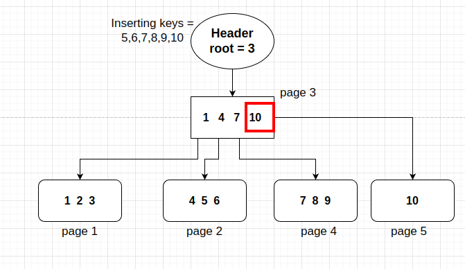

# The tree

Having basically all required functions to initiate my work with the trees in fact, I had one objective in mind, to create a CRUD for my tree. This CRUD contains basically four functions, insert, delete, update and get.

The challange now is to reconcile my free time and paternity to conclude this task. I'm writing this text while me and my wife stay in the hospital waiting for our baby to come. She had to udergo a labor induction due to some unexpected reduction in amniotic fluid. But there is nothing to worry about, it was preventive, not emergencial, and Since it has no determined time to happen, it can happen now or within 3 days, who knows? Knowing I'd spend a lot of time waiting in the Hospital, I brought my notebook to develop and write for a while.

I must confess that coding helps me overcoming anxiety and nervousness, but the ideas of how to implement the binary tree functions are not easly comming.

Therefore, I'll try to write down and exemplify with images how I want to implement and how I ended up implementing the bTree crud and the problems that I found during the process.

# Offtopic

My first son was born at 4:14 AM on 19th January 2024, healthy, beautiful. At the moment he came out to the world I instantly started to cry, I love him and my wife. Thank God he came so healthy to this world, this is such a joy and a realization for me to become a father. I'll do my best at this job, perhaps the most dificul job I'll ever have.

# The BTree Struct

Having the basic functions for the Node struct done, I have to figure out how to create a BTree Struct for using in the bTree crud. Since I am going to write a binary search, I must be able to access some callbacks functions to manage pages inside the crud methodes.

Let's imagine that we are at first page, a page that holds what is the number of root page, how would we access and retrieve root page information if we don't have any callback to do it? The bTree Structure will have some basic functions, such as: Get, Set, New, and so on. With these functions it's possible to modify pages while woking with other pages, which is something that I want to do.

Among all informations that we want to have within our Tree structure, one of them is the root page, meaning where the bTree really starts, maybe the name, page bytes when the tree was created and, of course, the callbacks.

```go
type BTree struct {
	data      []byte                // Page header
	pageSize  uint32                // Page Size. It's still hardcoded
	root      uint64                // Indicates Where the root page starts
	SetHeader func(BTree)           // Update header whenever needed
	Get       func(uint64) TreeNode // Returns a Tree Node
	New       func(TreeNode) uint64 // Allocate a new Page
	Del       func(uint64)
	Set       func(TreeNode, uint64) bool // Del a new page
}

```

I did implement both getters and setters for setting database name and root into the file, *pageSize* is still not implemented, since I use hardcoded 4096 bytes to all functions. I am thinking of letting it variable, depending on the system when creating a new bTree. 

For now the implementation of both callback functions is not mandatory, it is an Interface, I think that in the future those callbacks will do much more than just create or edit one page of a file. Perhaps I can add some management for editing files behind this interface, some sort of control for the cases when the database has a lot of read and write requests simultaneosly.

# Testing - The native Go Package

I must confess, I was testing everything using a *main.go* file, some prints and helpers functions to test the creation of pages from the last chapter. I was losing the track of things that I've been creating. This way, I decided to study and use some testing framework for Golang. Luckly, Golang has its own native testing package, which is, in my opinion, fatanstic! Simple, provides necessary tools, and runs so well with VSCode that I couldn't belive that I wasn't using it to develop until now.

Another good thing is that, for creating temporary files, they provide a function that creates a temporary folder that lives while some test function is running. Whenever it ends, the folder is completly deleted, lefting nothing behind, which is cool, we can skip the boring task of cleaning the garbage.

Usage for those who are interested in using the framework:

```go
/*
Teste if node creation returns correct data
*/
func TestNodeCreation(t *testing.T) {
    import (
	"bytes"
	"strconv"
	"testing"

	bTree "github.com/nicolasvancan/monvandb/src/btree" // My package
    )

    // Create a new Node
	newNode := bTree.NewNodeNode()

	if newNode.GetType() != bTree.TREE_NODE {
		t.Errorf("Node type should be %d and it is %d\n", bTree.TREE_NODE, newNode.GetType())
	}

	if newNode.GetNItens() != 0 {
		t.Error("Should have 0 items")
	}

	if bTree.GetFreeBytes(newNode) != 4080 {
		t.Error("Should be 4080 free bytes")
	}

}
```

The t input for the function is a pointer to a testing.T struct, that has some functions specific to testing. This is just one struct of the testing package. To assert or give an error, there should be a condition verified, such as if the type is what we expect, if not, we throw and error with t.Errorf().

I decided to implement some basic tests for my already existing package of treeNode, and it was a really cool process. For developing the BTree package, all public functions will be tested with this incredible tool.

# Implementing CRUD

## Introduction

While waiting in the hospital with my wife and my notebook, waiting until the baby decides to come to the world, I thought it would be a good ideia to start implementing the first function of my BTree CRUD, the **BTreeInsert**.

BTree must contain sorted data among all leaves, and those leaves must be sorted, in order to accelerate the searches for data. Remembering, For a leaf, I store the lowest key as the indicator of that leaf for the parent node, let me show an example of the intuition:

**Btree creation and first page**

Before everything happens, the tree must start from somewhere, that is why I have as my first page what I call as "Header Page", which contains information about the binary tree and what is the number of the root page (Page where the Btre effectivelly starts). Every time I want to read data from the binary Tree, my function should consult the header page and then get the number of root page. The more my binary tree grows the greater will the number become, and so on.

## First Scenario - First leaf

When the bTree has no data, that means when root page is null, the table is empty. Inserting any item in the binary tree, theremust be a new leaf, which will become the only leaf inside the binary tree, as follows:


After inserting a item, let's say some dataframe with index column **id** and index column value = 1, then one leaf is created, the root value of header is updated to page number one, and it becomes something as shown below:

**Obs: The rectangles with ronded corners represent leaves, whereas normal rectangles represent Nodes** 


## Splitting leaves

Now, let's supose we add another three keys, with keys equal to [2, 3, 4]. For demonstrating how the mechanism of data insertion will work, the maximum number of itens within one leaf or node will be three. Adding all new key value items, will require our bTree to increase it's size, since the maximum number of items in one leaf or node is three, now, after adding new items there will be four in one leaf, which is not permited.

When reaching max bytes size or max number of items, the node ou leaf must be splitted in two. The way I organized my elements within the binary tree, I do not split in two equal balanced new nodes, I let the first node with the maximum itens it can hold, and the second one with the rest. Now, after splitting the first leaf, there must be one representative node, pointing to the leaves before the leaves layer. This way, a creation of a node is also required.

The node will contain pointers to the pages with the respective first key of each of leaves, let me describe the example: Splitting the first leaf that is in page one, another leaf was originated, which holds the page value of two. Nontheless, another page was created to hold data related to the new node, as explained previously, and this page will be the number three.

As expected, the first key of the first page will still be number one, whereas the first key of the new leaf will be number four and the values inserted to the node pointing to those leaves will be something like this: key 1 can be found at page 1, key 4 can be found at page 2. Not forgetting that the root page, after insertions must be updated to page three, indicating that the node page is now the root page.


## Splitting Nodes

Advancing a little bit more, when node splitting is required, how could we proceed with that? Let's create a scenario to explain this possibility: With the same constraints as before, the user added the keys [5,6,7,8,9,10], therefore, two new leaves were originated comming from the same node:



Note that the pointer to the leaf that contains the key ten is a node's overflow, that is why is also needed to split node, becomming two new nodes, one containing the pointers to the three first leaves, and the second one containing node to the last leaf. Since the node was splitted, one new leaf on the parent layer of nodes will appear, and this node will become the root, with page number 7


## The non Trivial path - Non unique Keys

Thinking of possibles use cases of a Binary Tree containing, for instance, indexes, or even views, would they also use a bTree to store data? I don't know, but I decided to create a binary tree as flexible as possible, where I could insert even duplicated items reorganizing the whole tree again to let data sorted. Another problem that might appear eventually is for data greater than the limit of a page size. Let's suppose I want to insert a table row of index X and value of 100 kB, how would that happen when the limit of a page is 4096 bytes?

Those questions made me realize I had to figure something out. For the case of duplicated items or insertion of items out of order into tree, the logic applyied would not be so trivial.

Let's take our last image as an example, let's supose I want to insert the key 1 as a duplicated item, what would happen with the bTree structure in this case?


It's obvious that when inserting duplicated items, specially when the duplicated key is inside a full leaf, the job is not just put there and go out. If the leaf is already full, we must split it again, but not in the way we did before. The splitting means that the overflow key generated after the new key insertion, will become the key to be inserted in the next available leaf. If the next available leaf is also full, the process is repeated, until it reaches out the key that has space for the incomming key to be inserted there. In the case of the previous image, the key number one arrives at the leaf page one. It is inserted there and, as a result of that, the overflow key generated is the key three, which will be inserted to the next leaf of page 2.


As a result of one insertion at the very first leaf, the entire structure of nodes also changes, because the first key of every leaf is altered, therefore the parent nodes must also have their keys altered after this update. That happens kind of recursivelly, and the final result of all that actions can be seen at the next image.


## The Key Values with huge values length

The new challange now is to think in a way to add