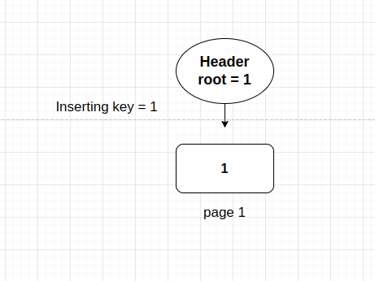

# The tree

Having all required functions to initiate my work with the binary trees, I had one objective in mind, to create a simple CRUD for my tree, whose  functions would be insert, delete, update and get.

The challange now is to reconcile my free time and paternity to conclude this task. I'm writing this text while me and my wife stay in the hospital waiting for our baby to come. She had to udergo a labor induction due to some unexpected reduction in amniotic fluid. But there is nothing to worry about, it was preventive, not emergencial, and since the labor has no determined time to happen, I brought my notebook to develop and write for a while.

I must confess that coding helps me overcoming anxiety and nervousness, but the ideas of how to implement the binary tree functions are not easly comming.

Therefore, I'll try to write down and exemplify with images how I want to implement and how I ended up implementing the bTree crud and the problems that I found during the process.

# Offtopic

My first son was born at 4:14 AM on 19th January 2024, healthy, beautiful. At the moment he came out to the world I instantly started to cry, I love him and my wife. I thank God he came so healthy to this world, this is such a joy and a realization for me to become a father. I'll do my best at this job, perhaps the most dificul job I'll ever have.

# The BTree Struct

Having the basic functions for the Node struct done, now I have to figure out how to create a BTree Struct for using in the bTree crud. Since I am going to write a binary search, I must also be able to access some callbacks functions to manage pages inside the crud methodes.

Let's imagine that we are at first page, a page that holds what is the number of root page, how would we access and retrieve root page information if we don't have any callback to do it? The bTree Structure must have some basic functions, such as: Get, Set, New, and so on. With these functions it's possible to modify pages while working with other pages, which is something that I want to do.

Among all possible informations that we could have in our Tree structure, the root page stays at the first position, followed by other possible information, such as pageSize, bTree name, among others.

```go
type BTree struct {
	data      []byte                // Page header
	pageSize  uint32                // Page Size. It's still hardcoded
	root      uint64                // Indicates Where the root page starts
	SetHeader func(BTree)           // Update header whenever needed
	Get       func(uint64) TreeNode // Returns a Tree Node
	New       func(TreeNode) uint64 // Allocate a new Page
	Del       func(uint64)
	Set       func(TreeNode, uint64) bool // Del a new page
}

```

I did implement both getters and setters for setting database name and root into the file, *pageSize* is still not implemented, since I use hardcoded 4096 bytes to all functions. I am thinking of letting it variable, depending on the system when creating a new bTree. 

For now the implementation of both callback functions is not mandatory, it is an Interface, maybe in the future those callbacks will do much more than just create or edit one page of a file. Perhaps I can add some management for editing files behind this interface, some sort of control for the cases when the database has a lot of read and write requests simultaneosly.

# Testing - The native Go Package

I must confess, I was testing everything using a *main.go* file, along with some prints and helpers functions. Doing so, I started losing the track of things that I was creating. To solve that, I decided to study and use some testing framework for Golang. Luckly, Golang has its own native testing package, which is, in my opinion, fatanstic! Simple, provides necessary tools, and runs so well with VSCode that I couldn't belive that I wasn't using it to develop until now.

Another good thing is that, for creating temporary files, the package also provides a function that creates a temporary folder to live while test functions are running. Whenever the test ends, the folder is completly deleted, lefting nothing behind, which is cool, I can skip the boring task of cleaning the garbage.

Usage for those who are interested in using the framework:

```go
/*
Teste if node creation returns correct data
*/
func TestNodeCreation(t *testing.T) {
    import (
	"bytes"
	"strconv"
	"testing"

	bTree "github.com/nicolasvancan/monvandb/src/btree" // My package
    )

    // Create a new Node
	newNode := bTree.NewNodeNode()

	if newNode.GetType() != bTree.TREE_NODE {
		t.Errorf("Node type should be %d and it is %d\n", bTree.TREE_NODE, newNode.GetType())
	}

	if newNode.GetNItens() != 0 {
		t.Error("Should have 0 items")
	}

	if bTree.GetFreeBytes(newNode) != 4080 {
		t.Error("Should be 4080 free bytes")
	}

}
```

The *t* input for the function is a pointer to a testing.T struct, that has some specific functions for testing. This is just one struct of the testing package. To assert or give an error, there should be a condition verified, such as if the type is what we expect, if not, we throw and error with t.Errorf().

I decided to implement some basic tests for my already existing package of treeNode, and it was a really cool process. For developing the BTree package, all public functions will be tested with this incredible tool.

# Implementing CRUD

## Introduction

While waiting in the hospital with my wife and my notebook, waiting until the baby decides to come to the world, I thought it would be a good ideia to start implementing the first function of my BTree CRUD, the **BTreeInsert**.

BTree must contain sorted data among all leaves, and those leaves must be sorted, in order to accelerate the searches for data. Remembering, For a leaf, I store the lowest key as the indicator of that leaf for the parent node, let me show an example of the intuition:

**Btree creation and first page**

Before everything happens, the tree must start from somewhere, that is why I have as my first page what I call as "Header Page", which contains information about the binary tree and what is the number of the root page (Page where the Btre effectivelly starts). Every time I want to read data from the binary Tree, my function should consult the header page and then get the number of root page. The more my binary tree grows the greater will the number become, and so on.

## Insert

### First Scenario - First leaf

The bTree has no data, meaning that root page is null. If we insert any item in the binary tree, one leaf will emerge becoming the only leaf inside the binary tree, as follows:


After inserting a item, let's say some dataframe with index column **id** and index column value = 1, then one leaf is created, the root value of header is updated to page number one, and it becomes something as shown below:

**Obs: The rectangles with ronded corners represent leaves, whereas normal rectangles represent Nodes** 



### Splitting leaves

Let's supose we add another three items, with keys equal to [2, 3, 4]. For demonstrating how the mechanism of data insertion will work, the maximum number of itens within one leaf or node will be three. Adding all new key value items, will require our bTree to increase it's size, since the maximum number of items in one leaf or node is three, now, after adding new items there will be four in one leaf, which is not permited.

When reaching max bytes size or max number of items, the node ou leaf must be splitted into two new. The way I organized my elements within the binary tree, I do not split in two equal balanced new nodes, I let the first node with the maximum itens it can hold, and the second one with the rest. Now, after splitting the first leaf, there must be one representative node, pointing to the leaves before the leaves layer. This way, a creation of a node is also required.

The node will contain pointers to the pages with the respective first key of each of leaves, let me describe the example: Splitting the first leaf that is in page one, another leaf was originated, which holds the page value of two. Nontheless, another page was created to hold data related to the new node, as explained previously, and this page will be the number three.

As expected, the first key of the first page will still be number one, whereas the first key of the new leaf will be number four and the values inserted to the node pointing to those leaves will be something like this: key 1 can be found at page 1, key 4 can be found at page 2. Not forgetting that the root page, after insertions must be updated to page three, indicating that the node page is now the root page.


### Splitting Nodes

Advancing a little bit more, when node splitting is required, how could we proceed with that? Let's create a scenario to explain this possibility: With the same constraints as before, the user added the keys [5,6,7,8,9,10], therefore, two new leaves were originated comming from the same node:


Note that the pointer to the leaf that contains the key ten is a node's overflow, that is why is also needed to split node, becomming two new nodes, one containing the pointers to the three first leaves, and the second one containing node to the last leaf. Since the node was splitted, one new leaf on the parent layer of nodes will appear, and this node will become the root, with page number 7


### The non Trivial path - Non unique Keys

Thinking of possibles use cases of a Binary Tree containing, for instance, indexes, or even views, would they also use a bTree to store data? I don't know, but I decided to create a binary tree as flexible as possible, where I could insert even duplicated items reorganizing the whole tree again to let data sorted. Another problem that might appear eventually is for data greater than the limit of a page size. Let's suppose I want to insert a table row of index X and value of 100 kB, how would that happen when the limit of a page is 4096 bytes?

Those questions made me realize I had to figure something out. For the case of duplicated items or insertion of items out of order into tree, the logic applyied would not be so trivial.

Let's take our last image as an example, let's supose I want to insert the key 1 as a duplicated item, what would happen with the bTree structure in this case?


It's obvious that when inserting duplicated items, specially when the duplicated key is inside a full leaf, the job is not just put there and go out. If the leaf is already full, we must split it again, but not in the way we did before. The splitting means that the overflow key generated after the new key insertion, will become the key to be inserted in the next available leaf. If the next available leaf is also full, the process is repeated, until it reaches out the key that has space for the incomming key to be inserted there. In the case of the previous image, the key number one arrives at the leaf page one. It is inserted there and, as a result of that, the overflow key generated is the key three, which will be inserted to the next leaf of page 2.


As a result of one insertion at the very first leaf, the entire structure of nodes also changes, because the first key of every leaf is altered, therefore the parent nodes must also have their keys altered after this update. That happens kind of recursivelly, and the final result of all that actions can be seen at the next image.


### The Key Values with huge values length

The new challange now is to think in a way to add key values that are way to big to fit in one exclusive page. What I personally think of this subject is that I could manage to store the values in a lot of pages, using a linked list type of struct, that means, I'll only create this sort of linked list for keys and value that together have more bytes than the total free bytes of an empty leaf, I think it's around 4073 bytes or something near it. In any other case, I'd split the leaf and follow the normal process.

**Solution**

Another leaf type was created, whose name is TREE_LEAF_SEQUENCE. Whenever I want to add a key value with value length greater than the maximum free bytes of a page, I create a normal Leaf, with tree leafs sequences. But what would indicate that the leaf has sequence? Naturally I've modified the leaf structure to contain the fields **leafHasSeq** and **leafSeqAddress**, where the first field indicates that the leaf has bytes saved in another leaf sequence, and the second field indicates what is the page that the sequence is stored.

As a linked list, the sequence leaf may not be enough to store all bytes from the value, therefore, the tre leaf sequence structure must have fields that tell how many bytes are stored in the sequence, whether or not the sequence has another sequence, and the other sequences address.

It became something like this:

- **type 2B**: The type of Tree (common for all node types)
- **hasSeq 2B**: Whether or not the leaf has sequence
- **vSeq 8B**: The address of the other sequence
- **nBytes 2B**: Number of bytes stored in leaf
- **bytes**: information

As a result, I had to refactor some methodes from the previous TreeNode structure, such as added new more methodes to deal with managing those new fields for this new type of node.

### The Setup

Before even start writing code to the insert function, I want to prepare the tests for my functions. Remembering, all functions will only be available if they are public, namelly if they have the first letter upper case.

The testing package has a function called t.TempDir(), that creates a temporary dir for the running test, returning to the user the dir path. I then decided to create a function and a helper package for testing purpose, called **b_tree_helper.go**, located in test/helper folder.

This module is useful to define and implement callbacks used for my tests and also to create functions used by more than one test file. For now, I wrote the callbacks functions using *mmap* and also **file.WriteAt()**.

The first step to use mmap to map my file was to create a temporary but useful function in a package called files. The function is located at **/files/mmaping.go**

```go
package files

import (
	"errors"
	"fmt"
	"os"
	"syscall"
)

/* Map page */
func MmapPage(f *os.File, page uint64, pageSize uint64) (int, []byte, error) {
	// Get File pointer that comes from os.OpenFile
	fileInfo, err := f.Stat()

	if err != nil {
		return 0, nil, fmt.Errorf("Stat %w", err)
	}

	// File is not multiple of pageSize (Must be corrupted or has some bug)
	if fileInfo.Size()%int64(pageSize) != 0 {
		return 0, nil, errors.New("File size may not correspond to database page size")
	}

	// Get mmap based on given page
	pageData, err := syscall.Mmap(
		int(f.Fd()),
		int64(page*pageSize),
		int(pageSize),
		syscall.PROT_READ|syscall.PROT_WRITE,
		syscall.MAP_SHARED)

	if err != nil {
		return 0, nil, fmt.Errorf("Mmap Error %w\n", err)
	}

	return int(fileInfo.Size()), pageData, nil
}

```

This function does a system call to map in memory my bTree files. To accomplish that, it requires a pointer to the os.File struct, that is used to get a file descriptor from the file to be used to the system call fcuntion. Note that there is a validation for file size in bytes, where it must be a multiple of pageSize variable, otherwise the file is corrupted.

There are three flags used to access the file, protected read and write, and that the map can be shared between accesses (That is what I've found about those flags)

The function returns the file size, page data required as []byte, and if there is an error while reading the file.

The use of mmap is not mandatory, although it uses system call, it may be quite slower than the normal file.readAt function, but for this purpose, I'll still use this functions this way. Perhaps in the future I evaluate another option.

I am not sure whether or not the implementation will require a memory mapping solution, that would only be true if the modification of a page occours directly at the page, since the mapping acts as a proxy for modifying the file. This solution would be relativelly good just if all my node functions where atomic, which is not the case. As I've commented in the last chapter, I did not implement all node functions atomically, getters and setters are, but insert, delet and node update functions are not.

Knowing that, the decision I made is to follow the development process updating an entire page at once.


```go
// Callback functions
func getPage(page uint64) bTree.TreeNode {
	_, data, err := files.MmapPage(Fp, page, 4096)
	if err != nil {
		fmt.Println(err)
	}
	tmp := make([]byte, len(data))
	copy(tmp, data) // It's not mapped anymore
	return *bTree.LoadTreeNode(tmp)
}

func setPage(node bTree.TreeNode, page uint64) bool {
	_, err := Fp.WriteAt(node.GetBytes(), int64(page*bTree.PAGE_SIZE))
	if err != nil {
		fmt.Println(fmt.Errorf("could not write to page %d", page))
		return false
	}

	return true
}

func newPage(node bTree.TreeNode) uint64 {

	// get Stat from file
	fileInfo, err := Fp.Stat()

	if err != nil {
		panic(err)
	}

	// Without header
	lastPage := (fileInfo.Size() / bTree.PAGE_SIZE)

	Fp.WriteAt(node.GetBytes(), fileInfo.Size())

	return uint64(lastPage)
}

func setHeader(bTree bTree.BTree) {
	Fp.WriteAt(bTree.GetBytes(), 0)
}

```

Alongside with all callback functions, there are two other functions that are really useful when creating tests mock environment, which are: **LoadBTreeFromPath** and **CreateBtreeFileAndSetFile**, whose functions are to enable a bTree to be used for testing.

```go
func CreateBtreeFileAndSetFile(t *testing.T, basePath string) string {
	fileName := basePath + string(os.PathSeparator) + "teste.db"
	bTree := bTree.NewTree(4096)
	// Fake name to test
	bTree.SetName("db_teste")
	// Should start at zero
	bTree.SetRoot(0)
	// We first create a db at the tmp folder
	fp, err := os.OpenFile(fileName, os.O_CREATE|os.O_RDWR, 0666)
	Fp = fp
	if err != nil {
		panic(err)
	}

	fp.Write(bTree.GetBytes())
	// Returns file path
	return fileName
}

func LoadBTreeFromPath(t *testing.T, filepath string) *bTree.BTree {
	_, data, err := files.MmapPage(Fp, 0, 4096)

	if err != nil {
		t.Errorf("Could not load temporaray database bTree on page 0")
	}
	tmpBTree := bTree.LoadTree(data, 4096)
	// Assign callback functions
	tmpBTree.Get = getPage
	tmpBTree.New = newPage
	tmpBTree.Set = setPage
	tmpBTree.SetHeader = setHeader
	tmpBTree.Del = delPage

	return tmpBTree
}
```

### Implementation

Let's get my hands durty, in fact, because I am not about to write the best clean code ever neither it will be the most efficient code. I want it first to work good.

Based on my first idea of inserting keys, where I have to worry about, inserting the key value bytes, check whether or not the leaf that is going to receive those bytes has enough space left. If not, I have to split the leaf, save two new generated leaves on the layer above them, if there is none I must create one, do it recursivelly, knowing that a tree can have many layers, and not only that! There is another possibility that contemplates key value shifting when inserting a duplicated key. 

In other words, I think this code is not going to be a easy to understand code. And I must confess, after writing the functions and looking back to them to explain them into this text, I got confused sometimes, due to variable names, or confuse flows that I created. That means, the code works, but it's still not well written, and that is a task that is already scheduled in my agenda.

Nontheless, the main objective here is not to discuss what is the best way to code this problem, but how I did it, how I tought the solution would work, and here it is.

**Base Function**

```go
/*
BTreeInsert
Main function to insert a key value to a bTree

This function will do almost all the hard work regarding bTreeInsertion.
It will look for the right place to insert the new key value to a Node, If necessary
*/
func BTreeInsert(bTree *BTree, key []byte, value []byte) {
	// Get root
	root := bTree.GetRoot()
	// Root = 0 means that there is no item in it
	if root == 0 {
		// Than we start a new bTree
		startsNewBTree(bTree, key, value)
		return
	}

	// Get node from page
	rootNode := bTree.Get(root)

	// Find leaf to insert value
	leafToInsert, history := findLeaf(bTree, rootNode, key, root, make([]TreeNodePage, 0))

	if leafToInsert == nil {
		/* Didn't find any leaf, that means the key to be inserted is smaller than the smallest key in bytes

		So we find first node and insert the key to it
		*/
		leafToInsert, history = findFirstLeaf(bTree)
	}

	// Verify whether leaf must be splitted
	insertAndReorderTree(bTree, *leafToInsert, history, key, value)
}
```

In this perspective, the code looks beatiful and well designed. Yes, but the ugly part hides behind the function **insertAndReorderTree**. But first things first. The function receives three parameters, the bTree pointer, relative to the bTree that we want to add information, the key and value, whose types are []byte (Array of bytes).

The first step is to check whether the root page is zero, meaning that there is no data and the bTree has not been initalized yet. So we call the method **startsNewBTree**, that in fact creates a new page (Leaf page)

```go
func startsNewBTree(bTree *BTree, key []byte, value []byte) {
	newLeaf := NewNodeLeaf()
	// Means that it is top page
	setParentAddr(newLeaf, 0)
	newLeaf.PutLeafNewKeyValue(key, value)
	// Calls callback
	pageNumber := bTree.New(*newLeaf)
	bTree.root = pageNumber
	bTree.SetRoot(pageNumber)
	bTree.SetHeader(*bTree)
}
```

**Ps: I am going to omit a lot of code lines here, since the full source is available on the files**

If there is a root diferent than zero, that means that the tree has values. The next step is to check what is the leaf that we will store our new key value. For that, I have created a function called **findLeaf**, that evaluates every new node, and checks whether the first value of each node is less than the key we want to add, if yes, it returns two values, one is a pointer to a struct called **TreeNodePage**, and the other is an array of **TreeNodePage**, which are basically a TreeNode with its respective page number of the file.

There are two possibilities, either the function finds a TreeLeaf where it will add the value, or there is no leaf containing a lower value. If the second occours, the key value must be inserted at the first leaf (The value will be the lowest).

After having both TreeNode and the History, we can now reorder tree, which is the interesting part.

#### The ugly part

When getting to the function **insertAndReorderTree**, there is a flow divisor, meaning that, depending on what you want to add, different functions are called.

```go
func insertAndReorderTree(bTree *BTree, tPage TreeNodePage, history []TreeNodePage, key []byte, value []byte) {
	keyLen := len(key)
	valueLen := len(value)

	// There is overflow in page, must split it or shfit values (when inserting unsorted data)
	if mustSplitNode(tPage.node, keyLen, valueLen) {
		if (keyLen + valueLen + 10) > PAGE_SIZE-26 { // 26 is header size for leaf
			// Special case
			leaf := createLeafAndSequencesForLargeBytes(bTree, key, value)
			insertOneKeyLeafAndReorderTree(bTree, tPage, *leaf, history)
			return
		}
		// Verify whether the leaf if the last one by comparing he page number
		lastLeaf, _ := findLastLeaf(bTree)

		if lastLeaf.page == tPage.page {
			// Last leaf split's backyards Node Recursivelly
			splitBackyardsRecursively(bTree, tPage, history, key, value)
			return
		}
		shiftValuesBetweenLeaves(bTree, tPage, history, key, value)
		return
	}

	tPage.node.PutLeafNewKeyValue(key, value)
	bTree.Set(tPage.node, tPage.page)
}

```

The direct path -- when the key value lengths summed fit in one leaf. What then happens is simple a leaf addition, and the callback of Set a page is called, refering to the page that will be overwritten and its value.

But what happens when there is a split case? Things start to get interesting. The answer is not direct, because a overflow to a leaf can mean that the leaf has too many items and the new item would cause the leaf to split, generating two new leaves. Another case is when the given key value are way to large and do not fit in an entire leaf, meaning that they must fit into a leaf and leaf sequences. There is the last possible case, where the key value must not be inserted in the last leaf, causing a cascade of split and insert into the tree until it reaches the last possible leaf.

I'll try to describe exactly what each case does when the key value is there to be inserted.

**Case 1 - Large key Value**

Let's take as an example the case where the user wants to insert a key = 10 and value as a byte array of length 9kB. The tree reaches the point where it identifies that the values would overflow a single page and it needs to create a new leaf that has sequences. The function **createLeafAndSequencesForLargeBytes** takes the bytes and splits it into n chunks, the number n is defined as a divisor of the total length. Having 9kB, the first leaf would have the first 4073 bytes, whereas the first sequence leaf would have another 4086 bytes and the second sequence leaf would have the rest.

The point now it to insert this new leaf in the respective parent node. For that, the function **insertOneKeyLeafAndReorderTree** is called, doing the following steps:

- Verify if there is not a parent (root), if not, creates one and insert the leaf key page into the new created node
- When there is a prent, verify if the parent node must be splitted, if yes, execute **splitParentNodeRecursivellyAndReorderTreeIfNeeded**
  - This function gets what is the key to be inserted into parent node
  - After that, it splits the parent node
  - Verifies if the splitted parend node was the root page, if yes, create another root node and insert both new key addresses there
  - If there are more layers of parent to be verified and splited, then the recursion is called with new values.

The intuition is clear, I'll try to describe that with a image list as follows:

Imagine we have the following tree


I want to insert now a large key value, with key = 11 and value something large. The first step is to find where that leaf must be inserted and if finds that the leaf is the last, whose values are 9 and 10


Knowing that the key 11 would never fit a single page, a new leaf and it's sequences are created, represented by a special square with lateral bars, and the new page is than added to its parent Node


Note that if the node that received the key 11, if it had reached its maximum size, the parent node would also need to be splitted, and that happens upwards

**Case 2 - Split Leaf Recursivelly**

Today I woke up tired. It's been a while since the last time I worked on this project. The baby wakes up frequently and I can't sleep all night long. I know that it doesn't last forever and, in fact, the baby grows really fast. I am taking some time to enjoy my wife and my son while I still have my paternity licence (Don't know if it's written so). My son is now fourteen days old, and he is gaining weight really fast, faster than the doctor expected, which is good.

Since I got some free time, I decided that it was a good idea to work on this project again. Although this part of the project is not really big, it took me a couple days to figure out how to solve and also to implement everything right, having half an hour daily is hard to get something done fast.

Let's talk about the solution. To increase the tree and maintain everything sorted, the split process must occour frequently, not only for leaves, but also for nodes. I've talked and explained about the splitting idea before and how it works, the challange now is to implement it to the tree.

The limit for a page is it's size in bytes, whenever a new item to be inserted in one node or leaf crosses this limit, it's time to split the leaf or node in two and relate them to a parent node.

To work with that sort of problem I've created a function called **splitBackyardsRecursively**, which has as input parameters the pointer to the bTree Struct, the page that the key value must be added, and the history of TreeNodePages showing all the nodes that compose the path through the leaf.

With all those inputs, we can do the following operations:

1. Finds the leaf that will be splitted


2. Splits leaf generating two new leaves ordered 


3. If the page to be splitted is the root page, than one root node is created and the new leaves are saved in the recend node, and header updated.
Otherwise an array of TreeNodePage is generated with the splitted leaves and the function **insertAndReorderTree** is called. In insertAndReorderTree function a new variable is created, holding the total bytes of the two new items to be added. Check if the node receiver must be splitted, if no it just insert the new items into the receiver node, otherwise it splits the node with the new values to be inserted


4. If there is still nodes above the previous splitted node, it calls the function **insertNodesRecursivelly** passing as parameters the new generated nodes and the new history. In the case the splitted node are the highers at the node layers, then a new node is created, the splitted nodes are inserted into them and the tree header is updated to point to the new node


I don't know if everything is clear, but what I know is that my code is not so clear and that is what I intend to improve in the future hehehe.

**Case 3 - Shift Values Recursivelly**

For shifting values, the most important thing is to map all the nodes and leaves that the binary Tree has, with that information, we can have an array of leaves, even leaves that don't belong to the same branch of nodes, aligned, one after other, all ordered, becomming really easy to make any changes we might want. We know that if we want to split recursivelly any kind of leaf, we must have the TreeNodePage information and the history of the leaf branch. And that is the idea of this function.

When the function starts, the system creates the map of the tree. After that, knowing what is the page that the item will be inserted, we start the process of insert and split recursivelly from the given page and respective tree branch. That will happens until the system either finds a leaf that has enought space left for the incomming information, or the system reaches the last existing leaf and then creates another one, doing the same logic of backwards splitting.

I'll probably regret this, but I'm feeling to lazy to put images here. Use your imagination and try to understand the ugly code. Sorry (I'll improve the code with the time)

## Get and Tests

How to test the results? How to test if everything is working good? Those are great questions, that are made daily by practically all developers around the world. What is a good way of testing?

Since this project will have many more parts, the first logical way of testing is with unit testing. I mean, I'll build all the functionalities based on tests that I'll create to cover the code. I don't think that all parts will be covered, and that is actually not my goal here.

**What will I test?**

- Check if values are inserted in the three, both getting the exact page of insertion and get the result by a Get function
- Check how the pages are being organized by the system and compare with my expectation
- Check for things that I don't want to happen

All tests are written in the test module. I didn't save the tests file in separated folders yet, since my code is not so long and there are not so many files yet.

**The Get function**

In order to test my functions, I had to develop a temprary but util function called BTreeGetOne, which is in fact a functino that a key is given and a result is returned to the called, if the value is not nil, that means that there is a result found. 

This is the single version of my final function GetMany, that will be used for the CRUD, knowing that the bTree can also return duplicated items, the correct way of implementing the functions is returning an array of Key-Values.

The function is presented below:

```go
func BTreeGetOne(bTree *BTree, key []byte) *BTreeKeyValue {
	// Create empty array
	var keyValue *BTreeKeyValue = nil
	// Load root page
	rootAddr := bTree.GetRoot()
	rootPage := bTree.Get(rootAddr)
	// Lookup tree to find
	leaf, _ := findLeaf(bTree, rootPage, key, rootAddr, make([]TreeNodePage, 0))
	if leaf == nil {
		return nil
	}

	allLeafValues := getAllLeafKeyValues(&leaf.node)

	for i := 0; i < len(allLeafValues); i++ {
		if bytes.Equal(allLeafValues[i].key, key) {
			// Found key
			keyValue = new(BTreeKeyValue)
			keyValue.Key = allLeafValues[i].GetKey()
			keyValue.Value = allLeafValues[i].GetValue()
			// In case it has no sequence
			if leaf.node.GetLeafHasSeq() == uint16(1) {
				keyValue.Value = getAllBytesFromSequences(bTree, leaf.node)
			}
		}
	}

	return keyValue
}

```

Note that a new struct wat created, the struct BTreeKeyValue, whose fields are respectivelly **key** and **value**, as its name suggests. This function is really simple, whenever a leaf is found containing the requested key, the function **findLeaf** returns the leaf. Having one leaf in hand, the next step is to iterate over all items and fill up the new object BTreeKeyValue created to be returned.

## Delete and Update

The delete function will not be so complicated as the insert function, that is what I think. Let's see if it really matches my expectations. Look, the case now is removing key-values from the binary tree. Analyzing all possibilites, what I can see are basically three: The direct removal, where one leaf is found, the value is removed and, finally, the leaf is updated in the file; The leaf removal, where the items to be removed is the only item of a leaf, that means that the leaf will need to be removed from the node reference and that must occours recursivelly going upwards to the root. The last case is where the value removed is the first value of a leaf, meaning that the Key reference of the above nodes will need to be updated.

I'll show some examples using images, this way it will become much clearer. 

The first example is the simple removal of a key-value in the tree. Let's suppose I want to remove the key two


In this case, what would happen is just a simple key removal, the leaf found would be the first one at page one, the system would than remove key two and save the updated leaf at page one again.


The second case is when we want to delete the first key-value of a leaf, let's then take the number one for the next example:


The point here is two delete the first key of the leaf, doing so, the value three assumes the place of first key at the leaf of page one. Knowing that, all the above nodes that have the key one as pointer would need to be altered to the key three, as follows:


And the next case is when a leaf vanishes completly after consecutive exclsions. That would happen if we kept deleting key-values from page one. Deleting the key three, would result in the following three


I know that the tree is not reordered after deletions and those modifications, perhaps it should be reordered on every new deletion, but It would become really complex and the gains doing that would not worth it. In the future I'll implement and modify things in the CRUD functions. 

# End of chapter

I can't belive I have finally reached the end of this chapter and I could implement all the CRUD functions, considering that since my little boy was born, I couldn't barelly find some time to work on this project, and consequently, the will to advance into other parts of the project was increasing and my patience to still work on the CRUD was decreasing.

As a conclusion, I have to say that I am pretty happy with the implementations made, first because I saw that the solutions work, second because It was working quite fast, third because there are many points to improve the code and it's usability.

As my cousing told me once, no good code starts in its best form ever. Sometimes it starts small, slow, but functional, sometimes it doesn't even work properly, but the core concept is int there. The most important thing to get something better is to always evaluate, learn new tools and concepts, and propose improvements to it. Nothing is perfect and there is no right or wrong solution, there are solutions that work and solutions that don't, and those that work extremly good, and that is the goal.

For now, I am going to enjoy my little son and think about the next step of this project, along with all the modifications and improvements that must me implemented in this package of the binary tree.