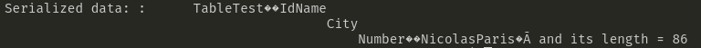

# Objects Serialization

Today I want to validate the concept of objects (Structs) serialization and it's possibilities, regarding data structure and how it would work if I had a complex data structure with columns definitions. The problem is that I don't kwnow how it might work. Therefore, I want to research a little bit of this subject and combine the research results with some small code testing.

## Why am I researching serialization?

The answer to this question is simple. Since I can store an array of bytes in the binary tree, I want to test if I can serialize a complex structure, whose fields would be analog to a table, containing columns. One of the problems is the serialization itself, the other one is the structure that will hold values regarding some specific structure.

When an user declares a create table function in a SQL Statement, he/she uses normally the following:

```SQL
-- Example of SQL STATEMENT
CREATE TABLE IF NOT EXISTS some_table (
    id INT PRIMARY KEY,
    createdAt DATETIME,
    name CHAR(100)
)
```

Note that the composition of a table is based on the columns that it can store and it's types, in addition to other possible constraints (Composite key). That is the definition of a table. But every row of this declared table will be stored inside a binary tree file as an array of bytes, and the key point here is to know how to serialize and deserialize it in order to read and write table data.

Another aspect of a row serialization is: What if I want to get only one column of the data, let's use the previous table as our example, if we want to get the column **name** of the table **some_table**, we would write some query, let's say 

```SQL
SELECT name
FROM some_table
``` 

The database would ask the table accessor to read data out of the binary tree file, and get only the name field. If we serialize the entire struct, for instance, a struct with the same fields

```go
type some_table struct {
    id int
    createdAt uint64
    name string
}
```

when reading data, the retrieved data would be the whole struct, and thinking about efficiency in storing and retrieving data, getting only what is required would be the best option, but not the easiest.

**Other Problem -- Tables are variables**

Yes, tables are variables, that means, when the user defines a table being composed of three columns with different data types, we cannot create a struct definition in execution time, we must assemble that table with some sort of built in structure, and that is the key point of it. Anyway, if this struct becomes huge, a single row would have so many bytes used just to store a small portion of information. Therefore, the prove of concept and evaluation of bytes usage of golang package serialization and my own serialization will be full of value.

## The Gob Package

I've researched for a while and encountered some options to solve my serialization problem. One of them is the encoding/gob package, that has serialization methodes for structures, which is exactly what I am looking for.

As my first test, I'll try to serialize (convert a struct into byte array), for that, I'll create a struct called TableTest with the fields **id**, **name**,**city**,**number**

```go
type TableTest struct {
    id int
    name string
    city string
    number int
}
```

The main function originated for the test purpose is shown below:

```go
package main

import (
	"bytes"
	"encoding/gob"
	"fmt"
)

type TableTest struct {
	Id     int
	Name   string
	City   string
	Number int
}

func main() {
	// Create an instance of the Person struct
	row := TableTest{
		Id:     1,
		Name:   "Nicolas",
		City:   "Paris",
		Number: 123456,
	}

	// Create a new buffer to write the serialized data to
	var b bytes.Buffer

	// Create a new gob encoder and use it to encode the person struct
	enc := gob.NewEncoder(&b)
	if err := enc.Encode(row); err != nil {
		fmt.Println("Error encoding struct:", err)
		return
	}

	// The serialized data can now be found in the buffer
	serializedData := b.Bytes()
	fmt.Printf("Serialized data: %s and its length = %d\n", serializedData, len(b.Bytes()))
}

```

The output obtained was the following:



Would be possible to serialize an array of my struct? Let's test it. Instead of using row as a struct, I'll modify it's name and content to fit an array of TestTable structs with only one struct in it.

```go
// Create an instance of the Person struct
    rows := make([]TableTest, 1)
	rows[0] = TableTest{
		Id:     1,
		Name:   "Nicolas",
		City:   "Paris",
		Number: 123456,
	}
	rows[1] = TableTest{
		Id:     2,
		Name:   "John",
		City:   "London",
		Number: 789456,
	}
	// Create a new buffer to write the serialized data to
	var b bytes.Buffer

	// Create a new gob encoder and use it to encode the person struct
	enc := gob.NewEncoder(&b)
	if err := enc.Encode(row); err != nil {
		fmt.Println("Error encoding struct:", err)
		return
	}

	// The serialized data can now be found in the buffer
	serializedData := b.Bytes()
	fmt.Printf("Serialized data: %s and its length = %d\n", serializedData, len(b.Bytes()))
}

```

As result, it's possible to also serialize an array of a struct type, showing that this kind of serialization is really versatile, although the bytes usage is greater than if it were directly serialized, and that can be counted easly. We have four fields, the first one is an integer, which is 32 bits or 4 bytes long, we have two of this variable, and two strings, summing what would be 20 bytes of raw data, with the overhead of the basic structure it becomes 86 for one item, and if it's an array of only one item it becomes 124. 

For deserializing, the oposite must be done. To validate this process, I've added another code part after the serialization refered to deserialization.

```go
// Create a new buffer from the serialized data
	c := bytes.NewBuffer(serializedData)

	// Create a new gob decoder and use it to decode the person struct
	var deserialized []TableTest
	dec := gob.NewDecoder(c)
	if err := dec.Decode(&deserialized); err != nil {
		fmt.Println("Error decoding struct:", err)
		return
	}

	// The person struct has now been deserialized
	fmt.Println("Deserialized struct:", deserialized)

```
The result is exactly what I've serialized before, as shown below:


Even though this process of serialization requires more bytes to be done than It would if I just inserted every field separatedly, it can represent exactly a Go Struct, which provides much more flexibility when working with structured and not structured data. What type of struct should I build in order to guarantee flexibility, reusability and a not complex solution? That will be done on the next diary.