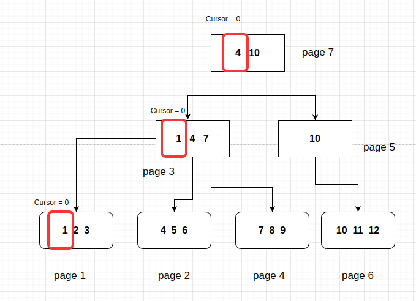

# The Crawler - What is it?

The name comes from my laziness in thinking of structure names and I based it on the search method of web crawlers, which perform indexed searches on the web. The idea is similar, however, instead of the web, there are pages of binary trees.

Up until now, it is possible to retrieve data from binary trees. However, we are unable to perform distance searches. How come? We are unable, for example, to search for keys between 1 and 31, unless we read all the items in the binary tree; and even then that is not possible. That is why this new structure came to light.

# Why implement it?

To be quite direct, it is to enable the use of **Range** searches and, later, to enable the use of queries.

# How does it work?

Before I begin, I would like to say that I always forget to save the figures I make from previous chapters and have to redo them, taking much more time than I would like to complete my diaries. This is already the fifth time I need to use a figure from the binary tree and have to rebuild everything again. I was just venting.

Let's imagine that we have a binary tree with some lines from a table saved in it:


To retrieve the information, we have to access each sheet in this file. But how do we know which pages are in order to do this?

I thought about this question for a long time. One solution I implemented within binary trees was to map all the pages of the tree and then obtain all the respective sheets and page numbers. Disadvantages of this implementation: Accessing all the pages of the file will make the system very slow the larger the database. (I even have to refactor the binary tree to improve this access issue).

As we know, for each leaf there is an access path passing through all the nodes. These nodes can be saved somewhere to later serve as a guide to where I am in the tree, right?

I decided to follow this premise. Using the figure above, we know that, to get to the page where I find the value of key 2, I need to go through pages 7 and 3. To store this history of the nodes I went through, I decided to create a variable called *Net*, representing a network of connections, being an array of **TreeNodes**.

In other words, each position in this *Net* array represents a layer of my binary tree. Cool! But to iterate through all the leaves of the tree, I also need to save the current index of each leaf where the tree is located, right? Of course, and for that we have another variable called *Cursor*, which is an array of integers for the indexes.

It seems that the idea is becoming clearer. Each Crawler will be able to search for information in different binary tree files, so this structure must also have a pointer to the binary tree in which it searches for information. From this, we have the first version of our structure:

```go
type BTreeCrawler struct {
	bTree            *BTree
	Net              []TreeNode
	Cursor           []int
}
```

## Example of operation for Scan

Try to understand the idea with an illustration and the step-by-step of each stage. Using the previous figure of our binary tree again, we want to scan this table, that is, read all the items within it. To do this, we instantiate a **BTreeCrawler** structure pointing to the first leaf.

**Method to Search for the First Item**

```go
/*
Function to go directly to the first list and first item, usefull when dealing with requests
that are not in index and all values must be evaluated
*/
func GoToFirstLeaf(tree *BTree) *BTreeCrawler {
	crawler := newBTreeCrawler(tree)
	rootAddr := tree.GetRoot()
	page := tree.Get(rootAddr)
	// While loop to find the leaf
	for {
		if page.GetType() == TREE_NODE {
			crawler.Net = append(crawler.Net, page)
			crawler.Cursor = append(crawler.Cursor, 0)
			// Get the next page
			page = crawler.bTree.Get(page.GetNodeChildByIndex(0).GetAddr())

		} else {
			crawler.Net = append(crawler.Net, page)
			crawler.Cursor = append(crawler.Cursor, 0)
			crawler.CurrentKeyValues = getAllLeafKeyValues(&page)
			break
		}
	}

	return crawler
}
```
A pointer to this **BTreeCrawler** structure is returned, which has the following values ​​for the *Net* and *Cursor* fields

```go
// Representation of BTreeCrawler field values
Net := []TreeNode{TreeNode{page:7}, TreeNode{page:3}, TreeNode{page:1}}
Cursor := []int{0,0,0}

```
Isn't it interesting? In the *Net* array, the pages accessed are listed sequentially until reaching the last page (Sheet), number 1, which contains the lines we want to access. The elements of the *Cursor* field contain the indexes of each page. How so?

See the figure below, where the elements marked in red represent the current Cursor indexes for each respective page up to our first sheet.



In each sheet, cursor = 0 corresponds to key 1. If we advance the cursor to the next item in the sheet, that is, key two, the new cursor values ​​are as follows:

```go
Cursor := []int{0,0,1}
``` 


Moving forward, we reach item 7. Our indexes in the *Cursor* variable are as shown below:

```go
Cursor := []int{0,2,0}
```

Isn't it simple? I believe that this implementation is much more direct and simple than the one I had implemented for the binary tree. In the near future, I will also refactor the binary tree.

Anyway, I need to materialize this idea in methods. To facilitate our navigation between the values ​​in the leaf, I created two structure methods, **Next()** and **Previous()**, which are used to navigate through our keys saved in the leaves.

To return the value of the current position of the Crawler, I created the structure method **GetKeyValue**, which returns a pointer to the struct **BTreeKeyValue**.

The implementation of each method is described below:

```go
type BTreeCrawler struct {
	bTree            *BTree
	Net              []TreeNode
	Cursor           []int
	CurrentKeyValues []LeafKeyValue
}

/*
Same as Next() but goes to the previous key value in the bTree
*/
func (crawler *BTreeCrawler) Previous() error {
	if len(crawler.Net) == 0 {
		return fmt.Errorf("no more keys")
	}

	reachedEnd := true
	// If it has reached maximum
	for i := 0; i < len(crawler.Net); i++ {
		if uint16(crawler.Cursor[i]) != 0 {
			reachedEnd = false
			break
		}
	}

	if reachedEnd {
		return fmt.Errorf("no more keys")
	}

	lastNode := crawler.Net[len(crawler.Net)-1]
	lastNodeIdx := crawler.Cursor[len(crawler.Cursor)-1]

	if lastNodeIdx == 0 {
		removeLastIdx(crawler)
		crawler.Previous()
	} else {
		// If it is not the last key in leaf, we just decrement the Cursor
		crawler.Cursor[len(crawler.Cursor)-1]--

		if lastNode.GetType() == TREE_NODE {
			nextIdx := lastNodeIdx - 1
			nextNode := crawler.bTree.Get(lastNode.GetNodeChildByIndex(nextIdx).GetAddr())
			crawler.Net = append(crawler.Net, nextNode)
			crawler.Cursor = append(crawler.Cursor, int(nextNode.GetNItens())-1)

			// Update the current key values
			if nextNode.GetType() == TREE_LEAF {
				crawler.CurrentKeyValues = getAllLeafKeyValues(&nextNode)
			}
		}
	}

	return nil
}

func (crawler *BTreeCrawler) Next() error {
	if len(crawler.Net) == 0 {
		return fmt.Errorf("no more keys")
	}

	reachedEnd := true
	// If it has reached maximum
	for i := 0; i < len(crawler.Net); i++ {
		if crawler.Net[i].GetNItens()-1 != uint16(crawler.Cursor[i]) {
			reachedEnd = false
			break
		}
	}

	if reachedEnd {
		return fmt.Errorf("no more keys")
	}

	lastNode := crawler.Net[len(crawler.Net)-1]
	lastNodeIdx := crawler.Cursor[len(crawler.Cursor)-1]
	// If it is a leaf, we need to find the next leaf
	// If it is the last key in leaf we need to remove it from the net and call next again
	if lastNodeIdx == int(lastNode.GetNItens()-1) {

		removeLastIdx(crawler)
		crawler.Next()
	} else {
		// If it is not the last key in leaf, we just increment the Cursor
		crawler.Cursor[len(crawler.Cursor)-1]++
		if lastNode.GetType() == TREE_NODE {
			nextIdx := lastNodeIdx + 1
			nextNode := crawler.bTree.Get(lastNode.GetNodeChildByIndex(nextIdx).GetAddr())
			crawler.Net = append(crawler.Net, nextNode)
			crawler.Cursor = append(crawler.Cursor, 0)

			if nextNode.GetType() == TREE_LEAF {
				crawler.CurrentKeyValues = getAllLeafKeyValues(&nextNode)
			}
		}
	}

	return nil
}

/*
Get actual BTreeKeyValue in the crawler
*/
func (crawler *BTreeCrawler) GetKeyValue() *BTreeKeyValue {
	if len(crawler.Net) == 0 {
		return nil
	}

	leaf := crawler.Net[len(crawler.Net)-1]

	// It is a linked list
	if leaf.GetLeafHasSeq() > 0 {
		key := leaf.GetLeafKeyValueByIndex(uint16(0)).key
		value := getAllBytesFromSequences(crawler.bTree, leaf)

		return &BTreeKeyValue{
			Key:   key,
			Value: value,
		}
	}

	keyValueIdx := crawler.Cursor[len(crawler.Cursor)-1]
	kv := crawler.CurrentKeyValues[keyValueIdx]

	return &BTreeKeyValue{
		Key:   kv.key,
		Value: kv.value,
	}
}
```

**Observations and Changes**

Notice that an additional field has been inserted into the **BTreeCrawler** structure, which is CurrentKeyValues. But why is it there? Well, we know that the leaves have a **GetLeafKeyValueByIndex** method, which returns a pointer to the **LeafKeyValue** structure. However, this method is not very efficient, since it needs to read the sequence of bytes and then form an array with these objects.

To speed up this process and for this mechanism to be done only once, every time the current leaf is changed, we read all the Key Values ​​saved in it and place these values ​​in the *CurrentKeyValues* variable. So, to retrieve the data from the current leaf, we no longer access the methods of the **TreeNode** struct, but rather the values ​​saved in our new field.

### Explanation of the methods

For both the **Next** and **Previous** methods, the logic is the same, what changes is the direction of navigation in the sheets, but here we go:

1. Validates if the length of the *Net* field is zero and returns an error
2. Checks if we are already at the last element of the page (in the case of the next method) and returns an error saying that there is no more data ahead
3. If it is not the last total index of the tree, the system checks if it is the last index of the current sheet, if so, it removes the last indexes of the arrays and recursively calls the method itself
4. In the last case, the system checks if the last object of the *Net* field is a sheet, if not, it performs the search and inserts the respective sheet, otherwise, it increments the index of the *Net* and *Cursor*, advancing the Crawler one position

To retrieve the values ​​from within the **BTreeCrawler** we use the **GetKeyValue** method that works as follows: simple:

1. Checks if the current sheet is a linked list (has bytes greater than the total size of the sheet) and performs its search
2. If not, reads from the *CurrentKeyValues* array of the respective index position in *Cursors* and *Net*

# What comes next?

Given the implementation of this functionality of navigating through the sheets, we can move on to our table methods and finally generate our **Range** function, which searches for data based on conditions of greater than, less than, greater than equal, etc. The next chapter covers the construction and idea of ​​this method.