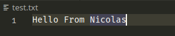

# O início da jornada

Às vezes, enquanto trabalho em projetos, sinto que estou jogando um RPG, onde tenho algumas missões pra cumprir para desbloquear novas missões, ganhar experiência e reunir novos equipamentos, tudo isso para me permitir enfrentar situações novas e mais desafiadoras.

Acho que gosto muito dessa sensação de RPG em desenvolvimento, e isso é algo que me motiva a continuar avançando e aprendendo novos assuntos. Eu devo confessar que recentemente estava me sentindo chateado e desmotivado, havia algumas coisas na minha vida que estavam me preocupando, isso é normal, as preocupações fazem parte da nossa vida, apesar disso você tem que se manter positivo e trabalhar para afastar essas preocupações e trazer alegria para sua vida, bom, pelo menos isso é o que sempre tento fazer.

Entre os problemas que terei que enfrentar no final de 2023 está o meu tédio nas horas vagas. Sou um cara muito ativo, faço academia, assisto animes, mas também gosto de me envolver em projetos de programação ou engenharia, não importando muito o que seja, contanto que eu me mantenha animado, fico fazendo o projeto na maior felicidade.

Sabe, também preciso de dinheiro para mim e para minha família, minha esposa está grávida e tenho muitas contas para pagar, estamos reformando nosso apartamento para receber o bebê. Estou investindo muito do meu tempo livre na construção de uma plataforma SaaS (que ainda está em desenvolvimento) para serviços contábeis, o projeto em si é interessante na perspectiva de software e arquitetura de nuvem e também na perspectiva de dinheiro, mas está me deixando muito cansado, e no sentido de raciocínio lógico não é tão desafiador.

Algumas pessoas apenas me dizem para focar diretamente no que te dá dinheiro, mas fazendo isso, com todas as situações da minha vida agora, comecei a ficar muito estressado e chateado, desanimado. Tenho que recuperar minha energia para, então, voltar a me focar em ganhar dinheiro. Não é apenas construindo um software que se fica ganha dinheiro, a parte mais difícil vem depois que se constrói ele, a venda e manutenção, empresa.

Surgiu então a ideia de um banco de dados. Por que não gastar tempo construindo algo desafiador e também aprender algo novo? Combinei a linguagem Golang e o projeto de banco de dados para ser meu parceiro de tempo livre por um tempo. E como eu esperava, mergulhei fundo no projeto desde o início.

# Mãos a obra - Primeiro dia

Lembro que na Universidade fiz alguns testes e pequenos projetos referentes a Estruturas de Dados, como Lista Encadeada, Árvore Binária, Grafo, entre outros. Desde que comecei minha carreira como desenvolvedor não tive tantas oportunidades de implementá-los na vida real (projetos reais), embora façam naturalmente parte da nossa vida (goste você ou não). Talvez seja por isso que as big techs se preocupam tanto com esse tipo de conhecimento em suas entrevistas, quem sabe um dia você possa implementá-las?

Eu sabia que os arquivos do banco de dados poderiam ser semelhantes a algumas estruturas de dados e, lendo mais sobre bancos de dados, percebi que era verdade. A implementação de estruturas de dados em arquivos não só é possível como também muito utilizada na indústria de software e em base de dados. Esse é o caso do Btree -- Árvore Binária.

### O BTree e o que é isso

A BTree ou Árvore Binária é uma estrutura de dados usada para armazenar dados (Sério?), mas o ponto chave é como ela a armazena. Funciona como uma árvore, tem nós e folhas. A árvore também possui algumas limitações, como número máximo de membros dentro de um nó ou folha, os valores devem ser ordenados, a árvore deve permanecer balanceada para evitar buscas lentas conforme a árvoce cresça.

Se você quiser ler um bom artigo sobre Btrees e os tipos de árvores que existem, basta conferir este [link](https://builtin.com/data-science/b-tree-index).

Normalmente todos os exemplos na internet são feitos usando ponteiros de memória, o que não é o nosso caso de uso, a árvore que estamos prestes a construir é baseada nas informações do disco. A ideia é bastante semelhante, mas em vez de endereçar ponteiros de memória para nós, iremos endereçar uma página de arquivo, louco não?.

### Como isso funcionaria?

O sistema operacional fornece API para acesso aos arquivos, através do seu File System. Em outras palavras, podemos acessar dados do disco, ler, escrever, modificar, salvar arquivos e assim por diante.

Os dados de um banco de dados são gravados em um ou mais arquivos, mas os dados não ficam lá aleatoriamente, eles têm uma ordem, estão divididos corretamente para facilitar o acesso a eles.

Você já leu um livro? Normalmente os livros possuem índices, que demonstram onde encontrar os capítulos ou alguma parte específica deles. Você lê qual é a página que deseja acessar no índice, digamos o **Capítulo 2** de um livro e vai diretamente para lá, em vez de ficar virando as páginas até chegar a essa página. É muito mais rápido que o processo normal de virar a página.

Imagine isso agora para um banco de dados que possui milhões, às vezes bilhões ou mais linhas em uma tabela. Como acessá-lo rapidamente? Como um computador acessa apenas uma página específica de um arquivo, sem trazer todos os bytes do arquivo para a memória?

Essa é a magia do banco de dados: acessar a página certa para obter rapidamente os dados certos.

### Primeiro Objetivo

Sabendo que devo construir um Btree baseado em disco e separar o arquivo em páginas, tenho que fazer alguns testes. E esses testes exigem algum entendimento da linguagem que desejo usar (Golang) para construir o banco de dados. Então decidi dividir minhas primeiras tarefas em três diferentes:

- Aprender a API Golang para gerenciar arquivos
- Pesquisar e entender mais sobre o tamanho da página do arquivo
- Como carregar apenas uma parte específica de um arquivo, digamos, do byte 200 ao 400?

#### Primeiro dia - API Golang para arquivos

Vamos codificar agora. Eu sou novo na programação Go. Para ser sincero, baixei o livro oficial do Go e li alguns capítulos básicos. Prefiro experimentar algumas implementações e ver o que sai.

**PS: Alguns códigos gerados aqui não estarão presentes nos commits, pois foram utilizados apenas para provar conceitos e testar funções**

Para fins de teste, iniciei um novo arquivo em golang **main.go** com o nome do pacote **main** e criei uma função vazia **main**

```go
package main

func main() {
    // I'll implement the code here
}
```

Até aí tudo bem, mas não sei como importar pacotes externos, nem mesmo pacotes internos. Usando o site mais famoso para isso, o famoso **stackoverflow**, li que você deve usar a instrução **import** com o nome da biblioteca que deseja usar. Vamos importar a biblioteca os, acho que é a certa para importar, e usar o método para criar um arquivo, normalmente é o método **Open** presente em muitas outras linguagens também.

Eu estava certo, existe uma função pública na biblioteca **os** do Golang que nos permite criar um arquivo. Então escrevi o seguinte código:


```go
package main

import "os"

func main() {
    // I'll implement the code here
    fileName := "/home/nicolas/Desktop/nicolas/projetos/monvandb/text.txt"
    // Filename, modes for opening file Create (if doesn't exist and Read Write)
    // And also permissions for file
    fp, err := os.OpenFile(fileName, os.O_CREATE|os.O_RDWR, 0666)

    if err != nil {
        panic("Could not create file")
    }

    fp.Write([]byte("Hello From Nicolas"))

    defer fp.Close()
}
```

Podemos ver que o arquivo foi criado corretamente e também que a string escrita no arquivo está correta




Ok, acho que foi muito fácil, já que a API é semelhante a todas as outras linguagens, isso não é novidade para mim. Mas digamos que eu tenha um arquivo com 4.096 bytes e queira ler os primeiros 100 bytes sem carregar o restante do arquivo na memória, como posso fazer isso?

Uma hipótese é usar a biblioteca **os** também, vamos ver se funciona. Usando a mesma função OpenFile, podemos acessar os dados salvos no arquivo, mas quero acessar os primeiros 100 bytes.

Primeiro de tudo, vou criar um array de bytes de tamanho 4096, concatenando a mesma frase *Hello From Nicolas* seguida de várias hastags *#*, depois vou gravá-la no arquivo, usando o mesmo script

```go
package main

import "os"

func generateByteArray() []byte {
	header := []byte("Hello From Nicolas")
	// Create new empty 4096 byte array
	mArray := make([]byte, 4096)
	// Copy header to mArray
	copy(mArray[:len(header)], header)

	// fill out the rest with hashtag
	for i := len(header); i < len(mArray); i++ {
		mArray[i] = byte('#')
	}

	return mArray
}

func main() {
    // I'll implement the code here
    fileName := "/home/nicolas/Desktop/nicolas/projetos/monvandb/text.txt"
    // Filename, modes for opening file Create (if doesn't exist and Read Write)
    // And also permissions for file
    fp, err := os.OpenFile(fileName, os.O_CREATE|os.O_RDWR, 0666)

    if err != nil {
        panic("Could not create file")
    }

    fp.Write(generateByteArray())

    defer fp.Close()
}
```

Depois que o arquivo for atualizado, devo escrever algum código para ler os dados do arquivo.


```go
func main() {
	// I'll implement the code here
	fileName := "/home/nicolas/Desktop/nicolas/projetos/monvandb/test.txt"
	fp, err := os.OpenFile(fileName, os.O_CREATE|os.O_RDWR, 0666)

	if err != nil {
		panic("Could not create file")
	}

	// Output with the size that we want to read
	output := make([]byte, 18)
	_, err = fp.ReadAt(output, 0)

	if err != nil {
		panic("Could not read file")
	}

	// print readData
	fmt.Printf("First 18 characteres = %s\n", output)

	defer fp.Close()
}
```

Também retornando Hello From Nicolas, o que era esperado. Não acho que usar os.OpenFile seja a maneira correta de acessar arquivos quando modificações constantes continuam acontecendo. O sistema operacional solicita recursos ao kernel para acessar arquivos e outros periféricos. Por que não usar diretamente o Kernel para ler bytes de arquivos? A resposta para essa pergunta fica para a posteridade, com todos os testes feitos hoje, já tenho uma noção de como devo utilizar a API do Golang para arquivos.

#### Dia Dois - Entendendo mais sobre Sistemas de Arquivos

Ler livros nem sempre foi minha paixão. Quando eu era mais jovem não tinha o hábito de ler. Por curiosidade, experimentei a leitura, comprei alguns livros de história, e um deles era um livro de resolução de mistérios. Depois de terminar o primeiro livro (O Mistério) me apaixonei pela leitura. A sensação de mistério começando a se revelar é emocionante, você literalmente não consegue parar de ler quando essa sensação surge.

E o mesmo sentimento surge quando aprendo novas matérias para resolver problemas ou construir projetos. Obviamente, depois que comecei a pesquisar sobre banco de dados, arquivos, tive aquela sensação de revelar os mistérios em minha mente junto com a emoção. Eu precisava saber mais sobre arquivos e como o sistema operacional lida com eles. Como minimizar a chance de corromper um arquivo durante falhas inesperadas.

Idealmente, ao modificar um arquivo, as operações devem ser atômicas de acordo com alguns blogs e tópicos que encontrei. Mas como posso garantir que todas as operações sejam atômicas? O que isso significa? Como funciona o processo de gravação de arquivos nos bastidores?

Penso que para responder a esta pergunta aprenderei como a máquina lida com este tipo de tarefa.

**Atomicidade**

As operações atômicas são definidas como operações que não podem ser interrompidas por nenhum outro processo ou tarefa. Conseguir isso na operação do sistema de arquivos, como Write, ou Read, pode ser às vezes difícil.

Uma boa maneira de modificar arquivos com uma única operação atômica é renomear o arquivo. Sim, a ideia é simplesmente ter sempre uma cópia do arquivo original (Banco de Dados), e sempre que quisermos submeter alterações no banco de dados original, o nome do arquivo é alterado. Esta ação é sempre atômica, ou seja, caso ocorra alguma falha durante o processo, seja a operação realizada ou não, o arquivo não será corrompido.

**Tamanho da página**

Como ler e gravar dados em disco significa mais operações em disco, queremos garantir que essas operações sejam realizadas de forma otimizada. Mas como? Saber o tamanho da página do SO nos ajuda a determinar qual será o tamanho de nossas páginas utilizadas em nossa estrutura de dados.

Garantindo que as páginas tenham o tamanho da página do SO, não só temos um uso eficiente de memória pelo kernel e pelo sistema, mas também muitas mais vantagens, tanto para controle de simultaneidade, operações de disco, mecanismos de recuperação.

Se você tiver um sistema operacional semelhante ao Unix, usar *getconf PAGE_SIZE* exibirá o tamanho da página do seu computador.

#### Conclusão

Eu acreditava fielmente que as partes do projeto relacionados aos arquivos e File Management seriam sensíveis, mas não que houvesse tantas possibilidades e detalhes no assunto. Acredito que durante a construção do projeto terei cada vez mais modificações no código, para atender todos os requisitos apresentados no início do projeto.

Por enquanto, vou me concentrar em produzir as partes mais básicas do projeto para conseguir prosseguir com as ideias e, posteriormente, ir ajustando e refatorando o que precisar. A primeira parte é construir o BTree e suas operações básicas. Estou muito animado para iniciar este capítulo do projeto. Não tenho muita experiência com Golang, nem tenho a ideia fixa de como ele será implementado, mas farei assim mesmo.