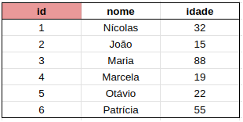
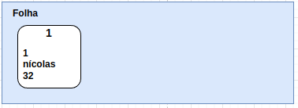
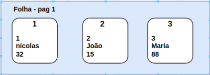
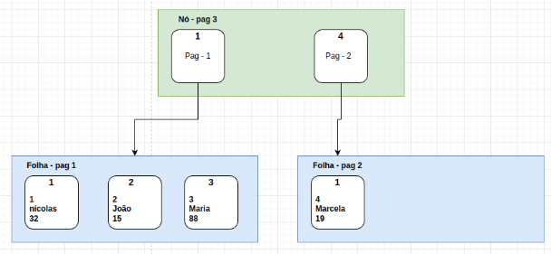
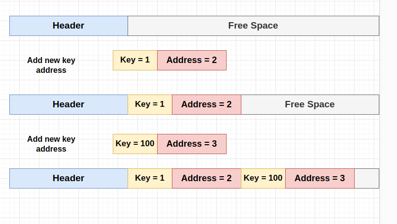

# A ideia

Antes de começar a implementar ou mostrar qualquer coisa sobre este assunto, é interessante visualizar o que quero construir e como isso se encaixa numa solução de banco de dados.

Como o intuito é salvar e trabalhar com dados tabulares, essas linhas de tabela devem ser salvas em algum arquivo em algum lugar no computador, normalmente com a extensão .db, ou algo do tipo.

Se tentarmos abrí-los com um editor de texto não conseguimos entender quase nada visualmente. Isto se dá pois os dados são, na verdade, informações binárias estruturadas de alguma forma que os desenvolvedores dos databases planejaram.

Pra quem já teve experiência com pandas, os dataframes (tabelas) podem ser salvos em diferentes formatos. No entanto, quando se deseja ler uma informação específica desse arquivo, o documento todo é lido e trazido para a memória e, assim, buscas em memória são feitas para, então, a informação ser efetivamente trazida.

Em arquivos de bancos de dados essa busca é transparente, a informação específica é trazida diretamente do arquivo sem ter que carregá-lo todo para a memória. Mas esta característica específica me leva à seguinte pergunta: "Como fazer isso?".

**O arquivo**

Já pararam para pensar em por que as tabelas de um banco de dados relacional precisam de índices? A resposta está diretamente ligada na estrutura de dados usada para montar o arquivo.

As árvores binárias ou B+Tree no nosso caso, utilizam algum tipo de informação como índice, seja um número, um texto, uma data; algo que identifique um registro dentro da estrutura de dados. Vamos imaginar o exemplo fictício da minha tabela de usuários abaixo:



A tabela contém três colunas: id; nome; idade, sendo o id a coluna índice. Digamos que seja do tipo int (inteiro). Quando inserimos esses dados, o que ocorre nos arquivos?

Eu gosto de fazer analogias com as coisas que trabalho para que fique mais fácil de visualizar as soluções. Um arquivo de banco de dados torna a busca rápida porque funciona basicamente como um livro, contendo índice, que mostra onde encontrar as páginas de cada capítulo, e as páginas, que armazenam informações diversas, podendo ser outros índices ou informações de textos.

O arquivo em disco também é separado por páginas, e cada uma possui um tamaho específico, podendo ir de 512 bytes até muito mais, alcançando algumas vezes alguns GB. 

Vejam que interessante, cada página do arquivo corresponde a uma estrutura da árvore binária, sendo um nó ou uma folha.

**Mas o que difere um nó e folha? Quais são suas funcionalidades?**

Os Nós são páginas de disco que contém informações sobre outros nós ou folhas, enquanto que as folhas são páginas de disco que contém efetivamente as informações que devem ser salvas, no caso de tabelas, as linhas.

Vamos usar a tabela da figura 1 para ilustrar a nossa árvore binária incrementando conforme as linhas da tabela são inseridas. Iniciamos com um arquivo vazio, e a primeira linha da tabela com id = 1 é adicionada no arquivo. 

Como o arquivo está vazio, ao inserir a primeira linha, uma folha surge e a chave 1 com as informações é adicionada.



Neste exemplo o número máximo que uma folha consegue comportar é de três linhas. No entanto, na prática ocorre que o limite de dados para a folha está relacionado ao tanto de bytes livres que ela possui. O mesmo ocorre para os nós que ao invés de armazenarem informações de linhas, armazenam endereços de outras páginas.

Dando continuidade, ao adicionar à folha a chave 2 e 3, resulta na seguinte forma:



Quando a quarta linha é inserida, a árvore necessita crescer, portanto, uma nova folha deve surgir para comportar novos dados. Este processo é chamado de quebra (split).

Além da nova folha, uma página contendo a estrutura de nó também deve surgir, pois à partir de agora, nossa base de dados possui duas páginas de informação, portanto, é necessario uma página índice para indicar onde encontrar as linhas com os respectivos índices.



A entrada do nó como página raíz faz com que a busca por chaves específicas torne-se mais rápida. Por exemplo, se quisessemos buscar a chave dois, a primeira página acessada seria o nó da página 3, tendo sua primeira informação como chave igual a 1 na página 1. 

Neste caso e nesta implementação, como a chave 1 é menor ou igual à chave que estou buscando, o sistema supõe que a chave dois esteja nesta folha. Caso não estivesse, o sistema tentaria encontrá-la em alguma outra folha disponível, até que não tivesse mais opções.

Esta mesma ideia se propaga para um universo infinito de páginas. Conforme a base de dados e a tabela vão crescendo, o número de páginas também e, consequentemente, o tamanho do arquivo.

Vale lembrar que neste exemplo ilustrativo utilizei informações concretas e com tipos de dados concretos, mas na verdade os valores salvos são representações binárias de tipos de dados. O índice pode ser um inteiro, texto, ponto flutuante, etc, enquanto que o valor também pode ser qualquer tipo de bytes sequenciais.

Para finalizar a ideia, todo arquivo de B+Tree corresponde a um índice de uma tabelae por isso que quando se cria uma tabela em um banco de dados SQL, é obrigatório o uso da chave primária.

Além disso, a página zero desses arquivos são descritos como página de cabeçalho, nas quais informações sobre qual a página raíz da árvore, tamanho das páginas, entre outras informações importantes, lá encontram-se.

Agora que temos um entendimento básico do que quero montar, bora fazer acontecer? Para isso se tornar realidade, precisamos estruturar nossos Nós e Folhas da árvore em Golang. Segue comigo que explico como fiz.

# Nós de árvore

O primeiro dia de implementação foi um dia comum. Meu trabalho diário não foi cansativo e resolvi começar a moldar o início do BTree. O conceito de árvore binária é uma estrutura de dados baseada em nós e folhas. Sei que existem vários tipos de árvores mas vou implementar a B+Tree, cujos nós são responsáveis por armazenar outros nós ou posições de folhas, enquanto as folhas armazenam Key-Values (Bytes).

Preparar uma estrutura de bytes para ser salva em uma página de arquivo é algo em que tive que pensar bem em como fazer. Normalmente me faço algumas perguntas antes de escrever algum código, e as perguntas foram as seguintes:

- A estrutura necessitará de mais de um tipo de disposição de bytes?
- Eles vão compartilhar algum tipo de informação?
- Que tipo de informação eu preciso?

Respondendo a primeira pergunta: **Sim**! como temos nós e folhas, temos que criar ambas as estruturas. Compartilhar informações entre elas seria bom, ambas devem armazenar informações sobre a página, seja endereços de nós, quantidade de itens, bytes livres ou até valores reais de dados. 

Acho que começar com essas informações básicas citadas acima para ambos é o suficiente. Creio que com a evolução da estrutura de árvore binária -- isso eu digo a longo prazo -- novas composições destas estruturas surgirão e haverão modificações. Mas não adianta tentar prever tudo antes de se vivenciar as dificuldades. Comecemos pelo básico

**Como criar e definir as estruturas**

A estrutura básica (funcional) de bytes não é uma tarefa difícil, mas deve ser feita com cautela. Trabalhar com IoT me deu uma boa ideia de como construir protocolos de dados para comunicação sem fio, construindo estruturas de dados a partir de arrays de bytes ou structs. A má notícia para mim agora é que tudo foi escrito em C naquela época, não em Golang.

Para quem tem experiência em codificação em C, o que desejo construir para a estrutura básica de dados é algo semelhante ao seguinte código C:

```C
#include <stdint.h>

struct Node {
    uint8_t type; // Node or Leaf
    uint8_t n_items; // Number of items stored
    uint16_t free_bytes; 
    uint64_t p_parent; // Pointer to parent address
}
```
A estrutura acima representa o cabeçalho básico para um Nó ou Folha, vamos chamá-los de Nó Nó e Nó Folha. Implementar algo semelhante em Golang seria:

```go
type Node struct {
    nodeType  uint8; // Node or Leaf
    nItems    uint8; // Number of items stored
    freeBytes uint16; 
    pParent   uint64 ; // Pointer to parent address
}
```

Golang também fornece tipos de struct, com algumas diferenças. Em C, a serialização de estrutura ocorre diretamente. Digamos que eu use malloc para alocar um tamanho de memória de página, neste caso 4.096 bytes. Quando eu converto para um tipo de struct, ele usa automaticamente a quantidade total de bytes que a struct precisa, e o restante fica livre para outra finalidade.

Em Golang também é possível serializar uma struct, mas não é tão direto como em C. Sabendo disso, e considerando que converter bytes para outro tipo de dados para convertê-los novamente e, depois, fazer algumas operações, ficaria lento para grandes operações de dados, decidi construir meu próprio processo de serialização para meus nós e folhas.

Pesquisei e vi que Golang possui duas bibliotecas utilizadas para lidar com arrays de bytes, *Binary* e *Bytes*, contendo funções para trabalhar diretamente com bytes e informações binárias.

## Golang Struct

Cada nó é uma página que corresponde a um array de bytes de tamanho fixo. Portanto, para construir nossa estrutura, precisamos preencher este array com as informações dos nós. Achei que seria uma boa ideia ter uma estrutura como esta, chamando-a de TreeNode:

```go
type TreeNode struct {
    data []byte
}
```

Essa estrutura contém apenas o array de bytes que carrega todas as informações de cabeçalho e itens da página, mas não tem outros campos justamente pelos motivos que citei sobre a serialização de estruturas em golang.

Em outras palavras, todo trabalho com os campos da estrutura TreeNode, ocorrerá manipulando-se diretamente os bytes dentro deste array. Cada um em sua posição específica. Bem legal, não? 

A desvantagem desse tipo de implementação é que precisamos construir todos os getters e setters para todas os campos específicos da nossa página, o que traz mais complexidade e verbosidade à minha solução. No entanto, prosseguirei com a solução desta forma.

# O nó nó

Não me inspirei hoje para criar algo fabuloso, então vou tentar fazer o básico. O nó nó deve ter um cabeçalho e também uma estrutura para salvar dados de nós ou folhas. Btrees normalmente requerem chaves que são usadas como índices para pesquisas. Que tipo de chave o bTree terá?

Normalmente o que vejo são colunas com números inteiros não negativos que aumentam automaticamente com o tempo, acho que a primeira abordagem seria usar um número inteiro. A chave pode se tornar enorme, então presumo que seja o maior tipo sem sinal disponível na linguagem: **uint64**.

Para cada chave armazenamos valor, mas no caso do nó nó, armazenamos um endereço, não um endereço de memória, mas um endereço de página, que também pode ser enorme, então assumimos que o endereço da página também é **uint64**.

Tendo em vista que há mais de um tipo de TreeNode, é necessário criar um enumerate para diferenciar o tipo de nó que estamos lidando. Uma maneira fácil de fazê-lo é utilizando a função iota do Golang, que automaticamente cria macros enumeradas.

```go
/* TreeNode implementation */
const (
	TREE_NODE = iota
	TREE_LEAF
)
```

Tendo nossa sctruct para o TreeNode e também os tipos de nós de árvore, chega a hora de pensar e construir o esquemático básico do nó e seus principais campos. Abaixo segue a lista da primeira versão dessa estrutura contendo informações dos do cabeçalho e estrutura do Nó:

**Cabeçalho**

- **type**: Tipo de Btree TREE_NODE ou TREE_LEAF **uint16**
- **nItems**: Indica quantos itens o nó possui **uint16**
- **freeBytes**: Indica quantos bytes livres o nó possui **uint16**
- **pParent**: Página referente ao nó pai (Caso precisemos) **uint64**
- **n * NodeStructure**: Esta é apenas uma representação para explicar que após os bytes pParent existem apenas dados relacionados a outros nós e endereços **Pode ter muitos bytes**
- **Estrutura do Nó**:
- - **key**: chave mais baixa da página referenciada **uint64**
- - **keyLen**: tamanho do array de bytes **key**
- - **addr**: Endereço da página **uint64**
- **Estrutura Nó Folha**
- - **leafHasSeq**: Indica que a folha tem sequencia de bytes em outra folha, utilizado para linhas que tem mais do que o limite da página em bytes uint16.
- - **leafHasSeqPointer**: Ponteiro da página que contém as outras informações da folha uint64. 
- - **n * Estrutura Folha**: Representa que após o campo leafHasSeqPointer, as informações da folha são adicionadas n vezes o número de itens.
- - **Estrutura Folha**:
- - **Key**: chave mais baixa da página referenciada byte[]
- - **KeyLen**: Tamanho da chave da página uint16
- - **value**: valores em bytes a serem adicionados ao índice key em byte[]
- - **valueLen**: tamanho em bytes do campo value

## Inserindo Informações no Nó

A ideia destes campos é armazenar variáveis para que o trabalho e manuseio dos dados dentro das páginas de nós e folhas fique mais fácil.

De forma ilustrativa, criei uma imagem para que mostra, de forma muito abrangente, como a estrutura de TreeNode se comportaria para adições de informações em seus bytes. O exemplo abaixo ilustra um Nó nó que inicialmente encontra-se vazio, mas depois recebe alguns dados referentes à outros nós:



O cabeçalho é fixo, composto pelos campos: tipo, nItems, entre outros; seguido por espaço livre usado para armazenar informações relacionadas aos principais endereços. 

Sempre que uma nova estrutura de endereço de chave é adicionada à página, o valor é concatenado à página após os cabeçalhos, a contagem de nItems é aumentada em um e o número de bytes livres diminui.

A mesma ideia se aplicaria aos pares de Key-Value do Nó folha, diferindo apenas pelo fato de que o número de bytes armazenados no campo valor é variável, portanto, para o caso das folhas, é necessário também armazenar a informação de qual o tamanho dos bytes dos valores.

## Primeira implementação

Como queremos construir nossa própria serialização por meio das informações da estrutura, devemos começar escrevendo getters e setters.

Para esta tarefa utilizarei o pacote binary, que nos permite trabalhar com bytes e escrever informações seja em little endian ou big endian. Usarei little endian, mas nada impede que alguém use big endian.

Antes de começar a escreve-los, decidi criar algumas variáveis de macros, que são escritas com a instrução const especificando o comprimento de cada informação em bytes, e também a posição em que essas informações começam nos arrays de bytes.

```go
// Example of const declaration
const (
	NODE_TYPE_LEN            = 2 // Length of node type field in bytes
	NODE_OFFSET_LEN          = 2 // Length of offset field in bytes
	NODE_N_ITENS_LEN         = 2 // Length of field n Itens in bytes
	NODE_FREE_BYTES_LEN      = 2 // Length of node free bytes field in bytes
	NODE_PARENT_ADDR         = 8 // Length of node parent address field in bytes
	NODE_P_KEY_LEN           = 8 // Length of node key len
	NODE_P_CHILD_ADD_LEN     = 8 // Length of node children address in bytes
	NODE_P_KEY_ADDRESS_LEN   = NODE_P_KEY_LEN + NODE_P_CHILD_ADD_LEN // Length key address len for node
	LEAF_HAS_SEQ_LEN         = 2 // Length of leaf has sequence field
	LEAF_SEQ_P_LEN           = 8 // Length of leaf sequence address field
	LEAF_KEY_LEN_LEN         = 2 // Length of leaf key lenght field in bytes
	LEAF_VAL_LEN_LEN         = 8 // Length of leaf val lenght field in bytes
	LEAF_SEQ_N_BYTES         = 2 // Length number of bytes in leaf sequence
	LEAF_SEQ_FREE_BYTES_SIZE = PAGE_SIZE - LEAF_SEQ_BYTES_OFFSET // Length of sequences free bytes size
)
```

As contantes acima são utilizadas para definir a localização de cada campo dentro do array de bytes, ao invés de usarmos números puros e deixarmos o código menos legível (Embora eu não tenha sido muito criativo com os nomes das constantes).

**Escrevendo getters e setters**

Eu ainda não havia escrito getters e setters em golang, mas já havia feito isso em diferentes linguagens, como: C, Java, JS, Python.

Li que é possível escrevê-los vinculados a alguma estrutura, ou seja, métodos de classe; ou escrever passando algum endereço de estrutura como parâmetro de função e modificar o que você deseja ali dentro.

Para ser sincero, eu misturei os dois tentando diferir algumas características da folha do nó e do nó, mas isso acabou sendo uma confusão e uma forma não padronizada de escrever código. Mas não é minha prioridade concertar isso agora, será uma tarefa para o futuro.

```go
func (n *TreeNode) GetType() uint16 {
	return uint16(binary.LittleEndian.Uint16(n.data[NODE_TYPE_OFFSET : NODE_TYPE_OFFSET+NODE_TYPE_LEN]))
}

func setType(n *TreeNode, nType uint16) {
	binary.LittleEndian.PutUint16(n.data[NODE_TYPE_OFFSET:NODE_TYPE_OFFSET+NODE_TYPE_LEN], nType)
}

// Example of use
var node TreeNode
type_of_node := node.GetType()

setType(&node, 1)
```

Aqui estão dois exemplos de como você pode usar métodos com estruturas. Tentei diferenciá-las, coloquei as funções públicas com os métodos struct e as funções privadas separadas, embora nem tudo siga esse padrão.

Para inserir números como uint16, uint32, uint64, foi utilizada a biblioteca binary.LittleEndian. Para a escrita de bytes genéricos, usa-se o método nativo copy.

**Obs: Os demais códigos foram omitidos, pois eram replicações muito similares aos exemplos apresentados na figura exemplo, no entanto, todos os campos da lista de informações da página foram implementados.**

**A função NewNode e NewLeaf**

Queria ter também uma função que me retornasse um TreeNode Nó e Folha vazio para serem usados na minha aplicação. Para quem está acostumado com orientação a objeto, seriam minha funções construtoras. 

Portanto, a criação de uma função para isso me pareceu uma boa ideia. O problema é que eu não sabia como inicializar uma struct contendo array de bytes como propriedade. 

Depois de alguns testes, descobri que existem algumas funções integradas que ajudam você a criar facilmente um objeto a partir de um tipo, são elas: funções make e new. Make é útil ao criar arrays de tipos, no meu caso, um array de bytes. 


```go
func NewNodeNode() *TreeNode {
	// Create a pointer to a new Node Structure
	nodeNode := &TreeNode{data: make([]byte, PAGE_SIZE)}
	// Set headers
	setType(nodeNode, TREE_NODE)
	setNItens(nodeNode, 0)
	setFreeBytes(nodeNode, PAGE_SIZE-NODE_FREE_BYTES_LEN-NODE_TYPE_LEN-NODE_N_ITENS_LEN-NODE_PARENT_ADDR)
	return nodeNode
}

```

## Tipos de nós e métodos de exclusão de inserção

Após finalizar a implementação de todos os getters e setters das estruturas, é hora de criar as funções que nos permitam inserir, excluir, atualizar e obter valores-chave e endereços de nossas páginas Nó e folhas.

A única restrição que existe dentro dos nós é manter todos os itens das páginas ordenados. Lembrando que quando menciono os itens das páginas significa os pares chave e valor para folhas e chave e endereço para os nós.

Manipular bytes em um array me pareceu uma operação exaustiva, por isso decidi simplificar a inserção deles, apenas adicionando os valores de bytes logo após offset do array sempre que uma nova informação era inserida dentro da folha. A parte da ordenação ficou totalmente a cargo da função de retornar os valores das folhas e nós.

De modo a facilitar a diferenciação dos itens salvos em nós e folhas, criei duas estruturas utilizadas respectivamente, que são: NodeKeyAddr, LeafKeyValue.


```go
type LeafKeyValue struct {
	keyLength   uint16
	valueLength uint64
	key         []byte
	value       []byte
}

type NodeKeyAddr struct {
	keyLen uint16
	key    []byte
	addr   uint64
}

```

O LeafKeyValue são os valores adicionados a uma folha, enquanto que os NodeKeyAddr são as informações adicionadas em nós.

Para os nós, precisamos apenas da chave key que é um array de bytes e também do KeyLen que é o comprimento do array de bytes da chave. Como o campo addr é um tamanho fixo, não é necessário especificar seu tamanho. Para o caso da folha, a única alteração é a adição do campo valuesLength e values que indica os valores (Linhas de tabela em array de bytes) e seu comprimento.

**Insert**

```go
func (n *TreeNode) PutNodeNewChild(key []byte, addr uint64) error {

	// Verify whether it will exceed total bytes
	aditionalLength := len(key) + 2 + 8
	if int(GetFreeBytes(n))-(aditionalLength) < 0 {
		return errors.New("exceeds total bytes")
	}
	keyLen := uint16(len(key))
	// takes offset
	offset := getNodeOffset(n)

	/*
		2B - Len of key
		Len of Key B - Key
		8B - Address
		Example:
		key = ["a","t","o","m","i","c"]
		addr = 157

		keyLen = 6 - Therefore the size will be 2B + 6B + 8B = 16B
	*/

	// Write len 2B
	binary.LittleEndian.PutUint16(n.data[offset:offset+2], keyLen)
	// Write Key (variable)
	copy(n.data[offset+2:offset+2+keyLen], key)
	// Write Address 8B
	binary.LittleEndian.PutUint64(n.data[offset+2+keyLen:offset+2+keyLen+8], addr)

	// Set new offset
	setNodeOffset(n, offset+2+keyLen+8)
	// Set new Free Bytes
	setFreeBytes(n, GetFreeBytes(n)-(2+8+keyLen))
	// Set NItems
	setNItens(n, n.GetNItens()+1)

	return nil
}

func (n *TreeNode) PutLeafNewKeyValue(key []byte, value []byte) error {
	aditionalLength := len(key) + 2 + 8 + len(value)

	if int(GetFreeBytes(n))-(aditionalLength) < 0 {
		return errors.New("exceeds total bytes")
	}
	keyLen := uint16(len(key))
	valLen := uint64(len(value))
	// takes offset
	offset := getNodeOffset(n)
	/*
		2B - Len of key
		8B - Len of value
		Len of Key B - Key
		8B - Value
		Example:
		key = ["a","t","o","m","i","c"]
		value = []byte("some value inserted in here")

		keyLen = 6 - Therefore the size will be 2B + 8B + 6B + 27B = 43B
	*/

	// Write keylen 2B
	binary.LittleEndian.PutUint16(n.data[offset:offset+2], keyLen)
	// Write valuelen 8B
	binary.LittleEndian.PutUint64(n.data[offset+2:offset+2+8], valLen)
	// Write Key (variable)
	copy(n.data[offset+10:offset+10+keyLen], key)
	// Write Address 8B
	copy(n.data[offset+10+keyLen:offset+10+keyLen+uint16(valLen)], value)

	// Set new offset
	setNodeOffset(n, offset+10+keyLen+uint16(valLen))
	// Set new Free Bytes
	setFreeBytes(n, GetFreeBytes(n)-(10+keyLen+uint16(valLen)))
	// Set NItems
	setNItens(n, n.GetNItens()+1)

	return nil
}
```

A ideia é simples. Para facilitar minha vida, criei outro campo chamado offset, que indica qual a posição do primeiro byte livre para ser a referência para novos bytes de entrada serem salvos. A diferença entre ambos é que o valor len de um LeafKeyValue é variável, portanto, possui um campo a mais referente ao comprimento dos bytes a serem salvos.

A cada novo item a ser adicionado, o sistema analisa o deslocamento e então armazena os dados após o deslocamento, atualiza a quantidade de itens na página e também atualiza o valor do deslocamento para o novo. Fazendo isso, não preciso fazer muitas contas e nem preciso criar uma solução lógica milagrosa para isso. Mas você pode me perguntar: **Como você garante que está ordenado?**

Na verdade não garanto nada ao inserir dados, apenas que os dados estão lá. Os dados ordenados vêm durante a leitura da página, conforme mostrado abaixo para métodos get:

```go
func getAllLeafKeyValues(n *TreeNode) []LeafKeyValue {
	nItems := n.GetNItens()
	r := make([]LeafKeyValue, nItems)
	baseOffset := LEAF_VAL_START_OFFSET
	for i := 0; i < int(nItems); i++ {
		kLen := binary.LittleEndian.Uint16(n.data[baseOffset : baseOffset+2])
		vLen := binary.LittleEndian.Uint64(n.data[baseOffset+2 : baseOffset+2+8])
		key := n.data[baseOffset+10 : baseOffset+10+int(kLen)]
		value := n.data[baseOffset+10+int(kLen) : baseOffset+10+int(kLen)+int(vLen)]
		r[i] = LeafKeyValue{
			keyLength:   kLen,
			valueLength: vLen,
			key:         key,
			value:       value,
		}
		// Add values to offset
		baseOffset += (int(kLen)) + int(vLen) + 2 + 8
	}

	sortLeafKeyValues(r)
	return r
}


func getAllNodeKeyAddr(n *TreeNode) []NodeKeyAddr {
	// Get number of items
	nItens := n.GetNItens()
	// Initiate return array
	r := make([]NodeKeyAddr, nItens)
	// Start always at the very beginning
	lastStart := NODE_P_KEY_ADDR_OFFSET
	for i := 0; i < int(nItens); i++ {
		// Get key Length
		kLen := binary.LittleEndian.Uint16(n.data[lastStart : lastStart+2])
		// Get key value in []bytes
		key := n.data[lastStart+2 : lastStart+2+int(kLen)]
		// Get key address
		addr := binary.LittleEndian.Uint64(n.data[lastStart+2+int(kLen) : lastStart+2+int(kLen)+8])
		r[i] = NodeKeyAddr{
			keyLen: kLen,
			key:    key,
			addr:   addr,
		}
		lastStart += 2 + int(kLen) + 8
	}

	sortNodeChildren(r)
	return r
}
```

A ideia de obter todos os dados é a mesma de armazenar, exceto pelo fato de ser feito de forma inversa, retornando um array do respectivo tipo, seja retornando um array de LeafKeyValues, ou NodeKeyAddress.

Depois de obter arrays em golang, podemos aplicar facilmente o método sort

```go
func sortNodeChildren(c []NodeKeyAddr) {
	sort.Slice(c, func(i, j int) bool {
		return bytes.Compare(c[i].key, c[j].key) <= 0
	})
}
```

Tive que criar o mesmo método para LeafKeyValue, e o código está ficando duplicado em algumas partes, o que não gosto, mas não é motivo de preocupação no momento.

**Excluir funções**

Excluir parte específica da matriz de bytes, especialmente quando não é um byte de comprimento fixo, pode ser uma tarefa difícil. Eu sei que esta implementação feita aqui não é algo especial e não é rápida como eu quero, mas é útil avançar com a primeira versão do meu bTree.

O que faço é não deletar nada, leio todos os valores de uma página (Node), removo a chave desejada, e depois armazeno tudo novamente no array renovado. Simples mas lento, uma das melhores alternativas é identificar a posição real do campo desejado na página, e copiar outros bytes para a sua posição, nomeadamente deslocando os bytes da direita para a esquerda.

Um exemplo do método implementado é mostrado abaixo:

```go
func (n *TreeNode) DeleteLeafKeyValueByKey(key []byte) {
	allLeafKeyValues := getAllLeafKeyValues(n)
	// Reset Node
	tmp := NewNodeLeaf()
	setParentAddr(tmp, n.GetParentAddr())
	setLeafHasSeq(tmp, n.GetLeafHasSeq())
	setLeafSeqPointer(tmp, n.GetLeafSeqPointer())
	for i := 0; i < len(allLeafKeyValues); i++ {
		if bytes.Equal(allLeafKeyValues[i].key, key) {
			continue
		}
		tmp.PutLeafNewKeyValue(allLeafKeyValues[i].key, allLeafKeyValues[i].value)
	}
	copy(n.data, tmp.data)
}
```

# Hora de seguir em frente

Depois de implementar tudo que cansei e precisava para avançar nesse assunto, quis começar a criar as funções crud da árvore binária, e farei isso. Percebi que poderia mesclar as duas estruturas **LeafKeyValue** e **NodeKeyAddress**, remover métodos duplicados para inserir, excluir, classificar e assim por diante. Farei isso mais tarde, para que seja mantido em um arquivo TODO.

Implementar o método delete diretamente nos bytes será muito mais rápido e melhorará a velocidade do meu software, embora eu deixe essa tarefa para mim no futuro.

As últimas considerações para este pacote é que vou escrevê-lo novamente usando algum padrão para nomenclatura e deixando-o menos detalhado, e a constante PAGE_SIZE poderia ser alterada para funcionar como uma PAGE_SIZE para cada arquivo bTree, esta informação seria armazenada no primeiro página do arquivo.