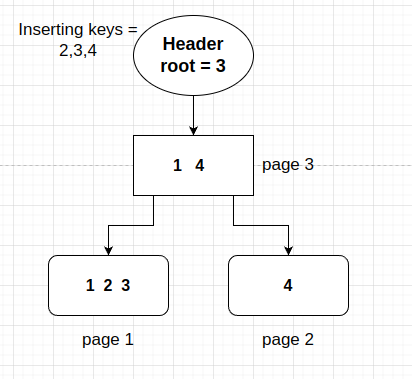
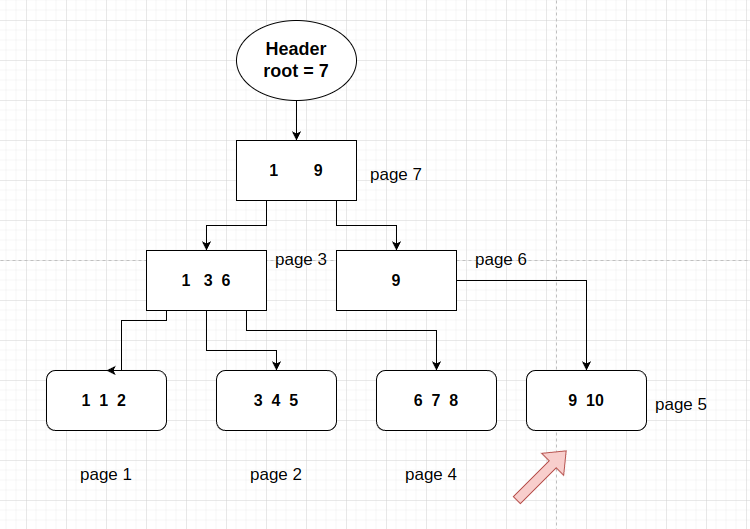
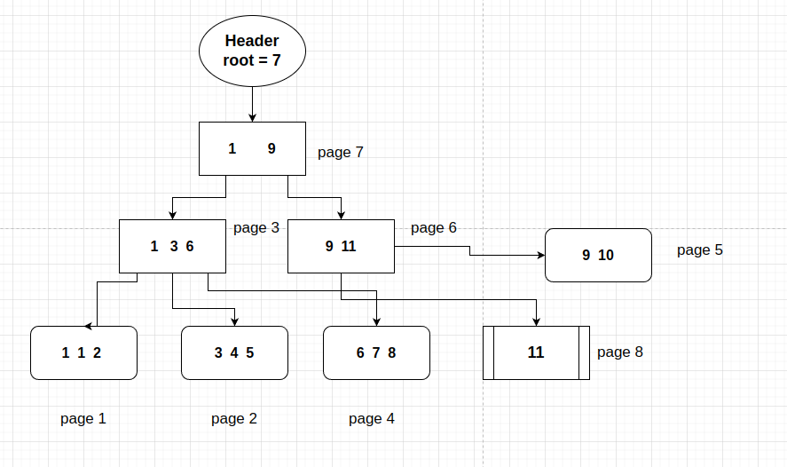
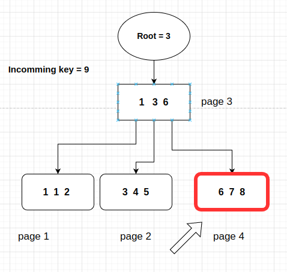
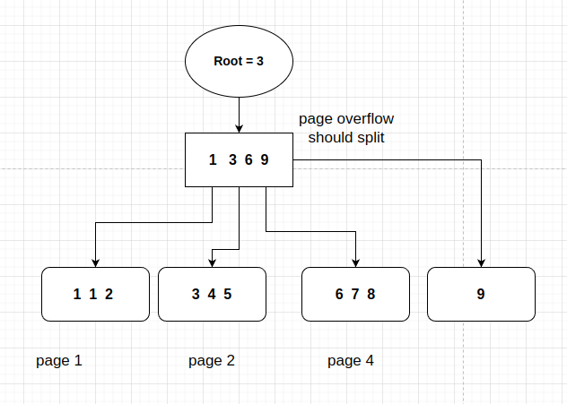
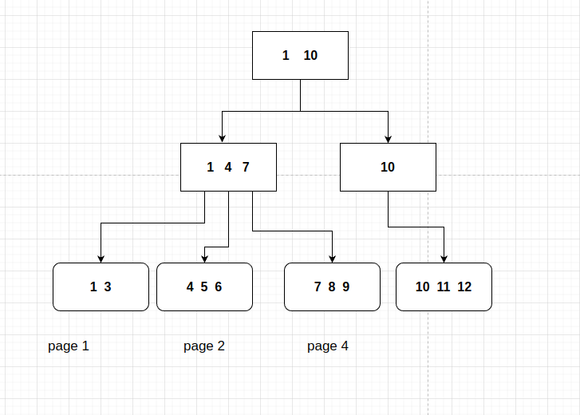
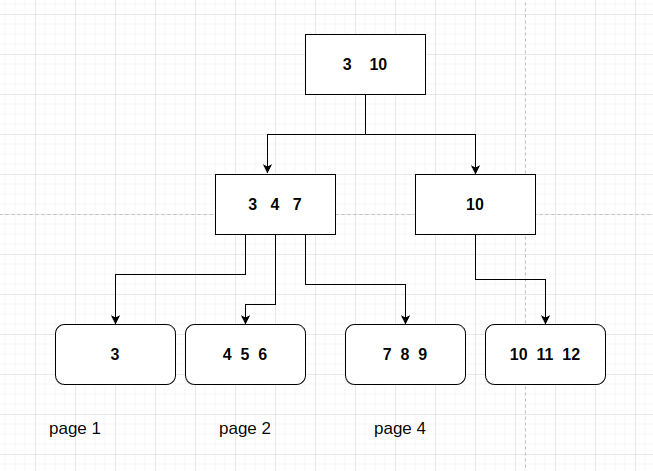

# A árvore

Tendo todas as funções necessárias para iniciar meu trabalho com as árvores binárias, eu tinha um objetivo em mente: criar um CRUD simples para minha árvore, cujas funções seriam **insert**, **delete**, **update** e **get**.

O desafio agora é conciliar meu tempo livre e paternidade para concluir esta tarefa. Estou escrevendo este texto enquanto eu e minha esposa ficamos no hospital esperando nosso bebê nascer. Ela teve que realizar uma indução de parto devido a alguma redução inesperada no líquido amniótico. Mas não temos que nos preocuparmos, foi preventivo, não emergencial, e como não tem hora certa para acontecer, trouxe meu computador para programar e escrever um pouco.

Devo confessar que a programação me ajuda a superar a ansiedade e o nervosismo, mas as ideias de como implementar as funções da árvore binária não estão vindo.

Portanto, tentarei anotar e exemplificar com imagens como quero implementar e como acabei implementando o bTree crud e os problemas que encontrei durante o processo.

# Offtopic

Meu primeiro filho nasceu às 4h14 do dia 19 de janeiro de 2024, saudável, lindo. No momento em que ele veio ao mundo eu imediatamente comecei a chorar, eu amo ele e minha esposa. Agradeço a Deus por ele ter vindo tão saudável a este mundo, é uma grande alegria e uma realização para mim ser pai. Farei o meu melhor neste trabalho, talvez o trabalho mais difícil que alguma vez terei.

# A estrutura BTree

Tendo as funções básicas para a estrutura do Node concluídas, agora tenho que descobrir como criar uma estrutura BTree para usar no bTree crud. Como vou escrever uma pesquisa binária, também devo ser capaz de acessar algumas funções de retorno de chamada para gerenciar páginas dentro dos métodos brutos.

Vamos imaginar que estamos na primeira página, uma página que contém qual é o número da página raiz, como acessaríamos e recuperaríamos as informações da página raiz se não tivéssemos nenhum retorno de chamada para fazer isso? A estrutura bTree deve ter algumas funções básicas, como: Get, Set, New e assim por diante. Com estas funções é possível modificar páginas enquanto trabalho com outras páginas, o que é algo que pretendo fazer.

Dentre todas as informações possíveis que poderíamos ter em nossa estrutura Tree, a página raiz fica na primeira posição, seguida de outras informações possíveis, como pageSize, nome bTree, entre outras.

```go
type BTree struct {
	data      []byte                // Page header
	pageSize  uint32                // Page Size. It's still hardcoded
	root      uint64                // Indicates Where the root page starts
	SetHeader func(BTree)           // Update header whenever needed
	Get       func(uint64) TreeNode // Returns a Tree Node
	New       func(TreeNode) uint64 // Allocate a new Page
	Del       func(uint64)
	Set       func(TreeNode, uint64) bool // Del a new page
}

```

Eu implementei getters e setters para definir o nome do banco de dados e a raiz no arquivo, *pageSize* ainda não está implementado, pois uso 4.096 bytes *hardcoded* para todas as funções. Estou pensando em deixar variável, dependendo do sistema na hora de criar uma nova bTree.

Por enquanto a implementação de ambas as funções de callback não é obrigatória, é uma Interface, talvez no futuro esses callbacks façam muito mais do que apenas criar ou editar uma página de um arquivo. Talvez eu possa adicionar algum gerenciamento para edição de arquivos por trás dessa interface, algum tipo de controle para os casos em que o banco de dados possui muitas solicitações de leitura e gravação simultaneamente.

# Testing – O pacote Go nativo

Devo confessar que estava testando tudo usando um arquivo *main.go*, junto com alguns prints e funções auxiliares. Ao fazer isso, comecei a perder o controle das coisas que estava criando. Para resolver isso, decidi estudar e usar algum framework de testes para Golang. Felizmente, Golang tem seu próprio pacote de testes nativo, o que é, na minha opinião, fantástico! Simples, fornece as ferramentas necessárias e funciona tão bem com VSCode que eu não conseguia acreditar que não o estava usando para desenvolver até agora.

Outra coisa boa é que, para criar arquivos temporários, o pacote também oferece uma função que cria uma pasta temporária para permanecer enquanto as funções de teste estão em execução. Sempre que o teste termina, a pasta é completamente deletada, não deixando nada para trás, o que é legal, posso pular a tarefa chata de limpar o lixo.

Uso para quem tem interesse em utilizar o framework:

```go
/*
Teste if node creation returns correct data
*/
func TestNodeCreation(t *testing.T) {
    import (
	"bytes"
	"strconv"
	"testing"

	bTree "github.com/nicolasvancan/monvandb/src/btree" // My package
    )

    // Create a new Node
	newNode := bTree.NewNodeNode()

	if newNode.GetType() != bTree.TREE_NODE {
		t.Errorf("Node type should be %d and it is %d\n", bTree.TREE_NODE, newNode.GetType())
	}

	if newNode.GetNItens() != 0 {
		t.Error("Should have 0 items")
	}

	if bTree.GetFreeBytes(newNode) != 4080 {
		t.Error("Should be 4080 free bytes")
	}

}
```

A entrada *t* para a função é um ponteiro para uma estrutura testing.T, que possui algumas funções específicas para teste. Esta é apenas uma estrutura do pacote de testes. Para afirmar ou dar um erro, deve haver uma condição verificada, como se o tipo é o que esperamos, caso contrário, lançamos e erramos com t.Errorf().

Decidi implementar alguns testes básicos para meu pacote já existente de treeNode e foi um processo muito legal. Para desenvolver o pacote BTree, todas as funções públicas serão testadas com esta ferramenta incrível.

# Implementando CRUD

## Introdução

Enquanto esperava no hospital com minha esposa e meu notebook, pensei que seria uma boa ideia começar a implementar a primeira função do meu BTree CRUD, o **BTreeInsert**.

BTree deve conter dados ordenados entre todas as folhas, e essas folhas devem ser ordenadas, para acelerar as buscas por dados. Lembrando, para uma folha, eu armazeno a chave mais baixa como o indicador daquela folha para o nó pai, deixe-me mostrar um exemplo da ideia:

**Criação de Btree e primeira página**

Antes de tudo acontecer, a árvore deve começar de algum lugar, por isso tenho como primeira página o que chamo de "Página Cabeçalho", que contém informações sobre a árvore binária e qual é o número da página raiz (Página onde está o Btre começa efetivamente). Toda vez que eu quiser ler dados da árvore binária, minha função deverá consultar a página de cabeçalho e então obter o número da página raiz. Quanto mais minha árvore binária crescer, maior será o número, e assim por diante.

## Insert

### Primeiro Cenário - Primeira folha

Quando a bTree não possuir dados, significa que a página raiz é nula. Se inserirmos qualquer item na árvore binária, uma folha surgirá tornando-se a única folha dentro da árvore binária, como segue:


Depois de inserir um item, digamos algum dataframe com coluna de índice **id** e valor da coluna de índice = 1, então uma folha é criada, o valor raiz do cabeçalho é atualizado para a página número um e se torna algo como mostrado abaixo:

**Obs: Os retângulos com cantos arredondados representam folhas, enquanto os retângulos normais representam nós**


### Dividindo folhas

Suponhamos que adicionemos mais três itens, com chaves iguais a [2, 3, 4]. Para demonstrar como funcionará o mecanismo de inserção de dados, o número máximo de itens dentro de uma folha ou nó será três. Adicionar todos os novos itens de valor-chave exigirá que nossa bTree aumente seu tamanho, pois o número máximo de itens em uma folha ou nó é três, agora, após adicionar novos itens haverá quatro em uma folha, o que não é permitido.

Ao atingir o tamanho máximo de bytes ou o número máximo de itens, o nó ou folha deve ser dividido em dois novos. Da forma como organizei meus elementos dentro da árvore binária, não divido em dois novos nós igualmente balanceados, deixo o primeiro nó com o máximo de itens que pode conter, e o segundo com o resto. Agora, após a divisão da primeira folha, deve haver um nó representativo, apontando para as folhas antes da camada de folhas. Desta forma, também é necessária a criação de um nó.

O nó conterá ponteiros para as páginas com a respectiva primeira chave de cada uma das folhas, deixe-me descrever o exemplo: Dividindo a primeira folha que está na página um, foi originada outra folha, que contém o valor da página dois. Mesmo assim, foi criada outra página para conter os dados relativos ao novo nó, conforme explicado anteriormente, e esta página será a número três.

Como esperado, a primeira chave da primeira página ainda será a número um, enquanto a primeira chave da nova folha será a número quatro e os valores inseridos no nó que aponta para essas folhas serão mais ou menos assim: a chave 1 pode ser encontrada na página 1, a chave 4 pode ser encontrada na página 2. Não esquecendo que a página raiz, após as inserções, deve ser atualizada para a página três, indicando que a página do nó agora é a página raiz.



### Dividindo nós

Avançando um pouco mais, quando for necessária a divisão de nós, como poderíamos proceder? Vamos criar um cenário para explicar esta possibilidade: Com as mesmas restrições de antes, o usuário adicionou as chaves [5,6,7,8,9,10], portanto, foram originadas duas novas folhas vindas do mesmo nó:


Observe que o ponteiro para a folha que contém a chave dez é um overflow do nó, por isso também é necessário dividir o nó, tornando-se dois novos nós, um contendo os ponteiros para as três primeiras folhas, e o segundo contendo o nó para a última folha. Como o nó foi dividido, uma nova folha na camada pai de nós aparecerá, e esse nó se tornará a raiz, com número de página 7


### O caminho não trivial - Chaves não exclusivas

Pensando em possíveis casos de uso de uma Árvore Binária contendo, por exemplo, índices, ou mesmo visualizações, eles também usariam uma bTree para armazenar dados? Não sei, mas resolvi criar uma árvore binária o mais flexível possível, onde pudesse inserir até mesmo itens duplicados reorganizando toda a árvore novamente para deixar os dados ordenados. Outro problema que pode aparecer eventualmente é para dados maiores que o limite do tamanho da página. Suponhamos que eu queira inserir uma linha da tabela de índice X e valor de 100 kB, como isso aconteceria quando o limite de uma página é de 4096 bytes?

Essas perguntas me fizeram perceber que eu precisava descobrir alguma coisa. Para o caso de itens duplicados ou inserção de itens fora de ordem na árvore, a lógica aplicada não seria tão trivial.

Vamos pegar nossa última imagem como exemplo, vamos supor que eu queira inserir a chave 1 como item duplicado, o que aconteceria com a estrutura bTree neste caso?


É óbvio que ao inserir itens duplicados, principalmente quando a chave duplicada está dentro de uma folha inteira, o trabalho não é simplesmente colocar lá e sair. Se a folha já estiver cheia, devemos parti-la novamente, mas não como fizemos antes. A divisão significa que a chave overflow gerada após a inserção da nova chave, passará a ser a chave a ser inserida na próxima folha disponível. Se a próxima folha disponível também estiver cheia, o processo se repete, até chegar à chave que tem espaço para a chave de entrada ser inserida ali. No caso da imagem anterior, a chave número um chega à página folha um. Ela é inserida ali e, como resultado disso, a chave overflow gerada é a chave três, que será inserida na próxima folha da página 2.


Como resultado de uma inserção na primeira folha, toda a estrutura dos nós também muda, pois a primeira chave de cada folha é alterada, portanto os nós pais também devem ter suas chaves alteradas após esta atualização. Isso acontece de forma meio recursiva, e o resultado final de todas essas ações pode ser visto na próxima imagem.


### Os valores-chave com comprimento de valores enormes

O novo desafio agora é pensar em uma forma de agregar valores-chave que sejam grandes demais para caber em uma página exclusiva. O que eu pessoalmente penso sobre esse assunto é que eu conseguiria armazenar os valores em muitas páginas, usando uma estrutura do tipo lista vinculada, ou seja, só vou criar esse tipo de lista vinculada para chaves e valores que juntos tenham mais bytes do que o total de bytes livres de uma folha vazia, acho que é cerca de 4.073 bytes ou algo próximo disso. Caso contrário, dividiria a folha e seguiria o processo normal.

**Solução**

Foi criado outro tipo folha, cujo nome é TREE_LEAF_SEQUENCE. Sempre que desejo adicionar um valor-chave com comprimento de valor maior que o máximo de bytes livres de uma página, crio uma Folha normal, com sequências de folhas de árvores. Mas o que indicaria que a folha tem sequência? Naturalmente modifiquei a estrutura da folha para conter os campos **leafHasSeq** e **leafSeqAddress**, onde o primeiro campo indica que a folha tem bytes salvos em outra sequência de folhas, e o segundo campo indica qual é a página que a sequência é armazenada.

Por ser uma lista vinculada, a folha da sequência pode não ser suficiente para armazenar todos os bytes do valor, portanto, a estrutura da sequência de três folhas deve ter campos que informem quantos bytes estão armazenados na sequência, se a sequência possui ou não outra sequência, e o endereço das outras sequências.

Tornou-se algo assim:

- **type 2B**: O tipo de Árvore (comum para todos os tipos de nós)
- **hasSeq 2B**: Se a folha tem sequência ou não
- **vSeq 8B**: O endereço da outra sequência
- **nBytes 2B**: Número de bytes armazenados na folha
- **bytes**: informações

Como resultado, tive que refatorar alguns métodos da estrutura TreeNode anterior, como adicionar novos métodos para lidar com o gerenciamento desses novos campos para este novo tipo de nó.

### A configuração

Antes mesmo de começar a escrever código para a função insert, quero preparar os testes para minhas funções. Lembrando que todas as funções só estarão disponíveis se forem públicas, nomeadamente se tiverem a primeira letra maiúscula.

O pacote de teste possui uma função chamada t.TempDir(), que cria um diretório temporário para o teste em execução, retornando ao usuário o caminho do diretório. Decidi então criar uma função e um pacote auxiliar para fins de teste, chamado **b_tree_helper.go**, localizado na pasta test/helper.

Este módulo é útil para definir e implementar callbacks utilizados em meus testes e também para criar funções utilizadas por mais de um arquivo de teste. Por enquanto, escrevi as funções de retorno de chamada usando *mmap* e também **file.WriteAt()**.

O primeiro passo para usar o mmap para mapear meu arquivo foi criar uma função temporária, mas útil, em um pacote chamado arquivos. A função está localizada em **/files/mmaping.go**

```go
package files

import (
	"errors"
	"fmt"
	"os"
	"syscall"
)

/* Map page */
func MmapPage(f *os.File, page uint64, pageSize uint64) (int, []byte, error) {
	// Get File pointer that comes from os.OpenFile
	fileInfo, err := f.Stat()

	if err != nil {
		return 0, nil, fmt.Errorf("Stat %w", err)
	}

	// File is not multiple of pageSize (Must be corrupted or has some bug)
	if fileInfo.Size()%int64(pageSize) != 0 {
		return 0, nil, errors.New("File size may not correspond to database page size")
	}

	// Get mmap based on given page
	pageData, err := syscall.Mmap(
		int(f.Fd()),
		int64(page*pageSize),
		int(pageSize),
		syscall.PROT_READ|syscall.PROT_WRITE,
		syscall.MAP_SHARED)

	if err != nil {
		return 0, nil, fmt.Errorf("Mmap Error %w\n", err)
	}

	return int(fileInfo.Size()), pageData, nil
}

```

Esta função faz uma chamada de sistema para mapear na memória meus arquivos bTree. Para fazer isso, é necessário um ponteiro para a estrutura **os.File**, que é usada para obter um descritor de arquivo do arquivo a ser usado para a função de chamada do sistema. Observe que existe uma validação para o tamanho do arquivo em bytes, onde deve ser um múltiplo da variável pageSize, caso contrário o arquivo será corrompido.

Existem três flags usadas para acessar o arquivo, leitura e gravação protegidas, e que o mapa pode ser compartilhado entre os acessos (foi o que descobri sobre essas flags)

A função retorna o tamanho do arquivo, os dados da página necessários como []byte e se houve um erro ao ler o arquivo.

O uso do mmap não é obrigatório, embora utilize chamada de sistema, pode ser bem mais lento que a função normal **file.readAt**, mas para esse propósito ainda usarei essas funções desta forma. Talvez no futuro eu avalie outra opção.

Não tenho certeza se a implementação exigirá ou não uma solução de mapeamento de memória, isso só seria verdade se a modificação de uma página ocorresse diretamente na página, pois o mapeamento atua como um proxy para modificação do arquivo. Esta solução seria relativamente boa apenas se todas as minhas funções de nó fossem atômicas, o que não é o caso. Como comentei no último capítulo, não implementei todas as funções de nó atomicamente, getters e setters são, mas funções de inserção, exclusão e atualização de nó não.

Sabendo disso, a decisão que tomei foi seguir o processo de desenvolvimento atualizando uma página inteira de uma só vez.


```go
// Callback functions
func getPage(page uint64) bTree.TreeNode {
	_, data, err := files.MmapPage(Fp, page, 4096)
	if err != nil {
		fmt.Println(err)
	}
	tmp := make([]byte, len(data))
	copy(tmp, data) // It's not mapped anymore
	return *bTree.LoadTreeNode(tmp)
}

func setPage(node bTree.TreeNode, page uint64) bool {
	_, err := Fp.WriteAt(node.GetBytes(), int64(page*bTree.PAGE_SIZE))
	if err != nil {
		fmt.Println(fmt.Errorf("could not write to page %d", page))
		return false
	}

	return true
}

func newPage(node bTree.TreeNode) uint64 {

	// get Stat from file
	fileInfo, err := Fp.Stat()

	if err != nil {
		panic(err)
	}

	// Without header
	lastPage := (fileInfo.Size() / bTree.PAGE_SIZE)

	Fp.WriteAt(node.GetBytes(), fileInfo.Size())

	return uint64(lastPage)
}

func setHeader(bTree bTree.BTree) {
	Fp.WriteAt(bTree.GetBytes(), 0)
}

```

Junto com todas as funções de callback, existem duas outras funções que são realmente úteis na criação de ambientes simulados de testes, que são: **LoadBTreeFromPath** e **CreateBtreeFileAndSetFile**, cujas funções são permitir que um bTree seja usado para testes.

```go
func CreateBtreeFileAndSetFile(t *testing.T, basePath string) string {
	fileName := basePath + string(os.PathSeparator) + "teste.db"
	bTree := bTree.NewTree(4096)
	// Fake name to test
	bTree.SetName("db_teste")
	// Should start at zero
	bTree.SetRoot(0)
	// We first create a db at the tmp folder
	fp, err := os.OpenFile(fileName, os.O_CREATE|os.O_RDWR, 0666)
	Fp = fp
	if err != nil {
		panic(err)
	}

	fp.Write(bTree.GetBytes())
	// Returns file path
	return fileName
}

func LoadBTreeFromPath(t *testing.T, filepath string) *bTree.BTree {
	_, data, err := files.MmapPage(Fp, 0, 4096)

	if err != nil {
		t.Errorf("Could not load temporaray database bTree on page 0")
	}
	tmpBTree := bTree.LoadTree(data, 4096)
	// Assign callback functions
	tmpBTree.Get = getPage
	tmpBTree.New = newPage
	tmpBTree.Set = setPage
	tmpBTree.SetHeader = setHeader
	tmpBTree.Del = delPage

	return tmpBTree
}
```

### Implementação

Eu realmente vou trabalhar firme, porque não estou prestes a escrever o melhor código limpo de todos os tempos, nem será o código mais eficiente. Quero que primeiro funcione bem.

Com base na minha primeira ideia de inserção de chaves, onde tenho que me preocupar, inserir os bytes do valor da chave, verificar se a folha que vai receber esses bytes ainda tem espaço suficiente. Caso contrário, tenho que dividir a folha, salvar duas novas folhas geradas na camada acima delas, se não houver devo criar uma, fazer isso recursivamente, sabendo que uma árvore pode ter muitas camadas, e não só isso! Existe outra possibilidade que contempla a mudança do valor da chave ao inserir uma chave duplicada.

Em outras palavras, acho que esse código não será fácil de entender. E devo confessar que depois de escrever as funções e voltar a elas para explicá-las neste texto, às vezes fiquei confuso, por causa dos nomes das variáveis, ou confundi os fluxos que criei. Ou seja, o código funciona, mas ainda não está bem escrito. Uma refatoração enorme precisa ser realizada

Mesmo assim, o objetivo principal aqui não é discutir qual a melhor forma de codificar esse problema, mas como fiz isso, como pensei que a solução funcionaria, e aqui está.

**Função básica**

```go
/*
BTreeInsert
Main function to insert a key value to a bTree

This function will do almost all the hard work regarding bTreeInsertion.
It will look for the right place to insert the new key value to a Node, If necessary
*/
func BTreeInsert(bTree *BTree, key []byte, value []byte) {
	// Get root
	root := bTree.GetRoot()
	// Root = 0 means that there is no item in it
	if root == 0 {
		// Than we start a new bTree
		startsNewBTree(bTree, key, value)
		return
	}

	// Get node from page
	rootNode := bTree.Get(root)

	// Find leaf to insert value
	leafToInsert, history := findLeaf(bTree, rootNode, key, root, make([]TreeNodePage, 0))

	if leafToInsert == nil {
		/* Didn't find any leaf, that means the key to be inserted is smaller than the smallest key in bytes

		So we find first node and insert the key to it
		*/
		leafToInsert, history = findFirstLeaf(bTree)
	}

	// Verify whether leaf must be splitted
	insertAndReorderTree(bTree, *leafToInsert, history, key, value)
}
```

Nessa perspectiva, o código parece bonito e bem desenhado. Sim, mas a parte feia se esconde atrás da função **insertAndReorderTree**. Mas primeiro as primeiras coisas. A função recebe três parâmetros, o ponteiro bTree, relativo à bTree que queremos adicionar informações, a chave e o valor, cujos tipos são []byte (Array de bytes).

O primeiro passo é verificar se a página raiz é zero, ou seja, não há dados e o bTree ainda não foi inicializado. Então chamamos o método **startsNewBTree**, que de fato cria uma nova página (página Folha)

```go
func startsNewBTree(bTree *BTree, key []byte, value []byte) {
	newLeaf := NewNodeLeaf()
	// Means that it is top page
	setParentAddr(newLeaf, 0)
	newLeaf.PutLeafNewKeyValue(key, value)
	// Calls callback
	pageNumber := bTree.New(*newLeaf)
	bTree.root = pageNumber
	bTree.SetRoot(pageNumber)
	bTree.SetHeader(*bTree)
}
```

**Ps: vou omitir muitas linhas de código aqui, já que o código-fonte completo está disponível nos arquivos**

Se houver uma raiz diferente de zero, significa que a árvore possui valores. O próximo passo é verificar qual é a folha que armazenaremos nosso novo valor de chave. Para isso, criei uma função chamada **findLeaf**, que avalia cada novo nó, e verifica se o primeiro valor de cada nó é menor que a chave que queremos adicionar, se sim, retorna dois valores, um é um ponteiro para uma estrutura chamada **TreeNodePage**, e o outro é um array de **TreeNodePage**, que é basicamente um TreeNode com seu respectivo número de página do arquivo.

Existem duas possibilidades: ou a função encontra um TreeLeaf onde irá somar o valor, ou não existe nenhuma folha contendo um valor inferior. Caso ocorra a segunda, o valor da chave deverá ser inserido na primeira folha (o valor será o menor).

Depois de ter o TreeNode e o History, podemos agora reordenar a árvore, o que é a parte interessante.

#### A parte feia

Ao chegar na função **insertAndReorderTree**, existe um divisor de fluxo, ou seja, dependendo do que você deseja adicionar, diferentes funções são chamadas.

```go
func insertAndReorderTree(bTree *BTree, tPage TreeNodePage, history []TreeNodePage, key []byte, value []byte) {
	keyLen := len(key)
	valueLen := len(value)

	// There is overflow in page, must split it or shfit values (when inserting unsorted data)
	if mustSplitNode(tPage.node, keyLen, valueLen) {
		if (keyLen + valueLen + 10) > PAGE_SIZE-26 { // 26 is header size for leaf
			// Special case
			leaf := createLeafAndSequencesForLargeBytes(bTree, key, value)
			insertOneKeyLeafAndReorderTree(bTree, tPage, *leaf, history)
			return
		}
		// Verify whether the leaf if the last one by comparing he page number
		lastLeaf, _ := findLastLeaf(bTree)

		if lastLeaf.page == tPage.page {
			// Last leaf split's backyards Node Recursivelly
			splitBackyardsRecursively(bTree, tPage, history, key, value)
			return
		}
		shiftValuesBetweenLeaves(bTree, tPage, history, key, value)
		return
	}

	tPage.node.PutLeafNewKeyValue(key, value)
	bTree.Set(tPage.node, tPage.page)
}

```

O caminho direto - quando os comprimentos dos valores-chave somados cabem em uma folha. O que acontece então é uma simples adição de folha, e o callback de Set a page é chamado, referindo-se à página que será sobrescrita e seu valor.

Mas o que acontece quando há um caso dividido? As coisas começam a ficar interessantes. A resposta não é direta, pois um estouro em uma folha pode significar que a folha tem muitos itens e o novo item faria com que a folha se dividisse, gerando duas novas folhas. Outro caso é quando o valor-chave fornecido é muito grande e não cabe em uma folha inteira, o que significa que deve caber em uma folha e em sequências de folhas. Existe o último caso possível, onde o valor da chave não deve ser inserido na última folha, causando uma cascata de divisão e inserção na árvore até atingir a última folha possível.

Tentarei descrever exatamente o que cada caso faz quando o valor da chave está lá para ser inserido.

**Caso 1 – Valor-chave grande**

Tomemos como exemplo o caso em que o usuário deseja inserir uma chave = 10 e um valor como um array de bytes de comprimento 9kB. A árvore chega ao ponto em que identifica que os valores transbordariam uma única página e precisa criar uma nova folha que possua sequências. A função **createLeafAndSequencesForLargeBytes** pega os bytes e os divide em n pedaços, o número n é definido como um divisor do comprimento total. Tendo 9kB, a primeira folha teria os primeiros 4.073 bytes, enquanto a primeira folha de sequência teria outros 4.086 bytes e a segunda folha de sequência teria o restante.

O ponto agora é inserir esta nova folha no respectivo nó pai. Para isso, a função **insertOneKeyLeafAndReorderTree** é chamada, seguindo os seguintes passos:

- Verifique se não existe um pai (raiz), caso contrário, crie um e insira a página chave folha no novo nó criado
- Quando houver um prent, verifique se o nó pai deve ser dividido, se sim, execute **splitParentNodeRecursivellyAndReorderTreeIfNeeded**
   - Esta função obtém qual é a chave a ser inserida no nó pai
   - Depois disso, divide o nó pai
   - Verifica se o nó pai dividido era a página raiz, se sim, crie outro nó raiz e insira os dois novos endereços de chave lá
   - Se houver mais camadas pai a serem verificadas e divididas, a recursão será chamada com novos valores.

A intuição é clara, tentarei descrever isso com uma lista de imagens da seguinte forma:

Imagine que temos a seguinte árvore


Quero inserir agora um valor de chave grande, com key = 11 e valor algo grande. O primeiro passo é descobrir onde aquela folha deve ser inserida e se descobrir que a folha é a última, cujos valores são 9 e 10



Sabendo que a chave 11 nunca caberia em uma única página, uma nova folha e suas sequências são criadas, representadas por um quadrado especial com barras laterais, e a nova página é então adicionada ao seu nó pai



Observe que se o nó que recebeu a chave 11, tivesse atingido seu tamanho máximo, o nó pai também precisaria ser dividido, e isso acontece para cima

**Caso 2 - Folha dividida recursivamente**

Hoje acordei cansado. Já faz um tempo desde a última vez que trabalhei neste projeto. O bebê acorda com frequência e não consigo dormir a noite toda. Eu sei que não dura para sempre e, na verdade, o bebê cresce muito rápido. Estou reservando um tempo para curtir minha esposa e meu filho enquanto ainda tenho minha licença de paternidade (não sei se está escrito assim). Meu filho está com quatorze dias e está ganhando peso muito rápido, mais rápido do que o médico esperava, o que é bom.

Como tinha algum tempo livre, decidi que seria uma boa ideia trabalhar novamente neste projeto. Embora essa parte do projeto não seja muito grande, demorei alguns dias para descobrir como resolver e também implementar tudo certo, ter meia hora diária é difícil para fazer algo rápido.

Vamos falar sobre a solução. Para aumentar a árvore e manter tudo ordenado, o processo de divisão deve ocorrer com frequência, não só nas folhas, mas também nos nós. Já falei e expliquei sobre a ideia de divisão antes e como ela funciona, o desafio agora é implementá-la na árvore.

O limite de uma página é o seu tamanho em bytes, sempre que um novo item a ser inserido em um nó ou folha ultrapassa esse limite, é hora de dividir a folha ou nó em dois e relacioná-los a um nó pai.

Para resolver esse tipo de problema criei uma função chamada **splitBackyardsRecursively**, que tem como parâmetros de entrada o ponteiro para o bTree Struct, a página onde o valor da chave deve ser adicionado e o histórico de TreeNodePages mostrando todos os nós que compõem o caminho através da folha.

Com todas essas entradas, podemos fazer as seguintes operações:

1. Encontra a folha a ser dividida



2. Divide a folha em duas folhas ordenadas 


3. Se a página a ser dividida for a página raiz, um nó raiz será criado e as novas folhas serão salvas no nó recente e o cabeçalho será atualizado.
Caso contrário, um array de TreeNodePage é gerado com as folhas divididas e a função **insertAndReorderTree** é chamada. Na função insertAndReorderTree uma nova variável é criada, contendo o total de bytes dos dois novos itens a serem adicionados. Verifique se o nó receptor deve ser dividido, caso contrário basta inserir os novos itens no nó receptor, caso contrário divide o nó com os novos valores a serem inseridos



4. Se ainda houver nós acima do nó dividido anterior, ele chama a função **insertNodesRecursively** passando como parâmetros os novos nós gerados e o novo histórico. Caso o nó dividido seja o mais alto nas camadas do nó, então um novo nó é criado, os nós divididos são inseridos nele e o cabeçalho da árvore é atualizado para apontar para o novo nó


Não sei se está tudo claro, mas o que sei é que meu código não está tão claro e é isso que pretendo melhorar futuramente hehehe.

**Caso 3 - Mudança de valores recursivamente**

Para a mudança de valores, o mais importante é mapear todos os nós e folhas que a Árvore binária possui, com essa informação, podemos ter um array de folhas, mesmo folhas que não pertencem ao mesmo ramo de nós, alinhadas, um após o outro, tudo ordenado, tornando-se muito fácil fazer as alterações que desejarmos. Sabemos que se quisermos dividir recursivamente qualquer tipo de folha, devemos ter as informações de TreeNodePage e o histórico do ramo da folha. E essa é a ideia desta função.

Quando a função é iniciada, o sistema cria o mapa da árvore. Após isso, sabendo qual é a página que o item será inserido, iniciamos o processo de inserção e divisão recursivamente a partir da página determinada e respectivo galho da árvore. Isso acontecerá até que o sistema encontre uma folha que tenha espaço suficiente para as informações recebidas, ou o sistema alcance a última folha existente e então crie outra, fazendo a mesma lógica de divisão regressiva.

Provavelmente vou me arrepender disso, mas estou com preguiça de colocar imagens aqui. Use sua imaginação e tente entender o código feio. Desculpe (vou melhorar o código com o tempo)

## Get e Test

Como testar os resultados? Como testar se tudo está funcionando bem? São ótimas perguntas, feitas diariamente por praticamente todos os desenvolvedores ao redor do mundo. Qual é uma boa maneira de testar?

Como este projeto terá muito mais partes, a primeira forma lógica de teste é com testes unitários. Quer dizer, vou construir todas as funcionalidades com base nos testes que vou criar para cobrir o código. Não creio que todas as partes serão abordadas e esse não é meu objetivo aqui.

**O que vou testar?**

- Verifique se estão inseridos valores nos três, tanto obtendo a página exata de inserção quanto obtendo o resultado por uma função Get
- Verificar como as páginas estão sendo organizadas pelo sistema e comparar com minha expectativa
- Verifique se há coisas que eu não quero que aconteçam

Todos os testes são escritos no módulo de teste. Ainda não salvei o arquivo de testes em pastas separadas, pois meu código não é tão longo e ainda não há tantos arquivos.

**A função Get**

Para testar minhas funções, tive que desenvolver uma função temporária, mas util, chamada BTreeGetOne, que na verdade é uma função que é dada uma chave e um resultado é retornado ao chamado, se o valor não for nulo, isso significa que existe é um resultado encontrado.

Esta é a versão única da minha função final GetMany, que será utilizada para o CRUD, sabendo que o bTree também pode retornar itens duplicados, a forma correta de implementar as funções é retornando um array de valores-chave.

A função é apresentada abaixo:
The function is presented below:

```go
func BTreeGetOne(bTree *BTree, key []byte) *BTreeKeyValue {
	// Create empty array
	var keyValue *BTreeKeyValue = nil
	// Load root page
	rootAddr := bTree.GetRoot()
	rootPage := bTree.Get(rootAddr)
	// Lookup tree to find
	leaf, _ := findLeaf(bTree, rootPage, key, rootAddr, make([]TreeNodePage, 0))
	if leaf == nil {
		return nil
	}

	allLeafValues := getAllLeafKeyValues(&leaf.node)

	for i := 0; i < len(allLeafValues); i++ {
		if bytes.Equal(allLeafValues[i].key, key) {
			// Found key
			keyValue = new(BTreeKeyValue)
			keyValue.Key = allLeafValues[i].GetKey()
			keyValue.Value = allLeafValues[i].GetValue()
			// In case it has no sequence
			if leaf.node.GetLeafHasSeq() == uint16(1) {
				keyValue.Value = getAllBytesFromSequences(bTree, leaf.node)
			}
		}
	}

	return keyValue
}

```

Observe que uma nova estrutura foi criada, a estrutura BTreeKeyValue, cujos campos são respectivamente **key** e **value**, como o próprio nome sugere. Esta função é muito simples, sempre que for encontrada uma folha contendo a chave solicitada, a função **findLeaf** retorna a folha. Com uma folha em mãos, o próximo passo é iterar todos os itens e preencher o novo objeto BTreeKeyValue criado para ser retornado.

## Excluir e atualizar

A função delete não será tão complicada quanto a função insert, é o que penso. Vamos ver se realmente corresponde às minhas expectativas. Veja, o caso agora é remover valores-chave da árvore binária. Analisando todas as possibilidades, o que vejo são basicamente três: A remoção direta, onde é encontrada uma folha, o valor é removido e, por fim, a folha é atualizada no arquivo; A remoção da folha, onde os itens a serem removidos são o único item de uma folha, isso significa que a folha precisará ser removida da referência do nó e isso deve ocorrer recursivamente subindo até a raiz. O último caso é onde o valor removido é o primeiro valor de uma folha, o que significa que a referência chave dos nós acima precisará ser atualizada.

Vou mostrar alguns exemplos usando imagens, assim ficará muito mais claro.

O primeiro exemplo é a simples remoção de um valor-chave na árvore. Suponhamos que eu queira remover a chave dois


Neste caso, o que aconteceria é apenas uma simples remoção da chave, a folha encontrada seria a primeira na página um, o sistema removeria a chave dois e salvaria novamente a folha atualizada na página um.



O segundo caso é quando queremos deletar o primeiro valor-chave de uma folha, vamos então pegar o número um para o próximo exemplo:


O ponto aqui é dois excluir a primeira chave da folha, fazendo isso, o valor três assume o lugar da primeira chave na folha da página um. Sabendo disso, todos os nós acima que possuem a chave um como ponteiro precisariam ser alterados para a chave três, conforme segue:



E o próximo caso é quando uma folha desaparece completamente após exclusões consecutivas. Isso aconteceria se continuássemos excluindo valores-chave da página um. Excluir a chave três resultaria nos três seguintes


Eu sei que a árvore não é reordenada após exclusões e essas modificações, talvez devesse ser reordenada a cada nova exclusão, mas ficaria muito complexa e os ganhos com isso não valeriam a pena. No futuro irei implementar e modificar essas coisas nas funções CRUD.

# Fim do capítulo

Não acredito que finalmente cheguei ao final deste capítulo e consegui implementar todas as funções do CRUD, considerando que desde que meu filho nasceu, mal consegui encontrar tempo para trabalhar neste projeto e, conseqüentemente, o a vontade de avançar para outras partes do projeto foi aumentando e minha paciência para continuar trabalhando no CRUD foi diminuindo.

Para concluir, devo dizer que estou bastante satisfeito com as implementações feitas, primeiro porque vi que as soluções funcionam, segundo porque estava executando bastante rápido, terceiro porque há muitos pontos para melhorar o código e a sua usabilidade -- mais trabalho -- O que é bom.

Como meu primo me disse uma vez, nenhum código bom começa da melhor forma possível. Às vezes começa pequeno, lento, mas funcional, às vezes nem funciona direito, mas o conceito central está aí. O mais importante para melhorar algo é sempre avaliar, aprender novas ferramentas e conceitos e propor e realizar as melhorias. Nada é perfeito e não existe solução certa ou errada, existem soluções que funcionam e soluções que não funcionam, e também aquelas que funcionam extremamente bem, e esse é o meu objetivo.

Por enquanto vou aproveitar meu filhinho e pensar no próximo passo deste projeto, junto com todas as modificações e melhorias que devo implementar neste pacote da árvore binária.