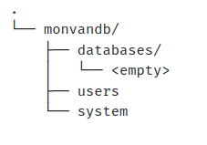
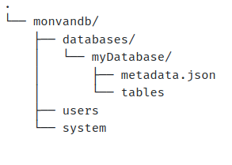
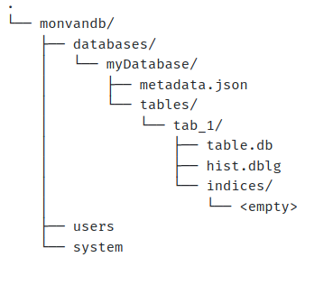

# Um desabafo

A escrita dos diários tem sido algo um pouco caótico no meu dia a dia. Há vezes que eu escrevo como um relatório de experimentos. Outros dias, eu anoto em folhas de papel os tópicos e coisas que pensei para reescrever quando tiver tempo. Mas o que mais tem me tomado tempo não é nem o fato de escrever, mas sim o de tornar a escrita mais compreensível pro leitor.

É interessante notar que quando estou pensando em algo, seja uma solução ou alguma ideia de desenvolvimento, aquilo está muito nítido na minha cabeça. Porém, quando eu coloco em texto toda a lógica que estou bolando, não fica tão claro quanto o que tinha imaginado, e isso me faz pensar em algumas hipóteses:

1. Minha falta de experiência na escrita influencia em como eu me expresso em textos (me expresso mal)
2. A falta de tempo para escrever me faz tentar ser muito rápido e direto nos pontos, faltando detalhes

Acredito que há um pouco de ambos casos acima. Realmente não tenho tanta experiência de escrita, mesmo embora eu sinto que eu tenha melhorado após alguns capítulos deste projeto. A falta de tempo é algo normal, trabalho, paternidade, familia; todas essas coisas demandam meu disso, mas as faço com muito carinho.

Faltou um último ponto acima que é o do perfeccionismo. Não é algo que sou, mas sou muito crítico comigo mesmo. Sempre que revejo coisas que eu fiz, me critico e tento melhorar. Acho que por isso que vivo reescrevendo textos e ideias. Talvez se eu relaxar um pouco a cobrança em mim isso melhore.

Enfim, após começar a lançar capítulos no Linkedin e revisitado não somente os códigos, mas principalmente os textos, penso em reescrevê-los sem perder a essência do diário, mas torná-los melhores.

## Marcos do bebê

Quando iniciei a implementação da árvore binária meu filho estava por nascer. O tempo passa rápido, enquanto escrevo esse texto aqui ele já completa quase 6 meses de vida. E isso traz novidades, como por exemplo ele ter experimentado banana hoje de manhã. Não gostou muito não. Mas deve ser esquisito, depois de 6 meses mamando no peito somente, experimentar comida.

# Estruturas Tabelas

Voltando ao assunto principal, chegou um momento importante do projeto e que acompanha muitas difinições, que são as **Tabelas**. Na minha visão, trata-se do cerne do banco de dados e por isso deve ser tratada com muito carinho.

Não bisbilhotei outros projetos para ver como faziam suas definições de tabela, eu me baseei nas minhas experiências. Então vamos lá! O que eu imagino como estrutura de tabelas e suas principais funcionalidades.

## O contexto

Sempre quando penso em qualquer tipo de funcionalidade do banco de dados, imagino de prontidão uma query sendo enviada pelo usuário para o servidor. A partir dai as coisas começam a se desenrolar. Processos são criados, threads executadas, arquivos acessados, etc. Do mesmo modo, usarei uma query simples mas como um bom exemplo de reflexão sobre o ponto que quero chegar neste dia.

**A query**

```sql
SELECT 
    u.user_id,
    u.name,
    u.age,
    a.address,
    a.address_number,
    a.city,
    CAST(u.ssn AS STRING) as ssn
FROM tab_users as u
    INNER JOIN tab_addresses a ON u.user_id = a.user_id
WHERE a.city in ('London', 'São Paulo')
```

Essa query simples faz a busca na tabela **tab_users**, a qual é usada para fazer uma junção com a tabela **tab_addresses** pela coluna **user_id**. Além disso, há uma cláusula condicional que limita a busca, cuja coluna **city** da tabela de endereços é igual a *London* ou a *São Paulo*.

No ideal, o sistema lê essa query, identifica o pedido de leitura e faz chamadas de execução no sistema. Mas que chamadas são essas?

Oras, eu também não sei direito. Na verdade, eu não sei especificamente quais são, pois podem ser mínimas, complexas; a depender de como eu implementá-las. E isso é algo que não tenho ainda nem planejado. No entanto, o que eu sei que deverá existir são as leituras nos arquivos das tabelas. Se lembra daqueles arquivos de árvore binária que montei nos capítulos passados? Então, elas deverão ser lidas volta e meia pelo sistema para trazer os dados como resultados das queries.

Isso me leva a pensar em diversas soluções e possível problemas. É claro que a primeira versão do banco de dados será simples, com funções simples e acessos simples. Os problemas mais complexos vão sendo endereçados assim que surgem. Mas isso também é um assunto para discutir mais tarde.

Entre joins, comandos, conversões, comparações, ou qualquer ação que precise ser feita com o dado, a mais básica e necessária ação entre elas é a própria aquisição do dado, não é mesmo?

É ai que nossa atuante **Table** entra. Além de conter as definições das tabelas, como os tipos de coluna, indices; ela é responsável também por conter os métodos de acesso em uma interface simples. A tabela deve ser simples o suficiente para ser chamada por diversas instâncias ou conexões do servidor e entregar os dados que os clientes necessitarem.

Dado o contexto inicial, vamos para as breves definições feitas.

## Definições e estruturas

Para quem tem familiriaridade com outros RDBMS, as tabelas estão contidas em bancos de dados (*databases*), sendo eles isolados um do outro. Um banco de dados pode possuir tabelas, views, procedures. A princípio, meu database possuirá somente informações e acessos à tabelas. Segue abaixo um exemplo inicial de como minha estrutura **Database** ficou:

```go
type Database struct {
	Name       string            // Database's name
	Tables     map[string]*Table // reference to Tables
	TablePaths map[string]string // Paths to the tables
	Path       string            // Path to the database dir
}
```

Bom, antes de mais nada o que são esses campos ai? Como eu nem as tabelas defini ainda, não tem como armazenar as informações do systema ainda em tabelas. É aquele mesmo paradoxo do compilador, o primeiro compilador de uma linguagem nova é construído em outra linguagem. Após se conseguir programar na linguagem nova, pode-se construir um compilador nessa mesma linguagem.

Então para poder salvar meus arquivos em alguma localização, decidi criar a estrutura contendo o nome e caminho do **database**, quais tabelas esse banco de dados possui, os caminhos para acessar essas estruturas. Por que salvar os caminhos dessas estruturas? Ao iniciar, o sistema carregará os metadados de todos os databases e tabelas existentes e salvas nele. Para isso e por enquanto, utilizará estes arquivos.

Mas isso nos leva a um outro problema: **Como salvar esses arquivos?** 

Podemos salvar de qualquer forma. Eu escolhi uma forma legível e simples de serializar, que é o **json**. Utilizei ele para este propósito apenas para fins de debug e leitura posterior. O ideal é que os metadados de qualquer coisa dentro do banco de dados, também fique armazenado em tabelas de bancos de dados, até porque, o conceito do RDBMS tudo vira tabela. 

Abaixo está o exemplo de serialização para **json**

```go
// Function that converts struct to json
func ToJson(value interface{}) ([]byte, error) {

	// Create a new gob decoder and use it to decode the person struct
	enc, err := json.Marshal(value)
	if err != nil {
		fmt.Println("Error encoding struct:", err)
		return nil, err
	}

	return enc, nil
}

// Function that converts json to struct
func FromJson(value []byte, dst interface{}) error {
	// Create a new buffer from the serialized data
	err := json.Unmarshal(value, dst)
	if err != nil {
		fmt.Println(err)
		return err
	}

	return nil
}

```

Um módulo adicional foi criado para comportar funções utilitárias para todos os módulos, sendo ele chamado de **utils**. Além das funções de serialização, criei outro arquivo no mesmo módulo contendo funções para lidar com arquivos genéricos, localizado em **src/utils/files_utilities.go**. Mais adiante comentarei especificamente sobre esse arquivo e alguns detalhes sobre sua implementação.

### Tabelas e Colunas

O que a estrutura de tabelas deve ter? Colunas, claro. Talvez um nome? O que mais será que uma coluna possui? Bom, pelo meu conhecimento e achismo, colunas são necessárias, uma coluna de chave primária também é necessária.

**Como assim?**

Não existe arquivo de árvore binária sem index, certo? Quando definimos alguma tabela, precisamos definir sua chave primária. Normalmente é alguma coluna com o nome **id**. Segue um exemplo:

```SQL
CREATE TABLE IF NOT EXISTS tab_users (
    user_id AUTO INCREMENT PRIMARY KEY BIGINT,
    name STRING,
    age INT,
)
```

Nossa tabela possui uma coluna que é identificada como chave primária. Ou seja, ao ser criada, a tabela indexará as linhas pela coluna **user_id** da tabela, e as buscas serão feitas baseadas nela.

Há também os casos onde há a criação de chaves compostas, vai outro exemplo abaixo:


```SQL
CREATE TABLE IF NOT EXISTS tab_users (
    user_id BIGINT,
    name STRING,
    age INT,
    PRIMARY KEY (user_id, name)
)
```

Acima, a primary key é definida como a junção das chaves user_id e name. Então, é necessário também saber se a tabela é uma tabela de chave composta ou chave simples. Por fim, uma tabela pode ter índices fora a chave primária. Um outro exemplo simples é uma tabela que contém dados em uma coluna como **insert_timestamp** e queremos com que seja criado um índice de busca para a mesma. Desta forma, quando fornecermos algum filtro baseado na coluna **insert_timestamp**, a busca torna-se indexada, não sendo necessário realizar scan por toda a tabela. Mas chegamos nisso em algum momento.

Bem, acho que para a primeira versão do nosso micro database isso já está bom. Juntando as informações, como resultado, tivemos a estrutura de tabela mostrada abaixo:

```go
// Column represents a column in a table
const (
	COL_TYPE_INT = iota
	COL_TYPE_SMALL_INT
	COL_TYPE_BIG_INT
	COL_TYPE_STRING
	COL_TYPE_FLOAT
	COL_TYPE_DOUBLE
	COL_TYPE_BOOL
	COL_TYPE_TIMESTAMP
	COL_TYPE_BLOB
)

type Table struct {
	Name         string            // Table's name
	Path         string            // Where the table configuration is stored
	Columns      []Column          // reference to Columns
	PrimaryKey   *Column           // reference to PrimaryKey
	CompositeKey []Column          // Case column is composite
	Indexes      map[string]*Index // reference to Indexes
	PDataFile    *files.DataFile   // private Access btree (Simple)
}

type Index struct {
	Name      string
	Column    string
	Path      string
	PDataFile *files.DataFile
}

type Column struct {
	Name          string
	Type          int
	Default       interface{}
	Nullable      bool
	AutoIncrement bool
	Primary       bool
}
```

Começando com a estrutura **Column**, cujos campos são respectivamente: o nome; o tipo do dado sendo uma das opções do enumerate; Default caso nada seja passado e exista um valor default para a coluna; Nullable caso o campo seja permitido ser nulo; AutoIncrement utilizado para incrementar automaticamente índices; Primary indicando se é ou não uma coluna primária.

Para a estrutura **Table**, tem-se além do campo **Columns**, o PrimaryKey que é um endereço de uma estrutura **Column** e o campo Composite key que é um array de valores da estrutura **Column**. Quando a tabela tem somente uma chave primária, o array CompositeKey fica com o valor *nil*. Caso seja uma coluna composta, o ponteiro da chave primária PrimaryKey fica *nil*.

O campo Indexes utiliza um mapa de chave igual a string e valor igual à ponteiros para estruturas de Indices. O campo PDataFile, aponta para a estrutura DataFile da chave composta ou chave Primária, a depender a configuração da tabela.

Por fim, as estruturas de índices contém informações como nome, coluna e caminho, e também o ponteiro para seu respectivo DataFile.

## Arquivos de Tabelas e File Utilities

Para finalizar este capítulo vamos falar sobre os arquivos de tabelas e o File Utilities. Como já havia comentado, por enquanto as definições de tabelas serão serializadas e salvas em locais específicos onde o servidor estará rodando. Mas onde?

Por default, o sistema usa a variável de ambiente **MONVANDB_PATH** para pegar o base path e utilizá-lo. Contudo, caso não seja configurado pelo usuário ou administrador do banco de dados, o sistema utiliza por default o caminho em Unix **/tmp**.

Tendo a base do caminho do software, pode-se dividir os principais diretórios do sistema, onde diversos arquivos são armazenados para seu funcionamento, sendo eles pré definidos como:

```go
// Get path for the mapped systems paths, that contain specific files for the system
func GetPath(path string) string {

	var monvanPaths = map[string]string{
		"base":      os.Getenv("MONVANDB_PATH") + string(os.PathSeparator) + "monvandb",
		"databases": os.Getenv("MONVANDB_PATH") + string(os.PathSeparator) + "monvandb" + string(os.PathSeparator) + "databases",
		"users":     os.Getenv("MONVANDB_PATH") + string(os.PathSeparator) + "monvandb" + string(os.PathSeparator) + "users",
		"system":    os.Getenv("MONVANDB_PATH") + string(os.PathSeparator) + "monvandb" + string(os.PathSeparator) + "system",
	}
	return monvanPaths[path]
}
```

O diretório base é onde o software reside e é instalado. As demais repartições são oriundas da base do software, sendo elas: **databases** contendo todos os bancos de dados criados pelos usuários, **users** contendo estritamente informações referentes aos usuários; **system** contendo informações do sistema.

Esse esquemático e divisão de diretórios não é permanente e foi somente uma ideia que tive para dividir o software. Lembrando que atualmente, somente o subespaço para databases será utilizado.

### Arquivos default

Os demais métodos deste diretório de utilidades são usados para trabalhar com arquivos e pastas, não contendo nenhuma funcionalidade muito específica. Lá encontram-se funções como: **CreateFolder**, **CreateFile**, **ReadFile**, entre outros. O ponto que mais vale a pena destacar aqui é como esses arquivos são salvos quando um database ou uma tabela dentro de um database é criada.

#### Criando um Database

O que ocorre nos diretórios quando um database é criado nessa primeira versão do software? Vamos seguir um exemplo inicial com a árvore de arquivos dentro da pasta base do nosso *database*.

1 - O servidor é recem instalado e não possui database tampouco tabelas



2 - Um primeiro database *myDatabase* é criado, com isso, um diretório com o respectivo nome do database também é criado contendo um arquivo *metadata.json*, o qual guarda informações sobre a classe deste database, e um diretório *tables*, o qual armazena as tabelas criadas.



3 - Ao criar-se uma tabela tab_1, um novo diretório dentro do *databases/tables/tab_1* é criado, cujos arquivos são respectivamente o *metadata.json* que guarda informações da tabela, *table.db* que é o arquivo B+Tree, *hist.dblg* um arquivo de logs da tabela e o diretório *indices*, que contem todos os índices possíveis para a tabela.



Conforme databases, tabelas, índices, são criados, a árvore de expande-se. Essa é a ideia inicial de divisão das tabelas. Porém, em um futuro não muito distante é provável que essas estruturas sejam alteradas e que todas informações referentes às tabelas, índices, procedures, e quaisquer outro tipo de informações de estruturas e sistema, fiquem salvas em tabelas.


