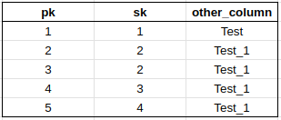

# Métodos tabela

Somente estruturas definidas não garantem o sucesso na leitura de informaçõẽs. Precisa-se implementar funções para utilizar os campos que defini no capítulo anterior. Como havia comentado, a tabela é a interface mais próxima do dado cru. Ou seja, é ela que acessa os arquivos *DataFile* e recupera tanto as chaves quanto os valores lá salvos; e é ela que tem a informação salva em sua estrutura usada para decodificar as informações recuperadas. E quais são os tipos de métodos da tabela então?

Resolvi dividí-los em três partes distintas por enquanto:

1. Conversores
2. Validação
3. CRUD

Todos os métodos utilizam um tipo de dado específico para funcionar, o RawRow.

**RawRow**

Tive muito contato com *pandas* e *spark* em python, e era comum utilizar o tipo de dados *dict* (dicionário) para manusear linhas e colunas, e acho o conceito interessante também, até pela praticidade e semelhança com json. Decidi então criar um tipo básico de dados chamado **RawRow**, cuja definição é a seguinte:

```go
type RawRow = map[string]interface{}

// Example

oneRow := map[string]interface{} {
    "id":1,
    "name": "Nícolas",
    "age": 32,
    "phone" "+555555555555",
    "email":"nicolas@nicolas.com"
}
```

Apesar de pratica, essa estrutura não é salva desta forma nos arquivos *DataFile*, existe um processo intermediário de conversão para que os dados sejam serializados e salvos.

# Conversores

A serialização vista no começo desta "temporada" será bem utilizada neste ponto do projeto. Vamos recapitular:

1. Arquivos *DataFile* guardam informações binárias tanto de chave quanto de valor, e retornam uma estrutura **[]BTreeKeyValue** quando uma leitura é feita.
2. Quando obtemos os bytes dos arquivos, transformamo-os em outro tipo de dados intermediário, um tipo que relaciona um valor a um tipo de dados e a uma coluna.
3. De posse deste tipo de dados intermediário, podemos criar, então, nosso conversor final para **RawRow** e o inverso também.

O que é esse tipo intermediário e por que resolvi desenvolvê-lo e não guardar diretamente os tipos **RawRow** como valor no arquivo? Bem, essa é uma pergunta que fiquei refletindo muitos dias até chega em uma conclusão aceitável.

Mas o grande ponto é que dentro dos arquivos, trabalhamos e armazenamos bytes, tornando esse manuseio mais complicado devido às possíveis implementações e limitações de golang em relação à serialização. O paco te *gob*, utilizado para este processo, serializa a estrutura inteira e muito rápido. Contudo, imaginem o seguinte cenário:

Decido realizar a seguinte query de uma tabela fictícia chamada **table_test**, cujas colunas são: **id**, **some_string**, **some_bytes**. Para tornar nossa vida mais complicada, uma das linhas salvas no arquivo possui a coluna **some_bytes** com tramanho próximo a 1 GB. Digamos que eu queira executar uma query simples para trazer somente os campos **id** e **some_string** de todas as linhas da tabela.

```sql
SELECT id, some_string
FROM table_test
```
Caso nosso valor da linha tenha sido serializado como um todo, o sistema tem que recuperar todas as linhas com todas as colunas e somente depois elimitar a coluna **some_bytes**, levando a um possível uso excessivo de memória sem a necessidade. E se fosse possível selecionar dentro do próprio arquivo da árvore binária as colunas que você ou o sistema quer sem ter que trazer todas elas para a memória? É o intuito da estrutura **ColumnValue**.

```go
type ColumnValue struct {
	Value interface{} // Value of the column
	Col   uint16      // Refers to the respective column of a table for example:
	// Table X has column Y and column Z, which are stored in a Table struct as an array of Columns struct
	// Each position of this array represents a column in the table. Whenever a column is serialized,
	// the position of the column is stored in the Col field
}
```

A ideia é simples -- existem dois campos, o *Value* e o *Col*, sendo respectivamente o valor da coluna e o número da posição da coluna estrutura da tabela. Vamos explicar melhor.

A nossa tabela tem a seguinte estrutura:

```go
table := Table{
    Columns: []Columns {
        {
            Name:"id",
            Type: COL_INT
        },
        {
            Name:"name",
            Type: COL_STRING
        },
        {
            Name:"email",
            Type: COL_STRING
        }
    }
}

```

Note que o aray de colunas definido é ordenado sendo a primeira coluna na posição zero, a segunda na posição um e assim sucessivamente. Essas posições representam o campo *Col* da estrutura de dados **ColumnValue**, não é fácil? Mas e como fica então a conversão em bytes de uma linha inteira?

Segue o exemplo ilustrativo dessa conversão, usando-se o tipo de tabela definido anteriormente:

**Linha a ser convertida**

```go
oneRow := map[string]interface{} {
    "id":1,
    "name": "Nícolas",
    "email":"nicolas@nicolas.com"
}
```

Convertendo essa linha para o tipo de dados **[]ColumnValue**, resulta em:

```go
columnValues := []ColumnValue{
    {
        Value: 1,
        Col:0
    },
    {
        Value:"Nícolas",
        Col:1
    },
    {
        Value:"nicolas@nicolas.com"m
        Col:2
    }
}
```

Por fim, basta serializar este array de **ColumnValue** e inserir os bytes no arquivo *DataFile*. Porém, a forma de serialização aqui segue o passo mais crítico. Para conseguir buscar colunas específicas das linhas sem ter que trazer a linha completa para a memória, preciso implementar meu próprio processo de serialização, que daria um pouco de trabalho; e agora meu objetivo ainda não é otimização. Por este motivo e outros mais, decidi utilizar a função das utilidades já criada **Serialize** para gerar os bytes.

Seguem as funções usadas para esse processo todo de conversão:

```go
// Functions that are used to convert a row to column values and vice versa
func (t *Table) MapRowToColumnValues(row RawRow) []ColumnValue {
	// Create a map to hold the column values
	columnValues := make([]ColumnValue, len(t.Columns))

	// Loop through the columns and add them to the map
	for index := range t.Columns {
		// Get the value from the row
		value := row[t.Columns[index].Name]

		// Create a new column value
		columnValues[index] = ColumnValue{
			Col:   uint16(index),
			Value: value,
		}
	}

	return columnValues
}

func (t *Table) FromColumnValuesToRow(columnValues []ColumnValue) RawRow {
	// Create a map to hold the column values
	row := make(RawRow)

	// Loop through the columns and add them to the map
	for index := range t.Columns {
		// Get the column value
		columnValue := columnValues[index]
		// Add the value to the row
		row[t.Columns[index].Name] = columnValue.Value
	}

	return row
}

func (t *Table) FromRawRowToKeyValue(row RawRow) btree.BTreeKeyValue {
	// Create a new column value
	columnValues := t.MapRowToColumnValues(row)

	// Serialize the column values
	serializedColumnValues, _ := utils.Serialize(columnValues)
	key, _ := utils.Serialize(row[t.PrimaryKey.Name])
	return btree.BTreeKeyValue{
		Key:   key,
		Value: serializedColumnValues,
	}
}

func (t *Table) FromKeyValueToRawRow(keyValues []btree.BTreeKeyValue) []RawRow {
	// Create a new column value
	rawRows := make([]RawRow, len(keyValues))

	for i := range keyValues {
		// Create tmp ColumnValue array
		var columnValue []ColumnValue
		// Get the value from the row
		err := utils.Deserialize(keyValues[i].Value, &columnValue)

		if err != nil {
			return nil
		}

		rawRow := t.FromColumnValuesToRow(columnValue)
		// Add the value to the row
		rawRows[i] = rawRow
	}

	return rawRows
}

```

# Validadores

Não queremos que nossos dados salvos fujam do padrão, não é mesmo? Então é sempre bom garantir que os tipos dos dados estejam nas conformidades das definições das colunas das tabelas. Como por enquanto as necessidades da tabela não são tantas, digo, não há muitas restrições que possam aparecer além dos mais básicos, como: Validação de tipos de dados; Verificação de dados nulos, Verificação de duplicados, Inserção automática de chave primária.

Para suprir essas necessidades, criei um arquivo chamado: **validator.go** dentro do módulo de tabelas, o qual contém todas as funções de validação e alteração de dados, caso necessário.

Começando com o método de validação se a coluna não existe nas definições da tabela. Já pensou no caso onde alguém tenta inserir uma coluna que não existe na definição da tabela e acaba conseguindo? Isso pode causar sérios problemas caso não seja evitado. Por isso, vamos criar nossa primeira função de validação, **validateIfColumnExist**

```go
func validateIfColumnExist(column Column, t *Table) error {
	if t.GetColumnByName(column.Name) == nil {
		return fmt.Errorf("column %s does not exist in table %s", column.Name, t.Name)
	}

	return nil
}
```

Ela é simples e verifica se nas definição da estrutura **Table**, no campo **Columns**, existe alguma coluna com o nome da variável *column* (parâmetro da função). Caso essa coluna recebida pela função não exista nas definições da tabela, o sistema retorna um erro.

Passado isso, tem o caso inverso, no qual menos colunas do que as totais existentes na tabela são fornecidas. Isso é comum e pode ocorrer, pois o próprio servidor do banco de dados encarrega-se de preencher as colunas faltantes com campos nulos e, no caso dos campos auto increment, ele trata de incrementar automaticamente caso seja uma chave da tabela.

```go
func fillupMissingFields(t *Table, row *RawRow, column Column) {
	// Fill up missing fields with default values
	if _, ok := (*row)[column.Name]; !ok {
		if !column.AutoIncrement && !column.Primary && !ok {
			(*row)[column.Name] = column.Default
			return
		}
	}

	// Get last Value, cast it to int64 and add one (This should be only with autoincrement columns)
	// Meaning that the columns is an integer between all possiblities
	// SMALL_INT, BIG_INT, INT, etc
	if column.AutoIncrement && column.Primary {
		lastValue := t.getLastItem()
		if lastValue == nil {
			(*row)[column.Name] = lastValue[column.Name].(int64) + 1
		} else {
			(*row)[column.Name] = 1
		}
	}
}

```

Olhem que interessante, na primeira parte da função eu verifico se a linha que vai ser inserida tem a coluna que estou validando. Caso ela não exista, o sistema insere o valor da coluna **Default**, que por definição é *nil*.

Na segunda parte tratamos os casos das colunas que não existem e são chaves primárias auto incrementais. Neste caso, buscamos o último item adicionado à tabela e recuperamos sua respectiva chave, fazemos um cast nesse valor para **int64** e adicionamos um ao número. Se a tabela for vazia significa que o campo de auto increment deve ser um.

Notem que eu considero que obrigatóriamente a coluna auto increment seja um inteiro, e realmente deve ser. Irei criar validadores nos comandos de criar tabela para impedir com que colunas auto increment sejam criadas quando tiverem tipos de dados diferentes de inteiros.

**Validar Não Nulos**

```go
func validateNull(column Column, value interface{}) error {
	if !column.Nullable && value == nil {
		return fmt.Errorf("column %s cannot be null", column.Name)
	}

	return nil
}
```

Aqui é simples e não tem segredo, verificamos se o campo é anulável e se não for, verificamos se o valor é *nil*. Caso as condições sejam satisfeitas, retornamos um erro na função.

**Validar Duplicidade**

Chegou uma função mais complicada para verificações, se o dados já existe ou não. Normalmente, dados duplicados são verificados na inserção da chave. Por exemplo, em tabelas com chaves únicas, não podemos inserir duas vezes uma linha com a chave igual a 1. O mesmo ocorre para tabelas que possuem chaves compostas e uma restrição criada para essas tabelas. Normalmente vê-se essas tabelas com as **constraints**. Bom, vamos lá, a implementação inicial é a seguinte:

```go
func validateUnique(table *Table, row RawRow) error {

	// It is a table without any constraints
	if table.PrimaryKey == nil && table.CompositeKey == nil {
		return fmt.Errorf("not indexed table. Cannot validate uniqueness")
	}

	// Uniqueness works only for primary keys or composite keys (Constraints)
	var pk *Column = nil
	var key []byte = make([]byte, 0)
	if table.PrimaryKey != nil {
		pk = table.PrimaryKey
		// Indicates that the PK is present and not composite key
		tmp := row[pk.Name]
		serialized, err := utils.Serialize(tmp)

		if err != nil {
			return err
		}

		key = append(key, serialized...)
	}

	if table.CompositeKey != nil {
		// If composite key is different than nil, then it is a composite key
		for _, column := range table.CompositeKey {
			tmp := row[column.Name]
			serialized, err := utils.Serialize(tmp)

			if err != nil {
				return err
			}

			key = append(key, serialized...)
		}
	}

	if len(table.PDataFile.Get(key)) > 0 {
		return fmt.Errorf("row already exists in table")
	}

	return nil
}
```

Nada muito complicado. Existem duas possibilidades, quando a chave é única ou a chave é composta, indicando que a restrição é baseada nessa chave e no arquivo principal da tabela. Após conseguirmos o valor da chave serializado, utilizamos diretamente a interface do ponteiro do arquivo **DataFile** para ver se essa chave existe ou não. Caso exista, o sistema emite um erro indicando que uma chave desse valor já fora adicionado.

**Função Única**

Bom, encapsulei todas essas validações em uma função única que roda antes das inserções de dados e recebe como parâmetro um array de **RawRow**, como mostrado abaixo:

```go
func (t *Table) ValidateRawRows(rows []RawRow) ([]RawRow, error) {
	validatedRows := make([]RawRow, 0)
	for _, row := range rows {
		err := t.ValidateColumns(&row)
		if err != nil {
			return nil, err
		}
		validatedRows = append(validatedRows, row)
	}
	return validatedRows, nil
}

func (t *Table) ValidateColumns(row *RawRow) error {
	columns := t.Columns
	for _, column := range columns {
		fillupMissingFields(t, row, column)
		err := validateIfColumnExist(column, t)
		if err != nil {
			return err
		}
		err = validateNull(column, (*row)[column.Name])

		if err != nil {
			return err
		}

		err = validateUnique(t, *row)

		if err != nil {
			return err
		}
	}

	return nil
}
```

# CRUD Tabelas

Cheamos na parte final deste capítulo, finalmente. Passei tanto tempo pensando nessa parte de estruturas e como deveria ser que, agora que estou perto de finalizar suas implementações iniciais, estou me sentindo aliviado. Bom, de todo modo, as tabelas precisam adicionar, ler, deletar e atualizar infomações, certo? Todas terão os seguintes métodos básicos:

- Get
- Insert
- Update
- Delete

Qual diferença de implementação destes inserts da implementação original do **DataFile**? Os inputs recebidos pelos métodos são todos baseados em **RawRow**, enquanto que os data file são baseados em bytes. Outro ponto muito importante, as tabelas podem ter índices, então, quando uma busca é feita por exemplo, os dados retornados podem vir tanto do arquivo original, quanto de um arquivo de índice; a depender de qual campo é passado.

As tabelas abstraem a utilização dos índices, tornando as buscas mais rápidas e inteligentes. Bom, mas bora para as implementações.

## Get

```go
func (t *Table) Get(column string, value any) ([]RawRow, error) {
	
	row := make([]RawRow, 0)
	// Get the pk column
	pk := t.PrimaryKey
	serializedValue, err := utils.Serialize(value)

	if err != nil {
		return nil, err
	}

	// If the column is the primary key, we can use the datafile to get the data
	if pk.Name == column {
		// Serialize the value

		row = append(row, t.FromKeyValueToRawRow(t.PDataFile.Get(serializedValue))...)
		return row, nil
	}

	// We try to find indexed DataFiles
	index, ok := t.Indexes[column]
	if ok {
		// Get the index DataFile
		indexDataFile := index.PDataFile
		// Get the value from the index
		indexValue := indexDataFile.Get(serializedValue)
		row = append(row, t.FromKeyValueToRawRow(indexValue)...)
	} else {
		// Worst case, there must be a scan through the datafile
		// Create a crawler at the beginning of the file
		crawler := btree.GoToFirstLeaf(t.PDataFile.GetBTree())
		// Loop through the datafile
		keyValues := make([]btree.BTreeKeyValue, 0)

		for {
			kv := crawler.GetKeyValue()
			keyValues = append(keyValues, *kv)

			// If the crawler is at the end of the file, break the loop
			if err = crawler.Next(); err != nil {
				break
			}
		}
		row = append(row, t.FromKeyValueToRawRow(keyValues)...)
	}

	return row, nil
}
```

O que acontece dentro dessa função? Os inputs *column* e *value* são análogos a uma condição de query, tipo **"WHERE x = 1"**. Então o input seria **column = 'x'** e **value = 1**. 

Eles são recebidos e a entrada *valor* é então serializado para ser usado em uma possível busca. Caso seja uma tabela com a chave primária, o sistema pega o ponteiro para a estrutura **DataFile** e realiza a busca para a chave proposta.

Caso a coluna passada não seja a coluna principal, o sistema verifica se há um índice dessa coluna e, se sim, utiliza para realizar a busca. Caso contrário, é feito o scan da tabela.

Mas calma lá, de onde surgiu esse scan e o que é isso ai? 

Essa é a surpresa e introdução do próximo capítulo. O scan é uma operação realizada pelo **BTreeCrawler** estrutura e tema do próximo capítulo, que basicamente varre a tabela pegando cada linha adicionada e verificando se existe ou não uma coluna com o respectivo valor.

Esse função get é útil para casos de buscas onde colunas indexadas são igualadas a valores, por exemplo:

```sql
WHERE indexed_column = 13 OR indexed_column IN (2,3,4,5,6,7)
```

## Insert

```go
func (t *Table) Insert(rows []RawRow) (int, error) {
	// First step - Validate rows

	validatedRows, err := t.ValidateRawRows(rows)

	// Returns case there is an error on rows validation process
	if err != nil {
		return 0, err
	}

	// We have to insert it into the base table and also into the indexes
	for i, row := range validatedRows {
		// Insert the row into the base table
		serializedRow := t.FromRawRowToKeyValue(row)
		t.PDataFile.Insert(serializedRow.Key, serializedRow.Value)
		// If there is indexed tables, we have to insert the row into the indexed tables
		for _, index := range t.Indexes {
			// Get the index DataFile
			indexDataFile := index.PDataFile
			// get the column name to be serialized
			indexKey := row[index.Column]
			// Serialize the value
			serializedIndexKey, err := utils.Serialize(indexKey)

			if err != nil {
				return i, err
			}
			// Insert the row into the index table
			indexDataFile.Insert(serializedIndexKey, serializedRow.Value)
		}
	}

	return len(rows), nil
}

```

A função de inserção não tem tantos segredos. Todas as linhas postas para serem inseridas passam pela função de validação. Não havendo problemas, as linhas seguem para inserção, que ocorre tanto no datafile original quanto em todos os índices existentes. O total de linhas adicionado é retornado.

## Delete

```go
func (t *Table) Delete(rows []RawRow) (int, error) {
	// Iterate over the input
	for _, row := range rows {
		// Delete the row from the base table
		serializedRow := t.FromRawRowToKeyValue(row)

		t.PDataFile.Delete(serializedRow.Key)
		// If there is indexed tables, we have to delete the row from the indexed tables
		for _, index := range t.Indexes {
			// Get the index DataFile
			indexDataFile := index.PDataFile
			// Delete the row from the index table
			indexColumn := row[index.Column]
			serializedIndexKey, err := utils.Serialize(indexColumn)

			if err != nil {
				return 0, err
			}
			// Get the keys from the index
			existingKeys := indexDataFile.Get(serializedIndexKey)

			// Indicates that there is more than one key for the same value
			// All keys must be deleted and the keys that are different from
			// the one that is being deleted must be inserted again
			if len(existingKeys) > 1 {
				deserializedExistingKeys := t.FromKeyValueToRawRow(existingKeys)
				reinsertKeys(t, indexDataFile, deserializedExistingKeys, row, serializedIndexKey)
			} else {
				indexDataFile.Delete(serializedIndexKey)
			}
		}

	}
	return len(rows), nil
}

func reinsertKeys(
	t *Table,
	indexDataFile *files.DataFile,
	existingKeys []RawRow,
	row RawRow,
	serializedIndexKey []byte,
) {
	musReinsert := make([]RawRow, 0)
	for _, iRow := range existingKeys {
		indexDataFile.Delete(serializedIndexKey)
		if iRow[t.PrimaryKey.Name] != row[t.PrimaryKey.Name] {
			musReinsert = append(musReinsert, iRow)
		}
	}

	// Reinsert
	for _, iRow := range musReinsert {
		serializedIndexRow := t.FromRawRowToKeyValue(iRow)
		indexDataFile.Insert(serializedIndexKey, serializedIndexRow.Value)
	}
}
```

Para a função delete também não há muitas diferenças em relação à função insert. O mesmo processo ocorre, onde as linhas são recebidas como input da função, o campo da chave primária é extraído e serializado para a tabela, e então a linha é excluida. Como a mesma linha deve ser excluída dos outros arquivos de índices, devemos fazê-lo para todos.

Há somente um ponto de atenção neste caso. Como há uma possibilidade remota de haver chaves duplicadas em arquivos de índices, quando o processo de deleção ocorre, todas as linhas que contém a chave acabam sendo excluídas, mas isso não deve ocorrer. Abaixo segue o exemplo ilustrado deste problema:

A tabela abaixo contém três colunas, a **pk** (chave primária única) a **sk** (chave secundária indexada) e **other_column** que é uma coluna qualquer.



Queremos deletar a linha onde o valor **pk** = 2. O que ocorre no sistema?

1. A tabela possui dois arquivos *DataFile*, o principal indexado pela chave **pk** e o secundário indexado pela chave **sk**.
2. Ao deletar a linha com valor **pk** = 2, o sistema deleta facilmente no arquivo *DataFile* principal. Porém, ao seguir para deleção no arquivo indexado pela chave **sk** ocorre um problema.
3. Dentro da função, quando o sistema busca dentro do arquivo indexado pelo valor da coluna **sk** da linha onde o **pk** = 2, ou seja, **sk** = 2 também, são retornados dois resultados; um referente à linha que deve ser deletada, e o outro, referente à linha onde **pk** = 3.
4. Como a função delete do datafile apaga todos os itens que possuam tal chave, ocorrerá uma deleção indesejada da linha onde **pk** = 3. Portanto, deve-se reinserir esta chave juntamente com seu valor.

## Update

A função update é a deleção seguida de uma inserção. Não houve implementação à parte.

# Finalização e a função Range

Não sei se perceberam, mas houve um método em espefício que não foi muito comentado, o Range. Enquanto construía os métodos das tabelas e elaborava alguns testes, percebi que quando eu quisesse executar uma query específica ou do arquivo todo, eu teria que de alguma forma ler todas as informações das folhas.

O grande problema, inclusive na montagem das funções da Árvore Binária, era ter essas informações rastreadas, ou seja, a localização de todas as folhas da árvore binária. Buscando um pouco e refletindo sobre como eu poderia solucionar esse problema, me veio a ideia de implementar algum tipo de um navegador de páginas da árvore binária. Em homengem aos crawlers da internet, chamei também esse buscador de BTreeCrawler.

Seu papel é navegar nas árvores binárias e encontrar folhas específicas e possibilitar a navegação pra frente ou para trás, através dos métodos da estrutura. Além disso, também é possível ler (derreferenciar) os valores de sua atual posição.

Não havia percebido mas, sem essa estrutura, seria muito lento e difícil realizar queries. Portanto, o próximo capítulo trata de sua implementação e seu funcionamento. Até lá
