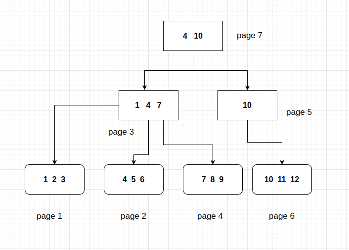
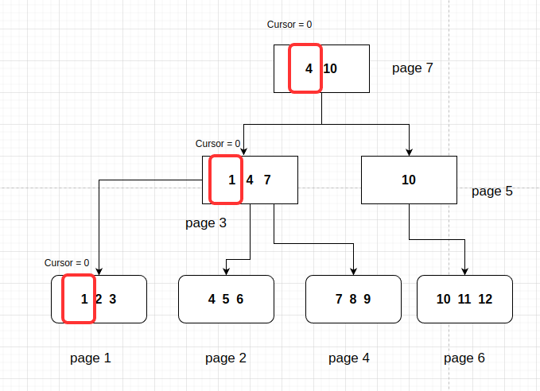
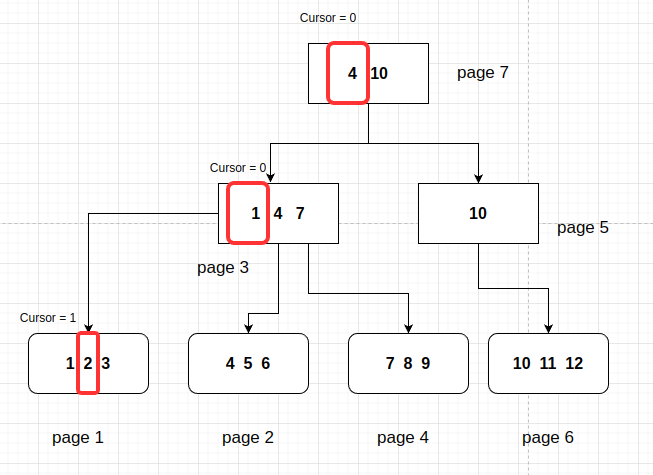

# The Crawler - O que é?

O nome vem da minha preguiça de pensar em nomes de estruturas e me baseei no método de busca dos web crawlers, que realizam buscas indexadas na web. A ideia é similar, porém, ao invés da web, tem-se páginas das árvores binárias.

Até o presente momento, é possível recuperar-se dados das árvores binárias. No entanto, não conseguimos realizar buscas de distância. Como assim? Não conseguimos, por exemplo, buscar chaves entre 1 e 31, a não ser que leiamos todos os itens da árvore binária; e mesmo assim isso não é possível. É para isso que essa nova estrutura veio à tona.

# Por que implementá-lo?

Sendo bem direto, é para viabilizar o uso de buscas **Range** e, depois, possibilitar o uso queries.

# Como funciona?

Antes de começar gostaria de dizer que eu sempre me esqueço de guardar as figuras que vou fazendo dos capítulos anteriores e tenho que refazê-las, tomando muito mais tempo do que gostaria para completar meus diários. Já é a quinta vez que preciso usar alguma figura da árvore binária e tenho que reconstruir tudo de novo. Foi só um desabafo.

Imaginemos que tenhamos uma árvore binária com algumas linhas de uma tabela salvas nela:



Para recuperar as informações, temos que acessar cada folha existente nesse arquivo. Mas como saber quais são as páginas para fazermos isso?

Fiquei refletindo nessa questão por um longo período de tempo. Uma solução que implementei dentro das árvores binárias era de mapear todas as pãginas da árvore para, então, obter todas as respectivas folhas e número das páginas. Desvantagens dessa implementação: Acesso de todas as páginas do arquivo farão com que o sistema fique muito lento quanto maior a base de dados. (Inclusive tenho que refatorar a árvore binária para melhorar essa questão de acesso).

Como sabemos, para cada folha existe um caminho de acesso passando por todos os nós. Esses nós podem ficar salvos em algum local para posteriormente servirem como guia de onde eu me encontro na árvore, não?

Resolvi seguir essa premissa. Usando a figura acima, sabemos que, para chegar na folha onde encontro o valor da chave 2, preciso passar pelas páginas 7 e 3. Para armazenar esse histórico de nós pelos quais passei, decidi criar uma variável chamada *Net*, representando uma rede de ligações, sendo ela um array de **TreeNode**.

Ou seja, cada posição neste array *Net* representa uma camada da minha árvore binária. Legal! mas para iterar todas as folhas da árvore, preciso também salvar o índice atual de cada folha que a árvore se encontra não? Claro, e para isso temos uma outra variável chamda *Cursor*, que é um array de números inteiros para os índices.

Parece que a ideia está ficando mais clara. Cada Crawler poderá buscar informações em arquivos de árvores binárias diferentes, portanto, essa estrutura também deve possuir um ponteiro para a árvore binária na qual ele busca informações. Disto isto, temos a primeira versão da nossa estrutura:

```go
type BTreeCrawler struct {
	bTree            *BTree
	Net              []TreeNode
	Cursor           []int
}
```

## Exemplo de funcionamento para Scan

Tentem entender a ideia com uma ilustração e o passo a passo de cada etapa. Usando novamente a figura anterior da nossa árvore binária, queremos fazer um scan dessa tabela, ou seja, ler todos os itens dentro dela. Para isso, instanciamos uma estrutura do **BTreeCrawler** apontando para a primeira folha.

**Método para Buscar primeiro Item**

```go
/*
Function to go directly to the first list and first item, usefull when dealing with requests
that are not in index and all values must be evaluated
*/
func GoToFirstLeaf(tree *BTree) *BTreeCrawler {
	crawler := newBTreeCrawler(tree)
	rootAddr := tree.GetRoot()
	page := tree.Get(rootAddr)
	// While loop to find the leaf
	for {
		if page.GetType() == TREE_NODE {
			crawler.Net = append(crawler.Net, page)
			crawler.Cursor = append(crawler.Cursor, 0)
			// Get the next page
			page = crawler.bTree.Get(page.GetNodeChildByIndex(0).GetAddr())

		} else {
			crawler.Net = append(crawler.Net, page)
			crawler.Cursor = append(crawler.Cursor, 0)
			crawler.CurrentKeyValues = getAllLeafKeyValues(&page)
			break
		}
	}

	return crawler
}
```

É retornado um ponteiro para essa estrutura do **BTreeCrawler** que possui os seguintes valores para os campos *Net* e *Cursor*

```go
// Representação valores campos BTreeCrawler
Net := []TreeNode{TreeNode{page:7}, TreeNode{page:3}, TreeNode{page:1}}
Cursor := []int{0,0,0}

```
Não é interessante? No array *Net*, estão listados de forma sequencial as páginas acessadas até chegar na última página (Folha), número 1, que contém as linhas que queremos acessar. Os elementos do campo *Cursor* contém os índices de cada página. Como assim?

Veja pelo figura abaixo, onde os elentos marcados em vermelho representam os índices autais do Cursor para cada respectiva página até a nossa primeira folha.



Em cada folha, o cursor = 0 corresponde à chave 1. Caso nós avancemos o cursor para o próximo item da folha, ou seja, a chave dois, os novos valores do cursor são os seguintes:

```go
Cursor := []int{0,0,1}
``` 



Avançando ainda mais chegamos no item 7, nossos índices na variável *Cursor* ficam como mostrado abaixo:

```go
Cursor := []int{0,2,0}
```

Não ficou simples? Acredito que essa implementação é extremamente mais direta e simples do que a que eu havia implementado para ávore binária. Num futuro próximo, refatorarei também a árvore binária.

De todo modo, preciso materializar essa ideia em métodos. Para facilitar nossa navegação entre os valores da folha, criei dois métodos de estrutura o **Next()** e o **Previous()**, que são usados para navegar nas nossas chaves salvas nas folhas.

Para retornar o valor da posição atual do Crawler, criei o método de estrutura **GetKeyValue**, que retorna em um ponteiro da struct **BTreeKeyValue**.

A implementação de cada método é descrita abaixo:

```go
type BTreeCrawler struct {
	bTree            *BTree
	Net              []TreeNode
	Cursor           []int
	CurrentKeyValues []LeafKeyValue
}

/*
Same as Next() but goes to the previous key value in the bTree
*/
func (crawler *BTreeCrawler) Previous() error {
	if len(crawler.Net) == 0 {
		return fmt.Errorf("no more keys")
	}

	reachedEnd := true
	// If it has reached maximum
	for i := 0; i < len(crawler.Net); i++ {
		if uint16(crawler.Cursor[i]) != 0 {
			reachedEnd = false
			break
		}
	}

	if reachedEnd {
		return fmt.Errorf("no more keys")
	}

	lastNode := crawler.Net[len(crawler.Net)-1]
	lastNodeIdx := crawler.Cursor[len(crawler.Cursor)-1]

	if lastNodeIdx == 0 {
		removeLastIdx(crawler)
		crawler.Previous()
	} else {
		// If it is not the last key in leaf, we just decrement the Cursor
		crawler.Cursor[len(crawler.Cursor)-1]--

		if lastNode.GetType() == TREE_NODE {
			nextIdx := lastNodeIdx - 1
			nextNode := crawler.bTree.Get(lastNode.GetNodeChildByIndex(nextIdx).GetAddr())
			crawler.Net = append(crawler.Net, nextNode)
			crawler.Cursor = append(crawler.Cursor, int(nextNode.GetNItens())-1)

			// Update the current key values
			if nextNode.GetType() == TREE_LEAF {
				crawler.CurrentKeyValues = getAllLeafKeyValues(&nextNode)
			}
		}
	}

	return nil
}

func (crawler *BTreeCrawler) Next() error {
	if len(crawler.Net) == 0 {
		return fmt.Errorf("no more keys")
	}

	reachedEnd := true
	// If it has reached maximum
	for i := 0; i < len(crawler.Net); i++ {
		if crawler.Net[i].GetNItens()-1 != uint16(crawler.Cursor[i]) {
			reachedEnd = false
			break
		}
	}

	if reachedEnd {
		return fmt.Errorf("no more keys")
	}

	lastNode := crawler.Net[len(crawler.Net)-1]
	lastNodeIdx := crawler.Cursor[len(crawler.Cursor)-1]
	// If it is a leaf, we need to find the next leaf
	// If it is the last key in leaf we need to remove it from the net and call next again
	if lastNodeIdx == int(lastNode.GetNItens()-1) {

		removeLastIdx(crawler)
		crawler.Next()
	} else {
		// If it is not the last key in leaf, we just increment the Cursor
		crawler.Cursor[len(crawler.Cursor)-1]++
		if lastNode.GetType() == TREE_NODE {
			nextIdx := lastNodeIdx + 1
			nextNode := crawler.bTree.Get(lastNode.GetNodeChildByIndex(nextIdx).GetAddr())
			crawler.Net = append(crawler.Net, nextNode)
			crawler.Cursor = append(crawler.Cursor, 0)

			if nextNode.GetType() == TREE_LEAF {
				crawler.CurrentKeyValues = getAllLeafKeyValues(&nextNode)
			}
		}
	}

	return nil
}

/*
Get actual BTreeKeyValue in the crawler
*/
func (crawler *BTreeCrawler) GetKeyValue() *BTreeKeyValue {
	if len(crawler.Net) == 0 {
		return nil
	}

	leaf := crawler.Net[len(crawler.Net)-1]

	// It is a linked list
	if leaf.GetLeafHasSeq() > 0 {
		key := leaf.GetLeafKeyValueByIndex(uint16(0)).key
		value := getAllBytesFromSequences(crawler.bTree, leaf)

		return &BTreeKeyValue{
			Key:   key,
			Value: value,
		}
	}

	keyValueIdx := crawler.Cursor[len(crawler.Cursor)-1]
	kv := crawler.CurrentKeyValues[keyValueIdx]

	return &BTreeKeyValue{
		Key:   kv.key,
		Value: kv.value,
	}
}
```

**Observações e Mudanças**

Notem que um campo a mais foi inserido dentro da estrutura **BTreeCrawler** que é o CurrentKeyValues. Mas por que ele está ai? Bom, sabemos que as folhas possuem um método **GetLeafKeyValueByIndex**, que retornam um ponteiro da estrutura **LeafKeyValue**, porém, esse método não é tão eficiente, pois ele precisa ler a sequência de bytes e então formar um array com esses objetos.

Para acelerar esse processo e esse mecanismo for feito somente uma vez, toda vez que a folha atual é trocada, fazemos essa leitura de todos os Key Values salvos nela e colocamos esses valores na variável *CurrentKeyValues*. Então, para recuperação do dado da folha atual, não acessamos mais os métodos da struct **TreeNode**, mas sim os valores salvos no nosso novo campo.

### Explicação dos métodos

Tanto para o método **Next** quanto o método **Previous** a lógica é a mesma, o que muda é o sentido da navegação nas folhas, mas vamos lá:

1. Valida se o comprimento do campo *Net* é zero e retorna um erro
2. Verifica se já estamos no último elemento da página (Caso método next) e retorna uma erro dizendo que não existe mais dados adiante
3. Caso não seja o último índice total da árvore, o sistema verifica se é o último índice da folha atual, se sim, remove os os últimos índices dos arrays e chama recursivamente o próprio método
4. Em último caso, o sistema verifica se o último obejeto do campo *Net* é uma folha, se não, ele realiza a busca a inserção da respectiva folha, caso contrário, ele incrementa o índice do *Net* e *Cursor*, avançando o Crawler de posição

Para a recuperação dos valores de dentro do **BTreeCrawler** usamos o método **GetKeyValue** que funciona de forma simples:

1. Verifica se a folha atual é uma lista ligada (tem bytes maiores que o tamanho total da folha) e realiza sua busca
2. Caso contrário, lê do array *CurrentKeyValues* da respectiva posição do índice em *Cursors* e *Net*

# O que vem depois?

Dada implementação dessa funcionalidade de navegar pelas folhas, podemos avançar nos nossos métodos da tabela e gerar finalmente a nossa função **Range**, que busca dados a partir de condições de maior, menor, maior igual, etc. O Próximo capítulo aborda a construção e a ideia desse método.

