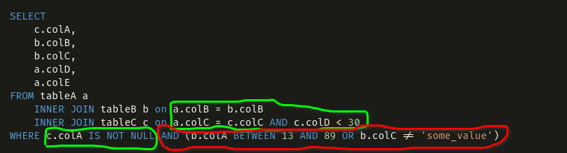

# O método range

Essa função tomou muito tempo e criatividade minhas, principalmente por ainda não ter várias outras camadas do software decididas. Antes de entrar em qualquer detalhe técnico, eu devo contextualizar as premissas e possibilidades dessa função, e o que me tomou tanto tempo para refletir.

Vamos lá! Por definição o método **Range** é uma busca por alcance. Em uma árvore binária indexada, o alcance é ditado pela faixa de índices que se deseja buscar. Vou exemplificar: Uma tabela que possui índices inteiros, tem valores de chave que variam de 1 a um número muito grande. Portanto, pode-se efetuar buscas entre qualquer combinação de condição desses valores, por exemplo: maior igual a um; menor que cinco maior que zero; diferente de dois. Todas essas condicionais de verificação geram alcances de busca distintos na tabela.

**Porque não usar scan para todas as buscas?**

Responderei com outra pergunta: Para que então utilizar árvores binárias? O intuito dessa estrutura é tornar mais ágil as buscas pelas chaves salvas nela. Utilizando sempre scan para realização de queries tornaria nosso sistema ineficiente.

**Pois qual o melhor cenário para isso?**

Dada uma query de sql, deve-se ter um sistema capaz de analisar todas condições da tabela, seus índices existentes, subjoins, etc; e criar uma busca por alcance mais eficiente para o cenário possível.

# A ideia por trás dessa implementação

Agora criarei diversas queries fictícias para demonstrar a ideia e o motivo por trás dessa implementação. Vão notar que provavelmente algumas coisas, principalmente da estrutura de dados, mudarão com o tempo, tendo em vista que eu fiz várias suposições e pensei que o sistema funcionaria de uma certa forma.

Vamos lá, nosso cenário de testes contem as seguintes tabelas e suas definições nessas estruturas

```sql
CREATE TABLE IF NOT EXISTS person (
    person_id AUTO INCREMENT KEY BIGINT,
    address_id FOREIGN KEY BIGINT,
    name STRING,
    age SMALLINT,
    email STRING
)

CREATE TABLE IF NOT EXISTS addresses (
    address_id AUTO INCREMENT KEY BIGINT,
    street_name STRING,
    number INT,
    postal_code INT,
    country STRING,
    indexed_column BIGINT
)
```

São duas tabelas fictícias com o único proposito de podermos fazer queries. E essas queries serão simples também, mas nos trarão a ideia básica do que quero mostrar. Outro detalhe que vale mencionar é que a tabela person possui indexação pela chave address_id também.

Suponha que queira fazer alguma query com a tabela person, por exemplo, buscar todas as pessoas que tenham idade menor que 30 anos. Teríamos a seguintes query:

```sql
SELECT * FROM person WHERE age < 30
```

Uma única condição simples na qual a coluna idade é menor que 30. Qual é o alcance que nossa tabela precisa realizar para verificar todos esses dados? Vamos lá para a explicação: A tabela person possui uma árvore binária com chave **person_id** e um índice criado posteriormente para a coluna **address_id**; para o caso da coluna age não temos como saber, de forma indexada, onde os registros se encontram. Portanto, é necessário realizar o scan da tabela toda e verificar, registro por registro, quem são as pessoas que possuem idade menor que 30 anos. Mas e se fizessemos uma alteração na busca e colocássemos da seguinte forma:

```sql
SELECT * FROM person WHERE age < 30 AND address_id BETWEEN 18 AND 78
```

Agora a situação mudou pois temos uma outra condição restritora *AND* que fala que o address_id, que é indexado nessa tabela, estejam entre 18 e 78. Deste modo, agora nosso range de buscas tem que ser maior que 18 e menor que 78.

**O que acontece com joins?**

Os joins são junções de tabelas, ou pedaços dessas tabelas com outras. Quando joins são realizados, normalmente deve-se buscar pela tabela toda, em ambos casos, onde os registros se igualam. Obviamente, existem técnicas que reduzem o tempo de processamento para essas junções, porém o alcance tem que ser total, a não ser que existe alguma condição de restrição de alguma tabela que já reduza o tamanho do alcance. Abaixo está um outro exemplo disso:

```sql
SELECT * 
FROM person p 
    INNER JOIN addresses a ON p.address_id = a.address_id
WHERE a.indexed_column > 700
```

Note que aqui um join é efetuado e, por via de regra, ambas tabelas precisariam de buscas de alcance máximo (scan). Porém, sabe-se que para a tabela a existe a condição em que a coluna indexada **indexed_column** deve ser maior que 700. Neste caso, o range da tabela addresses fica reduzido àquela condição.

**E para multiplas condições?**

O caso de múltiplas condições obedece sempre a regra de restrição baseada nas colunas comparativas. Dentre todas possibilidades, sempre o pior caso é o scan da tabela. Vejamos, se não consigo inferir um limite de alcance para a busca, significa, diretamente, que preciso varrer a tabela.

Para condicionais *OR*, é levado em conta sempre o pior caso, enquanto que para condicionais *AND* sempre o melhor caso, por exemplo:

```sql
-- First query
SELECT * 
FROM person p 
    INNER JOIN addresses a ON p.address_id = a.address_id
WHERE 1 = 1 OR a.indexed_column > 700

-- Second query
SELECT * 
FROM person p 
    INNER JOIN addresses a ON p.address_id = a.address_id
WHERE 1 = 1 AND a.indexed_column > 700
```

As queries são semelhantes, com uma única diferença no condicional para a coluna **indexed_column**. No primeiro caso, o range tem que ser total (Scan), enquanto que para o segundo caso, o range tem que ser > 700 para as chaves.

Trabalhando com multiplas condições requer que o sistema avalie todas as colunas colocadas como condicionais, joins, de modo que identifique as colunas indexadas bem como seu tipo de operação, se é um *AND* ou *OR*, e agrupe-as para cada tabela específica para decidir qual o melhor e mais otimizado range para determinada query.

**Por que quero realizar somente uma busca nas tabelas?**

O pior caso de acesso a dados é justamente em arquivos, onde a leitura é muito mais lenta que em memória. Neste caso, se diminuirmos a quantidade de vezes que um arquivo é acessado, melhor para nosso sistema e mais rápido os resultados virão. Por isso, determino o melhor caso de acesso aos arquivos e o faço somente uma única vez, e todas as outras verificações, transformações, joins, são oriundos desses dados retornados do Range

# Como funciona

Agora vem a parte da implementação e de realmente mostrar como eu pensei na estratégia de solução para este problema, encontrar o melhor alcance da função Range.

Existem duas possibilidades do range, retornar um ponteiro de uma estrutura **BTreeCrawler** ou retornar um array de **RawRow** **[]RawRow**. Escolhi, por ora, implementar somente o retorno de um array de raw row, embora o trabalho para a primeira opção fosse o mesmo.
Portanto, nossa função range tem o seguinte escopo:

```go
func (t *Table) Range(input []ColumnComparsion, limit int, order int) []RawRow {
    // Implement Here
}
```

## ColumnComparsion

Notem que existe uma variável de entrada da função chamada *input*, cujo tipo é um array de **ColumnComparsion**, ainda não mencionado aqui no projeto. O que seria essa nova estrutura?

Agora entra grande parte do meu sofrimento para essa tarefa: A definição dessa estrutura!

Após muito refletir, cheguei a conclusão que o que pode delimitar ou restringir o alcance das buscas em arquivos *DataFile* (Árvore Binárias) é o tipo de comparação de colunas. É exatamente o que eu havia introduzido de conceito no início desse capítulo, as comparações como: "***WHERE x > 1 AND (y = 1 OR z = 3)*** ", ***INNER JOIN sometable t ON t.x = x***.

O grande problema é analisar queries imensas, pois, elas podem ser extremamente simples como também absurdamente complexas, cascateadas, aninhadas, recursivas; e o grande ponto aqui é extrair as informações de colunas e tentar estipular qual o melhor cenário de busca de um arquivo de dados.

Resolvi então explicitar as possibildades de comparação de uma coluna em uma estrutura de dados chamada **ColumnComparsion**, cujo esquema é definido abaixo:

```go
type ColumnComparsion struct {
	ColumnName string               // Column name
	TableName  string               // Table Name ()
	Condition  int                  // Condition EQ, NEQ, GT, GTE, LT, LTE, IN, NIN, LIKE, NLIKE
	Alias      string               // Alias for the column
	Value      ColumnConditionValue // Value to be used in the comparsion
	Id         int                  // Identifier for comparsion, example WHERE x < 1 AND x > -3, the identifier belongs
	// to the layer of comparsion. Bosh x<1 and x>-3 have the same identifier, meaning that they are in the same layer
	ParentId        int // Parent layer id, if it is base layer, it is -1
	ParentLogicalOp int // Parent AND or OR
	LayerLogicalOp  int // AND or OR
}

type ColumnConditionValue struct {
	IsOtherColumn        bool                                         // Indicates if the value is a column comparsion
	IsOtherTable         bool                                         // Indicates if the value is a column from another table
	ColumnName           string                                       // Column name
	TableHash            string                                       // Table Hash (Used to get the table from the database)
	Value                interface{}                                  // Value is only used if isOther columns and isOtherTable are both false
	Transformation       func(interface{}, []interface{}) interface{} // Still not implemented
	TransformationParams []interface{}                                // Still not implemented
}
```

Essa estrutura foi pensada para ser também aproveitada para a parte de comandos, que nem sequer foi planejada, por isso, tento levar em consideração diversos pontos. Entre eles, encontram-se a parte de comparação e transformação de dados. Embora eu não tenha certeza se essa estrutura permanecerá a mesma até que a parte de comandos seja implementada, decidi ainda sim seguir com essa implementação, pois, o que mudaria no futuro seriam apenas alguns detalhes frente aos campos internos da estrutura. Porém, a lógica de implementação seguiria a mesma, não se fazendo necessária nenhuma refatoração absurda.

**Campos**

A coluna que recebe algum tipo de comparação tem seu nome anotado no campo *ColumnName* e sua respectiva tabela em *TableName*. Seguindo com o campo conditions, que segue um enumerate de condições como: GTE (Greater Equal); LT (Less Than); EQ (Equal). O campos alias é especificado caso a coluna tenha algum alias atrelado a ela. Por fim, existe o campo Value, cuja especificação se da pela estrutura **ColumnConditionValue**, sendo nada mais nada menos que a especificação da comparação. Se é ou não outra coluna de outra tabela, ou se é um valor; ou também se é um valor que precisa ser transformado antes de comparado.

Esses são os principais campos relacionados aos valores para comparações. Entretanto, nota-se que não comentei nada ainda sobre os campos de *Id*, *LayerLogicalOp*, *ParentId* e *ParentLogicalOp*, pois fazem parte de uma camada de abstração de nível de comparações.

## Níveis de Comparações

Analise a seguinte query e tente analisar quais os níveis de camadas de comparação que existem.

```sql
SELECT
    c.colA,
    b.colB,
    b.colC,
    a.colD,
    a.colE
FROM tableA a
    INNER JOIN tableB b on a.colB = b.colB
    INNER JOIN tableC c on a.colC = c.colC AND c.colD < 30
WHERE c.colA IS NOT NULL AND (b.colA BETWEEN 13 AND 89 OR b.colC != 'some_value')
```

Existem três tabelas que devem ter seus arquivos de dados acessados. O sistema deve, portanto, tentar estipular o melhor caso de acesso aos arquivos através das comparações de colunas de cada tabela. Para isso, devemos analisar quais os tipos de comparações e em que camadas encontram-se?

**Camadas**

A camada raíz, ou camada zero é a camada direta a partir da cláusula *Where* e também dos *Joins* e suas condições. Qualquer outras condições compostas que fiquem dentro de parênteses, são consideradas condições de outras camadas, e quanto mais camadas aninhadas existem, maior é o nível lógico das comparações. Abaixo segue a figura da mesma query acima com as camadas especificadas:



As cores verdes indicam que as comparações estão na camada zero, enquanto a parte vermelha indica a camada 1. Caso houvessem mais camadas dentro da camada 1, elas seriam respectivamente 2, e assim por diante.

Camadas identificadas, o que precisamos fazer?

Agora é hora de segregar as comparações para as respectivas tabelas, vamos lá. Existem três tabelas, portanto, devem existir três segregações, para a tabela a,b e c respectivamente. Cada uma delas corresponde a um array da estrutura de **ColumnComparsion**

De modo a facilitar, não definirei ainda as estruturas aqui dentro, porém, colocarei somente as comparações em formato de texto.

- **tableA**: ['a.colB = b.colB on layer 0','a.colC = c.colC on layer 0']
- **tableB**: ['b.colB = a.colB on layer 0', 'OR b.colC != 'some_value' on layer 1', 'b.colA between 13 AND 89 on layer 1']
- **tableC**: ['c.colC = a.colC on layer 0', 'c.colA != NULL on layer 0', 'c.colD < 30 on layer 0']

Agora temos as condições de cada tabela em forma de texto, passando-as para o formato de estrutura de dados seria a mesma coisa, porém em um formato que o software entenderia. Deixarei somente um exemplo de uma das comparações para que seja visivel como funciona:

```go
// Comparsion = a.colB = b.colB on layer 0

comparsionExample := ColumnComparsion{
    ColumnName: "colB",
    TableName: "tableA",
    Condition: EQ,
    Alias: nil,
    Value: ColumnConditionValue{
        IsOtherColumn: true,
        IsOtherTable: true,
        ColumnName: "colB",
        TableHash: "tableB",
        Value: nil,
        Transformation: nil,
        TransformationParams:nil
    },
    Id: 0, // layer
    ParentId: -1, // No parent
    ParentLogicalOp: AND, // Default
    LayerLogicalOp: AND // Default
}
```
## RangeOptions

Essa estrutura é o resultado da avaliação final do nosso sistema. Com o **RangeOptions** podemos delimitar, de forma rápida, a partir de qual chave será realizada a busca, bem como até que chave a busca seguirá. A estrutura é mostrada a seguir:

```go
type RangeOptions struct {
	From        []byte
	To          []byte
	FComparator int             // From Comparator, indicates what type of comparation should be done with the From value ex: GTE or GT
	TComparator int             // To Comparator, indicates what type of comparation should be done with the To value
	Order       int             // Order of the range wheter is ASC os DESC
	Limit       int             // Limit of the range
	PDataFile   *files.DataFile // Pointer to the data file to be used
}
```

Além dos campos *From* e *To*, temos dois outros adicionais que representam qual o tipo de operação delimita a parada e o início da busca. O FComparator delimita o início, por exemplo: quando FComparator é igual a GTE (Maior Igual), significa que o RangeOptions inicia na chave que estiver em From e vai até a comparação da chave To. Para a condição de parada para a chave To, temos que avaliar o que está escrito dentro de TComparator, se for GTE (Maior igual), significa que a condição de parada é quando a chave alcançar um valor maior igual ao *To*.

Os outros campos *Order*, indica qual a ordem de busca do método **RangeFromOptions** se é ascendente ou decrescente, e o limit indica se há ou não um limite de dados para a busca (-1 não há limite). Por fim, o PDataFile é um ponteiro ao arquivo que a busca está sendo direcionada, podendo ser o arquivo base de uma tabela ou até mesmo um índice.

Quando os valor de From ou To são iguais a *nil* significa que não há delimitador. Portanto, o scan de uma tabela é uma estrutura **RangeOptions** em que os valore *From* e *To* são iguais a *nil*.

**RangeFromOptions**

```go
func RangeFromOptions(t *Table, options RangeOptions) ([]RawRow, error) {
	// If from and to are not set, we return all the rows
	if options.From == nil && options.To == nil && options.Limit < 0 {
		// Scan the whole file
		scannedData, err := scan(options.PDataFile)
		return t.FromKeyValueToRawRow(scannedData), err
	}

	// Get crawler based on the options
	crawler := getCrawlerBasedOnOptions(options)
	// Returns all data gathered from crawling the data file
	return crawlDataFileBasedOnOptions(t, crawler, options)
}

```

Este método realiza o Range da tabela baseado nas opções de range, retornando um array de **RawRow**. O que ele faz basicamente é analisar o arquivo de opções passada e retornar um **BTreeCrawler** e depois utilizá-lo para buscar todas as linhas dada a condição do **RangeOptions**.

**Obs: Os outros métodos foram omitidos para não ficar muito verboso esse trecho. Para vê-los é só acessar o arquivo src/database/range.go**

## Merge

Tendo separado para cada tabela todas as comparações e seus níveis, precisamos realizar os merges respectivos de cada um. Mas como fazer isso?

Agrupamos agora por nível de comparação e criamos uma função chamada **Merge**, que transforma duas estruturas de **ColumnComparsion** em uma única, baseada em suas configurações. Como mostrado abaixo:

```go
func mergeAnd(r *RangeOptions, other RangeOptions) {
	// Create a new RangeOptions
	if (bytes.Compare(other.From, r.From) < 0 && other.From != nil) || r.From == nil {
		r.From = other.From
	}

	if (bytes.Compare(other.To, r.To) > 0 && other.To != nil) || r.To == nil {
		r.To = other.To
	}
}

func mergeOr(r *RangeOptions, other RangeOptions) {
	// Create a new RangeOptions
	if r.Order == DESC {
		if bytes.Compare(other.From, r.From) < 0 || r.From == nil {
			r.From = other.From
		}

		if bytes.Compare(other.To, r.To) > 0 || r.To == nil {
			r.To = other.To
		}

	} else {
		if bytes.Compare(other.From, r.From) > 0 || r.From == nil {
			r.From = other.From
		}

		if bytes.Compare(other.To, r.To) < 0 || r.To == nil {
			r.To = other.To
		}
	}
}

func (r *RangeOptions) Merge(other RangeOptions, op int) {
	// For end operation we restrict the range based on the lower and maximum values
	if op == AND {
		// Case it is ASC
		mergeAnd(r, other)
	} else {
		mergeOr(r, other)
	}
}
```

A premissa é simples: para merges realizados com o operador AND, o alcance da busca sempre será o menor entre os dois. Ou seja, valores *nil* são sobrepostos por qualquer valor diferente e os valores que façam o range tornar-se menor e mais restrito também. Enquanto que para a opção *OR*, o caso é o contrário, tudo que tende a aumentar o alcance sobrepõe o mais restrito.

**O que fazemos depois disso?**

Realizamos o merge de todos os níveis dentro dos parênteses, depois, pegamos os níveis mais elevados e vamos incorporando recursivamente em níveis menores, até chegar à raiz. O exemplo abaixo ilustra o que ocorreria com a tabela **tableB** da query elaborada acima. Tendo como condições em texto os seguintes campos:

1. b.colB = a.colB on layer 0
2. OR b.colC != 'some_value' on layer 1
3. b.colA between 13 AND 89 on layer 1

Das condições da **tableB** temos condições para as colunas *colA*, *colC* e *colB*, sendo a *colB* a chave primária da tabela e suponhamos que a coluna *colA* seja outro índice de busca, como os merges seriam feitos?

O layer um, que contém a comparação **"b.colA between 13 AND 89"** e **"OR b.colC != "some_value""** recebe o primeiro merge. Entretanto, como trata-se de um índice diferente da chave primária, o correto é separar e agrupar as condições baseadas nos índices, tendo em conta que qualquer coluna que não seja um outro índice além da chave primária, ou seja, qualquer outra coluna não indexada, vai ser agrupada com colunas da própria chave primária. Isto ficará claro no exemplo abaixo:

**Agrupamento da chave Primária**

1. **Layer 0**: b.colB = a.colB
2. **Layer 1**: OR b.colC != 'some_value'

O merge é feito do layer 1 para o layer 0, que incorpora os valores do layer 1. Como trata-se de um merge *OR*, os valores maiores serão os assumidos nessa junção. Neste caso, por serem dois casos de scan na tabela, não haveria diferença, sendo os campos *From* e *To* do **RangeOptions** iguais a *nil*.

**Agrupamento chave colA**

1. **Layer 1**: b.colA between 13 AND 89
   
Para o caso do agrupamente da colA, o layer 1 é o único layer disponível, portanto, o **RangeOptions** gerado tem como chaves *From* = 13, *To* = 89 e FComparator e TComparator iguais a GT (Maior que).

**Resolução de merges de índices distintos**

Bom, chegamos em um momento crítico no qual temos dois range options de índices distintos. Quando há este tipo de operação, como lidar?
Como não podemos comparar banana com maçã, analisamos as possibilidades nesses casos. Quando merges de diferentes tipos de índices são feitos e o merge é a operação *AND*, pode-se utilizar qualquer um dos dois.

Sério isso?

Sim, mas o ideal é escolher o que possui mais restrições, ou seja, o que os valores de *From* e *To* sejam ambos diferentes de *nil*. Caso ambas estruturas apresentem tal representação, pode-se escolher qualquer uma delas.

Para o caso onde merges são feitos pela opção *OR*, deve-se buscar a opção que seja mais abrangente, correto? Mas também não sabemos qual seria ou não a que cumpriria essa condição. Então, vemos a que apresenta maior incidência de valores *nil* nos campos *To* e *From*. Caso ambas apresentem esses campos com valores diferentes de *nil*, assumimos que o sistema deve efetuar um **scan** na tabela, pois não podemos inferir qual é a maior distância a percorrer.

Toda essa lógica aqui descrita pode ser acessada diretamente dos arquivos **src/database/range**.

# O Método da tabela Range e suas variações

Finalmente podemos concluir os métodos gerais da tabela com a função **Range**, que recebe um array de **ColumnComparsion** vinda do tradutor extrator de comandos SQL, realiza os joins desses comparadores de coluna, gera o **RangeOptions** e faz as buscas por range do arquivo que de dados especificado, retornando um array de **RawRow**.

```go
func (t *Table) Range(input []ColumnComparsion, limit int, order int) []RawRow {
	// create temporary variable for holding values of RangeOptions
	rangeOperation := MergeOperationsBasedOnIndexedColumnsAndReturnRangeOptions(t, input)
	rangeOperation.Limit = limit
	rangeOperation.Order = order

	// Invert the order of from and to
	if order == DESC {
		reverseAscToDesc(&rangeOperation)
	}

	// Get the range
	rows, err := RangeFromOptions(t, rangeOperation)

	if err != nil {
		return nil
	}

	return rows
}

```

## Problemáticas e reflexões

É possível extrair os dados de tabelas baseados em queries agora, embora não literalmente quanto num SQL. Porém, trazer uma quantidade absura de dados para a memória pode acarretar em alguns problemas quando diversas operações são feitas ou também quando o volume de dados salvos nos arquivos é imenso.

Visando atenuar tal atuação, podemos, ao invés de retornar um array de **RawRow**, retornar um iterador especial para essa função, com avanços e extração de dados assim como o **BTreeCrawler**. No entanto, pensando em possível uso simultâneo de dados por mais de uma query ao mesmo tempo, no caso de dois usuários quererem os dados de uma tabela com o mesmo alcance de busca, pode-se colocar um padrão de desenho *Observer*, onde cada nova iteração do resultado desse iterador, todos os observadores são alertados com a respectiva linha, e ai podem fazer o que bem entenderem com o dado.

Contudo, isso é um problema que endereçarei na próxima temporada, a temporada dos comandos.
